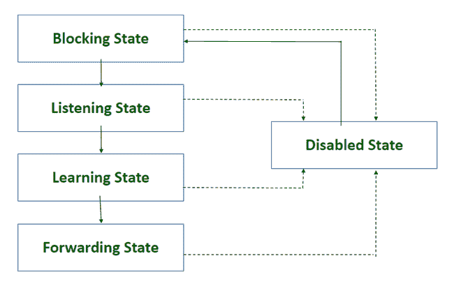

# 生成树端口状态

> 原文:[https://www.geeksforgeeks.org/spanning-tree-port-states/](https://www.geeksforgeeks.org/spanning-tree-port-states/)

[生成树协议](https://www.geeksforgeeks.org/introduction-of-spanning-tree-protocol-stp/)根据根交换机的选择、交换机的根开销等标准，将交换机的端口置于不同的状态，防止帧在局域网中循环。

**有五种生成树端口状态:**

**1。阻塞状态:**

*   交换机端口在选举过程中进入阻塞状态，此时交换机在某个端口上接收到指示到根交换机的更好路径的 BPDU，或者某个端口不是根端口。
*   端口丢弃从连接的网段接收的帧或从另一个端口交换的帧，以便转发。
*   端口接收 BPDUs，并将它们导向交换机系统模块进行处理。
*   端口接收并响应网络管理消息。
*   交换机端口保持阻塞状态 20 秒，随后变为监听状态。

**2。收听状态:**

*   监听状态是阻塞状态之后的第一个过渡状态。
*   在这种状态下，STP 决定端口是否应该参与帧转发。
*   端口丢弃从连接的网段接收的帧或从另一个端口交换的帧。
*   端口接收 BPDUs，并将它们导向交换机系统模块进行处理。此外，它还处理从交换机系统模块接收到的 BPDUs。
*   端口接收并响应网络管理消息。
*   交换机端口保持监听状态 15 秒，然后进入学习状态。

**3。学习状态:**

*   交换机端口根据 STP 的决定通过监听状态后进入学习状态。
*   端口丢弃从连接的网段接收的帧或从另一个端口交换的帧，以便转发。
*   端口将局域网主机位置信息合并到其媒体访问控制地址数据库中。
*   端口接收、处理和发送从系统模块接收的 BPDUs。
*   端口接收并响应网络管理消息。
*   交换机端口保持学习状态 15 秒，然后进入转发状态。

**4。转发状态:**

*   交换机端口在通过创建网络拓扑所涉及的所有状态后进入转发状态。
*   端口转发从连接的网段或从另一个端口交换的帧。
*   端口正在转发流量。
*   端口将局域网主机位置信息合并到媒体访问控制地址数据库中。
*   端口接收、处理和发送从系统模块接收的 BPDUs。
*   端口接收并响应网络管理消息。
*   交换机端口保持转发状态，直到在网络中检测到任何变化。

**5。禁用状态:**

*   作为禁用端口的管理命令的结果，交换机端口进入禁用状态。
*   端口不参与 STP 的任何操作，因为它被认为是不可操作的。
*   端口不将接收到的 BPDUs 导向交换机系统模块进行处理。
*   端口接收并响应网络管理消息。

<figure class="table">

| STP 模式 | 接收 BPDUs | 发送 BPDUs | 了解 MAC 地址 | 转发数据包 |
| --- | --- | --- | --- | --- |
| 阻塞 | 是 | 是 | 不 | 不 |
| 倾听 | 是 | 是 | 不 | 不 |
| 学问 | 是 | 是 | 是 | 不 |
| 促进 | 是 | 是 | 是 | 是 |
| 有缺陷的 | 是 | 不 | 不 | 不 |

</figure>