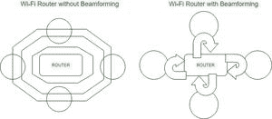

# 无线通信中的空间滤波(波束形成)

> 原文:[https://www . geeksforgeeks . org/space-filling-bearing-in-wireless-communication/](https://www.geeksforgeeks.org/spatial-filtering-beamforming-in-wireless-communications/)

波束形成是一种将无线信号集中到特定接收设备的策略，而不是像通常那样让无线电波从广播天线向四面八方传播。随后更直接的连接比没有波束形成时更快、更可靠。如今，波束形成对于刚刚起步的 5G 网络至关重要。

波束形成保证了更快、更接地的无线信号，并且每个小工具都有更长的覆盖范围。路由器并不只是通过各种方式进行通信，而是努力以一种适合小工具的方式来传递小工具所期望的远程信息。这样，波束形成的结果是——更好的无线信号和更好的为你的小玩意收集能量。

**传统系统的问题及波束形成的缓解措施:**
当接入点天线向一组用户发射信号时，它会产生特定形状的波束来覆盖这些用户，波束的形状由接入点天线在各个方向上的增益量决定，增益越高，波束在该方向上到达的距离越远。信号能量以这种形状从接入点发送到天线，该形状内的所有用户从接入点天线接收信号能量。用户使用窄波束向接入点发送信号，当接入点天线接收从用户发送的数据时，它监听与发送时相同波束形状的信号，当来自用户和接入点的波束相交时， 接入点可以听到用户接收其数据，这意味着与接入点频率相同的信号以及进入接入点天线波束形状的用户会干扰来自用户的信号，导致数据丢失。

**<u>【上行波束形成】</u>** 减轻了干扰或数据丢失的情况，因为接入点形成在特定方向上具有高增益的窄波束，而不是传统系统中使用的广角，该波束指向用户接入点以从其接收数据， 与用户的波束相交并接收其数据，同时减轻来自干扰的干扰，因为接入点形成的波束对于来自干扰的波束是低增益的，这使得接入点对它们的信号震耳欲聋，因为接入点想要监听其他用户，来自接入点的波束在指向感兴趣的用户的方向上形成，再次减轻来自干扰的干扰。

**<u>下行链路波束成形</u>** 解决了传统系统的另一个问题，当来自接入点天线的信号能量在一个广角上时，天线能够产生的总信号能量在该角度上扩展，然而，当接入点天线向一个用户发射时，将该信号能量聚焦到一个较窄的波束以类似于上行链路波束成形的方式向用户提供较高的信号电平是有益的 接入点天线形成指向感兴趣的用户的窄波束，并使用该波束向用户发送数据，这可以向用户提供更高的信号电平，改善网络性能，因为与传统系统中的宽波束相比，信号能量被窄聚焦。 通过上行链路和下行链路波束成形，无线系统可以显示出极大改善的干扰容限和系统增益，只需改变所需的接入点天线。

对于 802.11ac，这个问题已经解决。波束形成有一个标准的工作路线，任何有助于波束形成的 802.11ac 小工具都将与不同的小工具一起工作。基本上，802.11ac 小工具——如路由器和电脑——可以相互对话，并给出它们相对位置的数据。波束形成是 802.11ac 无线标准的一个标准化方面。无论如何，并非所有 802.11ac 小工具都需要帮助波束成形。因为你有一个 802.11ac 小工具，但这并不意味着它支持波束形成。然而，如果一个小工具支持波束形成，它会以一种规范化的方式这样做。

**空间滤波大致可以分为:**

**1。<u>显式波束形成:</u>** 显式空间滤波是传感器集群中用于在特定方向接收或传输信号的信号处理策略。这是通过连接天线阵列中的组件来实现的，这样特定点的信号会受到有用的阻抗，而其他点则会受到破坏性的阻碍。波束成形可以在发送端和接收端使用，以便实现空间选择性。

**2。<u>隐式波束成形:</u>** 通过“隐式空间滤波”，无线路由器努力利用波束成形方法来提高更成熟的小工具(即没有 802.11ac 设备的小工具)的信号功率。原则上，旧的 802.11n、g 和 b 小工具会有一些改进。这种类型的空间滤波只是一种优势，它也为您更成熟的小工具带来了一些波束成形优势。

**空间过滤的主要优势:**

*   扩大无线网络覆盖范围，减少盲点
*   为语音和高清视频提供稳定的无线连接
*   更好的无线网络吞吐量
*   毫无意义的射频干扰
*   通过以特定方式集中信号，波束成形允许您向接收方传递更高的符号质量，这逐渐意味着更快的数据移动和更少的失误，而不期望帮助广播功率。这基本上是远程系统管理的神圣目标，也是大多数改进远程通信方法的目标。
*   另一个优点是，由于你不是在不需要的标题下传递信号，波束形成可以减少试图获得不同信号的人遇到的障碍。

**空间过滤的限制:**

*   波束形成的约束通常包括它需要的处理资产；有许多情况下，波束形成计算所需的时间和力量最终会破坏其有利环境。
*   尽管如此，随着处理器能力和效率的升级，波束形成方法已经变得足够合理，可以与购物者组织硬件相结合。
*   由于使用多个天线和其他硬件系统，硬件复杂性更高。
*   由于硬件资源的增加和先进数字信号处理器芯片的使用，波束形成系统的成本比非波束形成系统高。
*   由于使用了更多的资源，波束成形系统中的功率要求更高。因此，波束形成系统中的电池消耗更快。