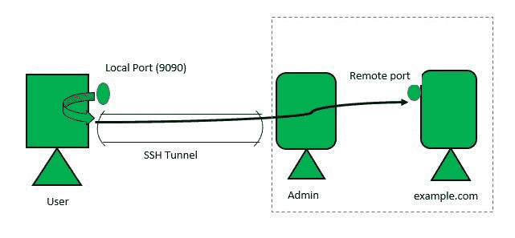
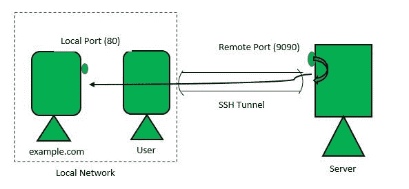

# SSH 端口转发

> 原文:[https://www.geeksforgeeks.org/ssh-port-forwarding/](https://www.geeksforgeeks.org/ssh-port-forwarding/)

[SSH](https://www.geeksforgeeks.org/difference-ssh-telnet/) 端口转发是一种用于保护 TCP/IP 连接的方法。TCP/IP 数据包可以通过 SSH 链路进行隧道传输，使数据变得模糊，从而保护链路免受攻击。SSH 端口转发也可以看作是虚拟专用网络(VPN)的一种形式。

**端口转发类型:**
端口转发主要有两种:本地端口转发和远程端口转发。这些解释如下。

1.  **Local Port Forwarding:**
    Suppose you are on a local network that restricts access to a site, let us suppose example.com. To work around this we could create a tunnel through a server that is not on our network and thus has access to example.com. The command we would use is:

    ```
    ssh -L 9090:example.com:80 admin@server.com 
    ```

    这里的-L 标志表示正在使用本地端口转发。因此，上述命令的作用是将本地端口 9090 上的数据转发给可以通过安全 SSH 连接访问 example.com 的服务器。请注意，管理员是服务器上的用户。现在用你的浏览器访问 example.com。

    

    第二种情况是，出于安全原因，您希望访问仅在 localhost 上打开的服务器上的服务。您可以使用以下命令:

    ```
    ssh -L 9090:localhost:3306 admin@server.com 
    ```

    请注意，命令中的 localhost 是从服务器的角度来看的。服务器在端口 3306 上运行 MySQl 服务，它只允许本地连接。

2.  **Remote Port Forwarding:**
    The command for remote forwarding is

    ```
    ssh -R 9090:example.com:80 admin@server.com
    ```

    -R 标志指定远程服务器端口(9090)上的请求应转发到本地网络端口 80 上的 example.com。现在，如果我们向 9090 端口上的服务器发出请求，您将收到 example.com 的回复。

    