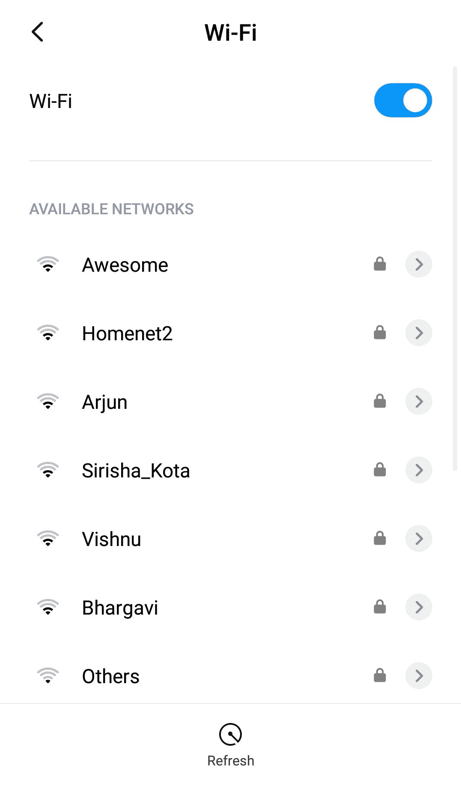

# SSID 完整格式

> 原文:[https://www.geeksforgeeks.org/ssid-full-form/](https://www.geeksforgeeks.org/ssid-full-form/)

**服务集标识符(SSID)** 用于识别任何 802.11 无线局域网(WLAN)。客户端也使用它来识别和连接到特定的无线网络。用外行人的话来说，它是我们尝试将您的设备(电话/计算机)连接到无线网络时看到的 SSID。下面是一个截图，显示了在浏览可用网络进行连接时可用的 SSID。



它可以是区分大小写的 32 个字符串，可以包含字母、数字、符号、标点符号甚至空格。

以下六个字符被视为 SSID 中的无效字符:

```
/, ",  +, ], TAB, trailing spaces 
```

第一个字符不能是以下任何字符:

```
!, #, ;  
```

**SSID 的类型:**

1.  **隐藏–**
    SSID 不会对所有客户端可见。只有知道确切 SSID 的用户才能在该无线网络上跳转。
2.  **广播-**
    SSID 通过网络广播。任何人都可以找到那个网络并加入。

**特征:**

1.  SSID 有助于区分一个网络和其他网络。
2.  SSID 可以 2.4 千兆赫或 5 千兆赫广播。
3.  每个 SSID 都可以有自己的安全性，包括开放、WEP、WPA、WPA2 等
4.  来宾 SSID 可能允许用户连接到互联网，但不能连接到其他本地设备或设施，如内部网。
5.  SSID 可以类似于虚拟局域网(VLAN)，用于划分流量或提供不同的设施或访问级别。

**优势:**

*   在多个无线网络环境中，发送和接收数据会很混乱。为了避免这种情况，SSID 包含在通过无线网络发送的每个数据包中
*   它确保通过空中传送的数据到达正确的位置。
*   帮助区分无线局域网
*   如果两个无线局域网的 SSIDs 相同，漫游是有效的。
*   单个接入点可以同时广播多个 SSIDs。这将有助于从逻辑上划分用户(例如:在学校环境中，所有教师都可以使用一个 SSID，并且可以为所有学生分配不同的 SSID，每个 SSID 具有不同的策略和功能。).

**缺点:**

*   尽管隐藏网络增加了安全性，但它仍然很容易被黑客攻击
*   虽然加密很强，但大多数人使用简单的密码，访问会变得更容易
*   任何攻击者都可以广播与我们同名的 SSID 并窃取我们的个人信息
*   攻击者还可以欺骗来自无线网桥的“解除关联帧”，并将其发送到连接的客户端之一；客户端立即重新连接，显示 SSID。