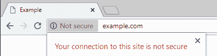
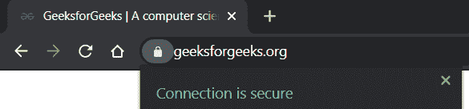

# SSL 证书

> 原文:[https://www.geeksforgeeks.org/ssl-certificate/](https://www.geeksforgeeks.org/ssl-certificate/)

SSL 证书是一种数字证书，可用于网站的身份验证，我们可以在客户端和网络服务器之间创建安全连接。安装证书后，它使网站从 [HTTP 到 HTTPS](https://www.geeksforgeeks.org/difference-between-http-and-https/) 。

**SSL 证书工作流程:**

SSL 证书允许对数据进行加密，然后将数据发送到服务器端。它有两个密钥，一个是公钥，另一个是私钥。用公钥加密的数据只能用私钥解密。有私钥的 web 服务器可以理解数据。如果数据包在这两者之间被盗，它们是无用的，因为它们是加密的。

**示例–**

可以查看截图了解一下。

在这张截图中，您可以清楚地看到极客门户访问极客是安全的。

**SSL 证书包含什么样的数据:**

*   [网站](https://www.geeksforgeeks.org/static-vs-dynamic-website/)域名
*   子域
*   签发日期
*   截止日期
*   SSL/TLS 版本
*   [证书颁发机构信息](https://www.geeksforgeeks.org/digital-signatures-certificates/)
*   [公钥](https://www.geeksforgeeks.org/public-key-encryption/)
*   证书签名算法

**注–**

*   [SSL–安全套接字层](https://www.geeksforgeeks.org/secure-socket-layer-ssl/)
*   [TLS–传输层安全性](https://www.geeksforgeeks.org/transport-layer-security-tls/)

**SSL 证书需要什么:**

每天都有新的攻击和数据泄露发生，在线交易客户数据的增长非常令人尊敬。有了 SSL 证书，我们可以确保客户端和服务器之间的加密连接。

它可以如下保护数据。

*   银行信息
*   登录信息
*   信用卡/借记卡详细信息
*   医院记录
*   住宅信息

它可以建立客户的信任，让他们分享个人信息，并在网站上进行交易。主要是电子商务和银行网站。搜索引擎也更喜欢它，所以它会出现在搜索结果中。

**SSL 证书类型:**

*   单域 SSL 证书
*   通配符 SSL 证书
*   多域 SSL 证书
*   统一通信 SSL 证书

**SSL 证书验证级别的类型:**

*   域验证证书
*   组织验证的证书(OV SSL)
*   扩展验证证书(EV SSL)

**如何获取 SSL 证书:**

在第三方[证书颁发机构](https://www.geeksforgeeks.org/digital-signatures-certificates/)之外获取有效证书。他们给域颁发证书。认证机构对某些有效证书的收费。一旦证书安装在服务器上，那么数据流量将被加密和安全。