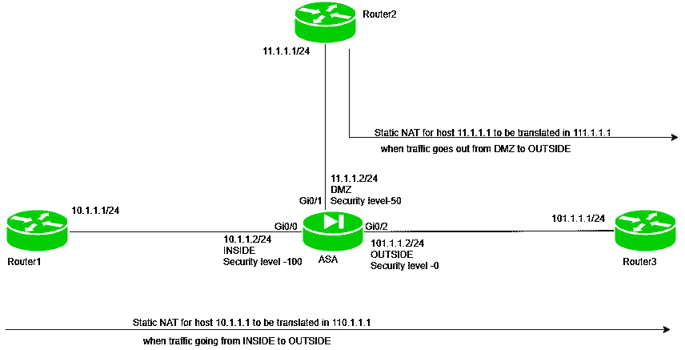

# 静态 NAT(在 ASA 上)

> 原文:[https://www.geeksforgeeks.org/static-nat-on-asa/](https://www.geeksforgeeks.org/static-nat-on-asa/)

先决条件–[自适应安全设备(ASA)](https://www.geeksforgeeks.org/computer-network-adaptive-security-appliance-asa-features/) 、[网络地址转换(NAT)](https://www.geeksforgeeks.org/computer-network-network-address-translation-nat/)
ASA 是一款思科安全设备，具有静态包过滤、带 VPN 的有状态包过滤、防病毒和防入侵等经典防火墙功能。
网络地址转换(NAT)是将私有 IP 地址转换为公共 IP 地址的过程。这将对外部网络隐藏原始源设备的 IP 地址。

**静态 NAT–**
在这种情况下，单个未注册的(私有)IP 地址与合法注册的(公共)IP 地址进行映射，即本地和全局地址之间的一对一映射。
这些一般用于网络托管和家庭网络。

这些在组织中不使用，因为有许多设备需要互联网接入，为了提供互联网接入，需要公共 IP 地址。假设，如果有 3000 台设备需要访问互联网，组织必须购买 3000 个公共地址，这将非常昂贵。

**程序–**

*   **步骤 1:配置访问列表–**
    构建访问列表，说明许可条件，即谁应该被许可以及什么协议应该被许可。
*   **步骤 2:将访问列表应用于接口–**
    访问组命令将用于说明动作(如上所述)应该发生的方向(出或入)。
*   **步骤-3:创建网络对象–**
    这将说明将应用 NAT 的主机。
*   **步骤-4:创建静态 NAT 语句–**
    此步骤将指定 NAT 应该发生的方向以及应该将私有 IP 地址转换到哪个 IP 地址，例如 NAT (DMZ，OUTSIDE)静态 111.1.1.1 此步骤说明当流量从 DMZ 流向 OUTSIDE 时，将进行静态 NAT 操作，并将 IP 地址(在 network object 命令中指定)转换到 111.1.1.1

**注意–**
访问列表允许从外部到非军事区或内部的 ICMP 流量，因为默认情况下，在 ASA(自适应安全设备)中不允许从较低安全级别到较高安全级别的 ICMP 流量。

**示例–**



三个路由器，即路由器 1 (IP 地址–10 . 1 . 1 . 1/24)、路由器 2 (IP 地址–11.1.1.1/24)和路由器 3 (IP 地址–101.1.1.1)连接到 ASA (IP 地址- 10.1.1.2/24，名称–内部和安全级别–Gi0/0 上的 100，IP 地址–11.1.1.2/24,名称–非军事区和安全级别–Gi0/1 上的 50，IP 地址–101.1.1.2/24,名称–外部和安全级别–Gi0/2 上的 0)，如上图所示。

在本任务中，我们将为从内部到外部产生的流量以及从非军事区到外部的流量启用静态 NAT。
在所有路由器和 ASA 上配置 IP 地址。
在路由器 1 上配置 IP 地址。

```
Router1(config)#int fa0/0
Router1(config-if)#ip address 10.1.1.1 255.255.255.0
Router1(config-if)#no shut 
```

在路由器 2 上配置 IP 地址。

```
Router2(config)#int fa0/0
Router2(config-if)#ip address 11.1.1.1 255.255.255.0
Router2(config-if)#no shut 
```

在路由器 3 上配置 IP 地址。

```
Router3(config)#int fa0/0
Router3(config-if)#ip address 101.1.1.1 255.255.255.0
Router3(config-if)#no shut 
```

在 ASA 的接口上配置 IP 地址、名称和安全级别。

```
asa(config)#int Gi0/0
asa(config-if)#no shut
asa(config-if)#ip address 10.1.1.2 255.255.255.0
asa(config-if)#nameif INSIDE 
asa(config-if)#security level 100
asa(config-if)#exit
asa(config)#int Gi0/1
asa(config-if)#no shut
asa(config-if)#ip address 11.1.1.2 255.255.255.0
asa(config-if)#nameif DMZ
asa(config-if)#security level 50
asa(config-if)#exit
asa(config)#int Gi0/2
asa(config-if)#no shut
asa(config-if)#ip address 101.1.1.2 255.255.255.0
asa(config-if)#nameif OUTSIDE
asa(config-if)#security level 0
```

现在给路由器静态路由。配置到路由器 1 的静态路由。

```
Router1(config)#ip route 0.0.0.0 0.0.0.0 10.1.1.2 
```

配置到路由器 2 的静态路由。

```
Router2(config)#ip route 0.0.0.0 0.0.0.0 11.1.1.2 
```

配置到路由器 3 的静态路由。

```
Router3(config)#ip route 0.0.0.0 0.0.0.0 101.1.1.2 
```

现在，最后配置静态路由到 ASA。

```
asa(config)#route INSIDE 10.1.1.0 255.255.255.0 10.1.1.1
asa(config)#route OUTSIDE 101.1.1.0 255.255.255.0 101.1.1.1
asa(config)#route DMZ 11.1.1.0 255.255.255.0 10.1.1.1

```

现在，对于 ICMP，要么我们必须检查，要么我们必须使用 ACL 来允许 ICMP 回应从较低的安全级别回复到较高的安全级别(这样做是因为默认情况下，不允许从较低的安全级别到较高的安全级别的流量)。
在这个场景中，我们将使用 ACL。

```
asa(config)#access-list traffic_out permit icmp any any 
asa(config)#access-list traffic_dmz permit icmp any any 
```

这里有两个访问列表。
第一个访问列表名称是 traffic_out，它将允许 ICMP 流量从外部到内部(具有任何掩码的 IP 地址)。
第二个访问列表已被命名为 traffic_dmz，它将允许 ICMP 流量从外部进入 dmz(具有任何掩码的 IP 地址)。

现在，我们必须将这些访问列表应用于 ASA 接口:

```
asa(config)#access-group traffic_out in interface OUTSIDE 
asa(config)#access-group traffic_dmz in interface DMZ
```

第一条语句声明访问列表流量输出在向内的方向应用于外部接口。第二种说法是访问列表 traffic_dmz 向内应用于 dmz 接口。
现在，内部设备将能够 ping 通外部和非军事区设备。现在，任务是每当流量从内部流出到外部以及从非军事区流出到外部时，在 ASA 上启用 NAT。

```
asa(config)#object network INSIDE_OUTSIDE_NAT
asa(config-network-object)#host 10.1.1.1
asa(config-network-object)#nat (INSIDE, OUTSIDE) static 110.1.1.1 
```

在这里，主机 10.1.1.1 将被翻译成 110.1.1.1，而流量将从内部流向外部。

```
asa(config)#object network DMZ_OUTSIDE_NAT
asa(config-network-object)#host 11.1.1.1
asa(config-network-object)#exit
asa(config)#nat (DMZ, OUTSIDE) static 111.1.1.1 
```

在这里，当交通从非军事区到外部时，东道主 11.1.1.1 将被翻译成 111.1.1.1。