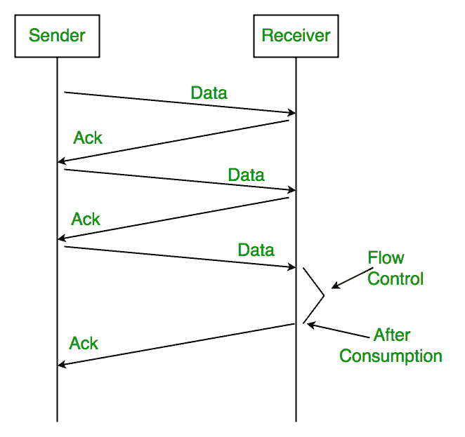
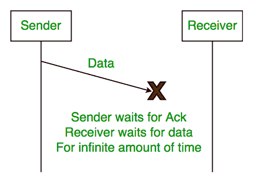
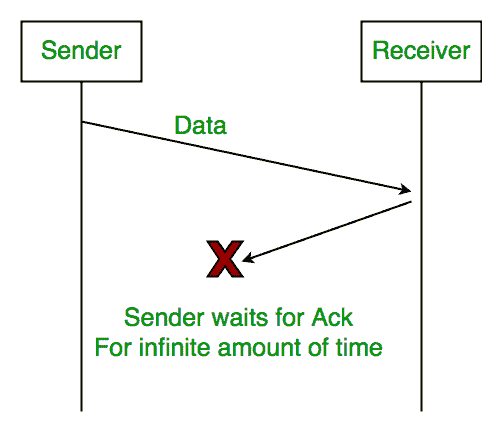
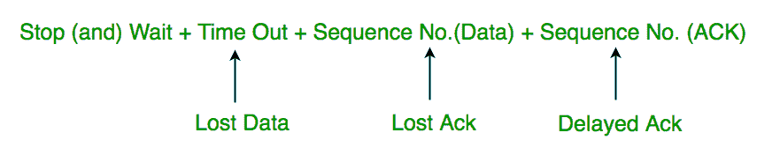
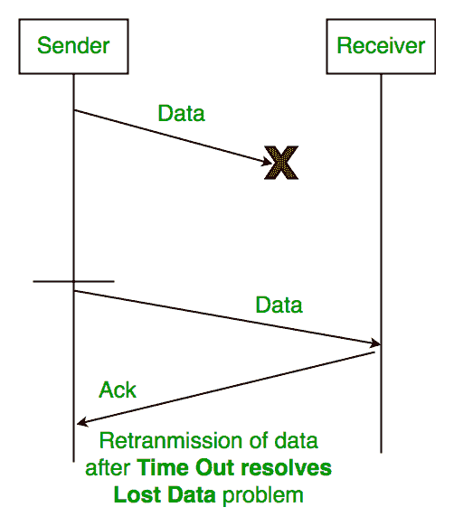
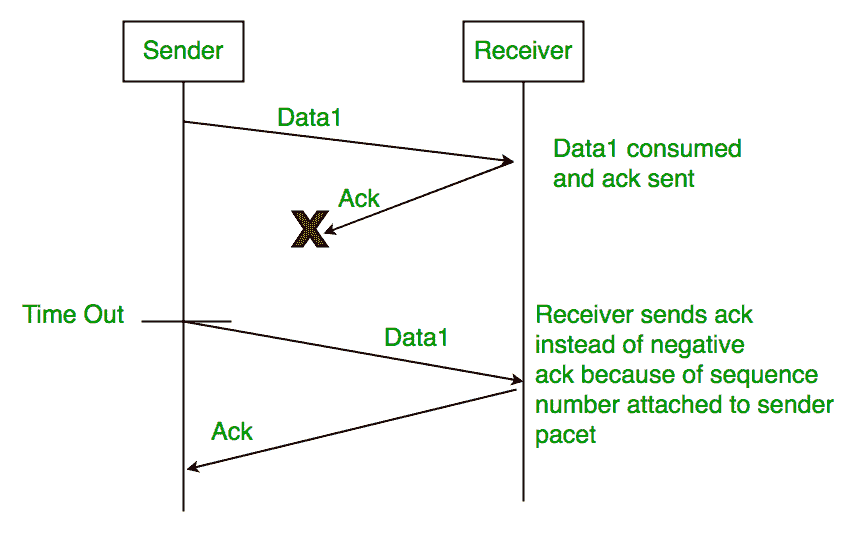
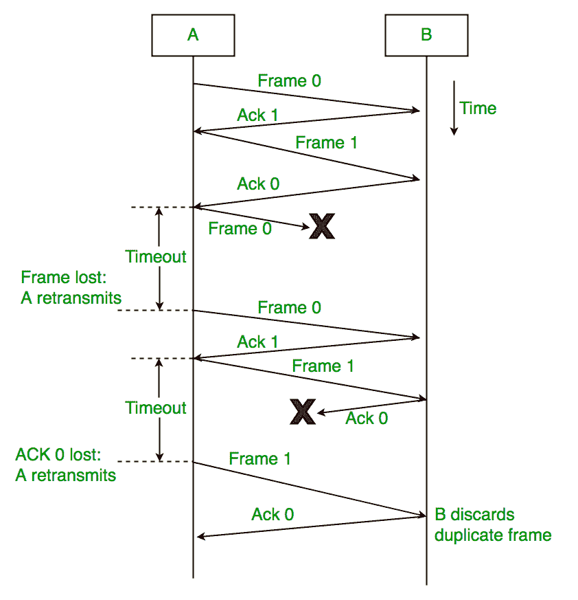

# 停车等待 ARQ

> 原文:[https://www.geeksforgeeks.org/stop-and-wait-arq/](https://www.geeksforgeeks.org/stop-and-wait-arq/)

### 特征

*   用于面向连接的通信。
*   它提供误差和流量控制
*   它用于数据链路层和传输层
*   停止并等待 ARQ 主要实现窗口大小为 1 的滑动窗口协议概念

### 有用术语:

*   **传播延迟:**数据包从一台路由器到另一台路由器进行物理传输所花费的时间。

传播延迟=(路由器之间的距离)/(传播速度)

*   往返时间( **RTT** ) = 2*传播延迟
*   超时(**至** ) = 2* RTT
*   生存时间( **TTL** ) = 2*超时。(最大 TTL 为 180 秒)

### <u>简单停车等待</u>

#### 发件人:

规则 1)一次发送一个数据包。
规则 2)只有在前一个数据包收到确认后，才发送下一个数据包。

#### 接收者:

规则 1)在接收和消费数据包后发送确认。
规则 2)消费后需要发送数据包确认(流量控制)

## <u>问题:</u>

**1。丢失数据**

**2。遗失回执:**

**3。延迟确认/数据:**在发送方超时后，长时间延迟的确认可能被错误地认为是对其他最近数据包的确认。

### <u>停止并等待 ARQ(自动重复请求)</u>

上述 3 个问题通过停止并等待 ARQ(自动重复请求)来解决，它同时进行错误控制和流量控制。

**1。超时:**

**2。序列号(数据)**

**3。延迟确认:**
这也可以通过引入确认序列号来解决。

### <u>停止并等待工作</u><u>ARQ:</u>

1)发送方 A 发送序列号为 0 的数据帧或数据包。
2)接收方 B 接收到数据帧后，发送序列号为 1 的确认(下一个预期数据帧或数据包的序列号)
只有一个一位的序列号，表示发送方和接收方都只有一个帧或数据包的缓冲区。

#### ARQ 停车等待的特点:

*   它使用发送方和接收方之间的链路作为半双工链路
*   吞吐量=每个 RTT 1 个数据包/帧
*   如果带宽*延迟乘积很高，那么如果协议不是很有用，他们会停止并等待协议。发送方必须在发送处理过的下一个数据包之前一直等待确认。
*   这是“**闭环或面向连接的**协议的一个例子
*   这是 SWP 的一个特殊类别，其窗口大小为 1
*   不管发送方有多少包，停止和等待协议只需要 2 个序列号 0 和 1

停止和等待 ARQ 解决了三个主要问题，但可能会导致严重的性能问题，因为发送方总是等待确认，即使它有下一个数据包准备发送。假设您有一个高带宽连接，传播延迟也很高(您通过高速连接连接到其他国家的某个服务器)。为了解决这个问题，我们可以一次发送多个序列号更大的数据包。我们将在下一篇文章中讨论这些协议。

因此，在传播延迟非常小的情况下，例如局域网连接，停止并等待 ARQ 可能工作得很好，但是对于像卫星连接这样的远距离连接，表现就很差。

**参考文献:**

*   [http://users.ecs.soton.ac.uk/sqc/EL336/CNL-5.pdf](http://users.ecs.soton.ac.uk/sqc/EL336/CNL-5.pdf)
*   [<u>图书–塔南鲍姆的计算机网络</u>](https://amzn.to/3hfQerb)

本文由 G. Shabharesh 供稿。如果您发现任何不正确的地方，或者您想分享更多关于上面讨论的主题的信息，请写评论