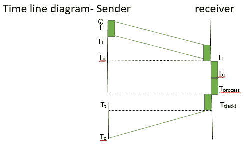
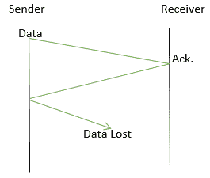
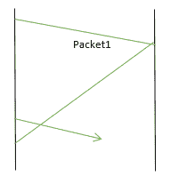

# 停止等待协议及其问题和解决方案

> 原文:[https://www . geesforgeks . org/stop-and-wait-protocol-its-problems-and-solutions/](https://www.geeksforgeeks.org/stop-and-wait-protocol-its-problems-and-solutions/)

这是最简单的[流量控制方法](https://www.geeksforgeeks.org/difference-between-flow-control-and-congestion-control/)，发送方将发送数据包，然后等待接收方确认收到数据包，然后发送下一个数据包。

停止和等待协议非常容易实现。



发送所用的总时间是，

```
Ttotal = Tt(data) + Tp + Tq + Tprocess + Tt(ack) + Tp     

( since, Tq and Tprocess = 0)

Ttotal = Tt(data) + 2Tp + Tt(ack)
Ttotal = Tt(data) + 2Tp   

(when Tt(ack) is negligible) 
```

```
Efficiency 
= useful time / total cycle time 
= Tt / (Tt+2Tp)
= 1 / (1+2a)    [a = Tp/Tt] 
```

**注意:**停车等待距离越短越好。因此它是一个很好的局域网协议。停止和等待有利于更大的数据包。

**如果数据包在两者之间丢失了怎么办？**



1.  据发送方称，接收方很忙，但实际上数据丢失了。
2.  接收方将假设发送方没有发送任何数据包。
3.  双方都在等待对方，会出现僵局。

**需要超时定时器:**
应用定时器，接收器将等待数据的超时定时器，之后它将确认数据已经丢失。

**数据包丢失了怎么办？**
超时定时器到期后，发送方将假设数据丢失，但实际上确认丢失。通过假设这一点，它将再次发送数据分组，但是根据接收器，它是一个新的数据分组，因此它将引起重复分组问题。

为了消除重复的数据包问题，序列号被添加到数据包中。因此使用包号可以很容易地确定重复的包。

**收到确认有延迟怎么办？**



根据发送方，数据包 1 的确认被延迟，数据包 2 已丢失。但是接收器假设已经接收到的确认是分组 2。这个问题叫做丢包问题。
如果确认也有编号，则可以解决丢包问题。