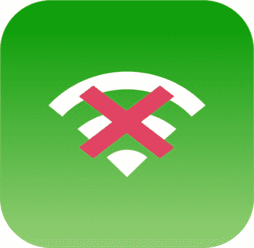

# 阻止 Wi-Fi 窃取

> 原文:[https://www.geeksforgeeks.org/stop-stealing-wi-fi/](https://www.geeksforgeeks.org/stop-stealing-wi-fi/)

我们周围有很多无线信号吗？公寓怎么样？无线信号在整个大楼里广播，上上下下，进进出出。事实上，你的网速很有可能会受到这种喧嚣的无线信号的影响。

这里还有一个问题。如果我们的 Wi-Fi SSID 正在向周围的公寓广播，并且我们的安全措施松懈，互联网就有可能被窃取。



自然，当多个设备连接到同一个网络时，**带宽在这些设备之间分配。这种带宽分配是如何发生的取决于多种因素，并可能导致路由器倾向于哪种设备的“带宽窃取”。**

假设我们的无线路由器带宽为 50 Mbps。这是否意味着如果两台设备连接到路由器，带宽将在它们之间平均分配(每台 25 Mbps)，还是带宽分配略有不同？

事实上完全不同。**分割完全基于使用情况**，而不是连接到网络的客户端数量。如果某个特定设备以 1 Mbps 的速度执行下载操作，则剩下 49 Mbps 用于剩余活动。类似地，如果下载以 45 Mbps 的速度进行，将会留下 5 Mbps 用于其他活动。

**那么现在是什么导致了 1Mbps 和 45Mbps 的差异呢？**
即使 Wi-fi 打算做到不偏不倚，给每个设备平等的机会访问其信道，但许多因素会影响最终的吞吐量。带宽的分配很难预测，但是*影响这种分配的前五个因素可以在下面看到。*

1.  **距离:**
    有两个距离要考虑。首先，是与正在访问的服务器的距离。距离越大，数据分组的跳数越大，因此等待时间越长。例如，如果我试图从位于美国的服务器(从印度)获取数据，与中国的服务器相比，这将是一个较慢的连接。这也是网站开发者经常选择内容交付网络(CDNs)来提升用户体验的主要原因。

    其次是距离路由器或接入点的距离。接入点可以是连接到路由器的独立设备，也可以内置于路由器本身，它包含无线局域网技术，允许您的设备连接到它。因此，离这个接入点的距离越小，无线体验就越好。
2.  **服务器性能:**
    服务器的后端性能对于决定吞吐量至关重要。像 Torrents 或 YouTube 这样强大的服务器可以提供高吞吐量，从而消耗更大部分的路由器带宽。另一方面，一个弱服务器，不会需要大量消耗带宽。
3.  **Router implementation or Protocol (is QoS enabled):**
    Inherently, the router’s inbuilt protocol will attempt to provide the bandwidth required by a connection for optimum user experience. But as stated before, it is the activity that is being performed that will define the bandwidth allocation. The general trend (though it may differ based on other factors) followed is that

    ```
     Multimedia stream > VOIP > Downloads > Email > Web 
    ```

    因此，如果我连接到网络，正在播放一段网飞视频，它将占用很大一部分带宽，留给其他活动的空间很小。路由器试图为正在执行的每个活动提供最佳质量的体验，而不做任何区分。

    然而，拥有良好实施的服务质量(QoS)技术的路由器将有助于更公平地分配带宽。QOS 了解网络上的各种流量，并对其进行优先级排序。启用服务质量后，重要的 Skype 通话可以优先于游戏或网飞流，因此通话质量保持不变，反之亦然。

4.  **硬件性能:**
    设备的硬件也会造成接收带宽的差异。例如，路由器被配置为在一个或多个无线协议下运行。这些协议被命名为 802.11a、802.11b、802.11g、802.11n、802.11ac，每个协议都具有特有的最大通信带宽或频带。在某些情况下，如果设备硬件无法支持某个协议，路由器必须退回到合适的旧通信频段，并相应地分配带宽。这导致分配的带宽不同。
5.  **周围环境:**
    有时，Wifi 信号的强度只是通过移动位置来改变。接收到的信号也受到接入点和设备之间障碍物的影响。与木材相比，金属和水等材料的阻碍更大。同样，智能电视和烤箱等其他电子设备的存在也会因其中存在电磁芯片而影响信号。

**现在，我们如何保护无线网络:**

*   **更改默认管理员密码/设置强密码:**
    一些网站允许根据路由器型号搜索默认登录凭据。所以这显然是一个很大的风险，所以通过路由器的网页更改 admin 密码(一般 admin panel 的地址是 192.168.0.1 或者写在路由器上)。
*   **加密设置使用 WPA2:**
    没有加密良好的密码，任何人都可以查看我们的网络。为了使我们的网络更加安全，我们应该启用 WPA2 加密。为此，请通过无线网络或以太网电缆将系统连接到路由器，打开浏览器并输入 IP 地址，如果尚未设置，请使用默认密码和用户名首次登录。进入无线设置选择安全并从身份验证类型下拉菜单中选择 WPA2 选择 PSK 和 AES，单击应用更改现在需要输入新密码才能进入无线。
*   **Choose the right SSID name/Hide Your SSID:**
    Don’t go with the default SSID name which came with the router. we should change the name something different. Hackers are more likely to look for networks with default SSID’s because it’s a sign that the user has not spent more time to protect his network.
    1.  从浏览器转到 192.168.0.1(某些路由器的地址可能有所不同)。
    2.  在“用户名”字段中输入“管理员”，在“密码”字段中输入“密码”以登录。
    3.  在“高级”面板中选择“无线设置”，取消选中“启用 SSID 广播”

    隐藏 SSID 广播不能保证 100%的保护。攻击者可以通过使用网络嗅探器程序监控网络流量来轻松发现。

*   **MAC address filtering:**
    Go to Wireless->Wireless MAC Filtering page, click the Add New button. Type in the MAC address you want to allow or deny to access the router, and give a description of this item. The status should be Enabled and at last, click the Save button.

    如果我们启用了媒体访问控制地址过滤，它只允许注册了媒体访问控制地址的设备连接到我们的网络。