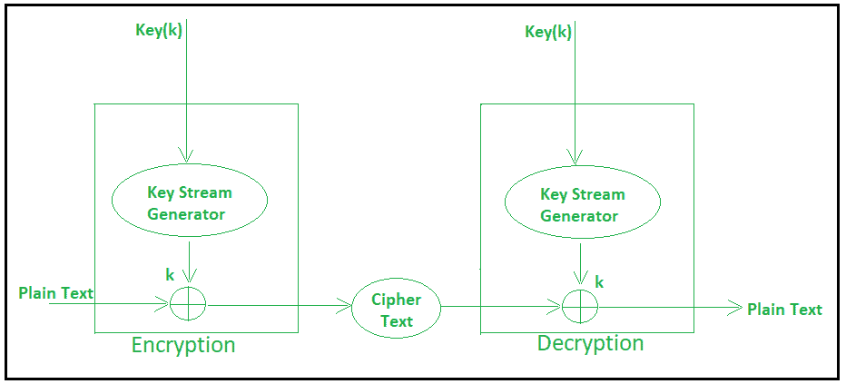

# 流密码

> 原文:[https://www.geeksforgeeks.org/stream-ciphers/](https://www.geeksforgeeks.org/stream-ciphers/)

在流密码中，一次加密一个字节，而在分组密码中，一次加密 128 位。

最初，密钥(k)将作为输入提供给伪随机位发生器，然后它产生一个随机的 8 位输出，该输出被视为密钥流。

产生的密钥流大小为 1 字节，即 8 位。

1.  流密码遵循伪随机数流的顺序。
2.  跟随流密码的好处之一是使密码分析更加困难，因此在密钥流中选择的位数必须很长，以便使密码分析更加困难。
3.  通过使密钥更长，它也可以安全地抵御暴力攻击。
4.  密钥越长，安全性就越强，可以防止任何攻击。
5.  密钥流可以通过包含更多数量的 1 和 0 来更有效地设计，从而使密码分析更加困难。
6.  流密码相当大的好处是，与分组密码相比，它只需要几行代码。

**加密:**
对于加密，

*   纯文本和密钥流生成密文(相同的密钥流将用于解密。).
*   明文将与密钥流逐位进行异或运算，生成密文。

**示例–**

```
Plain Text : 10011001
Keystream  : 11000011
`````````````````````
Cipher Text : 01011010

```

**解密:**
对于解密，

*   密文和密钥流提供原始明文(相同的密钥流将用于加密。).
*   密文将与密钥流逐位进行异或运算，并产生实际的纯文本。

**示例–**

```
Cipher Text : 01011010
Keystream   : 11000011
`````````````````````` 
Plain Text  : 10011001

```

解密只是加密的逆过程，即与密文进行异或运算。



流密码图