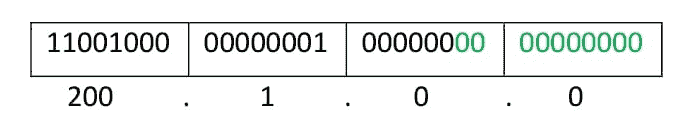

# 网络层超网

> 原文:[https://www . geeksforgeeks . org/网络层超网/](https://www.geeksforgeeks.org/supernetting-in-network-layer/)

**超网**与[子网](https://www.geeksforgeeks.org/ip-addressing-classless-addressing/)相反。在子网划分中，单个大网络被分成多个较小的子网。在超网划分中，多个网络组合成一个更大的网络，称为超网或超网。

超网主要用在路由总结中，在路由总结中，到具有相似网络前缀的多个网络的路由被合并到一个路由条目中，路由条目指向一个超级网络，包含所有网络。这反过来又大大减小了路由表的大小以及路由协议交换的路由更新的大小。

更具体地说，

*   当多个网络组合成一个更大的网络时，称为超级网络

*   在路由聚合中使用超级网络来减少路由表的大小和路由表更新

超网时有几点需要牢记:

1.  所有网络都应该是连续的。

2.  每个网络的块大小应该相等，并且必须是 2 <sup>n</sup> 的形式。

3.  第一个网络 id 应该可以被整个超网整除。

**示例–**假设 4 个 C 类小网络:

```
200.1.0.0, 
200.1.1.0,
200.1.2.0,
200.1.3.0
```

建立一个更大的网络，只有一个网络标识。

**解释–**在超网之前，路由表如下所示:

<figure class="table">

| 网络标识 | 子网掩码 | 连接 |
| --- | --- | --- |
| 200.1.0.0 | 255.255.255.0 | A |
| 200.1.1.0 | 255.255.255.0 | B |
| 200.1.2.0 | 255.255.255.0 | C |
| 200.1.3.0 | 255.255.255.0 | D |

首先，让我们检查是否满足三个条件:

1.  **Contiguous:** You can easily see that all networks are contiguous all having size 256 hosts. 
    Range of first Network from 200.1.0.0 to 200.1.0.255\. If you add 1 in last IP address of first network that is 200.1.0.255 + 0.0.0.1, you will get the next network id which is 200.1.1.0\. Similarly, check that all network are contiguous. 
2.  **Equal size of all network:** As all networks are of class C, so all of them have a size of 256 which is in turn equal to 2<sup>8</sup>. 
3.  **First IP address exactly divisible by total size:** When a binary number is divided by 2<sup>n</sup> then last n bits are the remainder. Hence in order to prove that first IP address is exactly divisible by while size of Supernet Network. You can check that if last n v=bits are 0 or not. 

    在给定的示例中，第一个 IP 是 200.1.0.0，超网的整体大小是 4*2 <sup>8</sup> = 2 <sup>10</sup> 。如果第一个 IP 地址的最后 10 位是零，那么 IP 将是可分的。



1.  第一个 IP 地址的最后 10 位为零(用绿色突出显示)。所以第三个条件也满足。

    1.  控制和减少网络流量

    2.  有助于解决缺少 IP 地址的问题

    3.  最小化路由表
        *   当组合时，它不能覆盖网络的不同区域

        *   所有的网络应该在同一个类中，所有的 IP 应该是连续的

</figure>