# 第 2 层开关功能

> 原文:[https://www.geeksforgeeks.org/switch-functions-at-layer-2/](https://www.geeksforgeeks.org/switch-functions-at-layer-2/)

先决条件–[交换机](https://www.geeksforgeeks.org/network-devices-hub-repeater-bridge-switch-router-gateways/)
交换机是第 2 层设备，它基于设备的 MAC 地址(物理地址)工作。交换机主要执行以下功能:

1.  **学习–**交换机在接收帧的交换机端口上学习设备的 MAC 地址。
2.  **转发–**交换机进行两种类型的消息转发:
    (a) **单播:**交换机仅在其 MAC 地址表中有目的 MAC 地址条目时，才将帧单播到目的地。
    (b) **未知单播:**当交换机收到目的地的单播帧时，如果交换机的 MAC 表中没有该目的地的条目，则交换机只需通过所有端口广播该帧。这就是所谓的洪水。
3.  **过滤–**仅当交换机已经获知其 MAC 表中的 MAC 地址时，帧才会通过该交换机端口转发。
4.  **环路避免–**为了实现冗余，两台交换机通过两条链路相互连接，这也可能导致第 2 层环路。通过使用 STP(生成树协议)协议进行交换，可以避免这些环路。

**注意–**交换机 MAC 表中的一个条目，也称为 CAM(内容可寻址存储器)，最多可以保留 300 秒。当收到目的媒体访问控制地址的帧时，300 秒的时间限制将被重置。媒体访问控制表有 4 个条目:

*   **端口号–**交换机端口连接到目的 MAC。
*   **媒体访问控制地址–**连接到该交换机端口的主机的媒体访问控制地址。
*   **Type–**它告诉我们交换机是如何获知主机的 MAC 地址的，即静态还是动态。如果条目是手动添加的，那么它将是静态的，否则它将是动态的。
*   **VLAN–**它告诉连接到该交换机端口的主机属于哪个 VLAN。

**交换机如何获知 Mac 地址？**
交换机只有在收到来自主机的任何帧时，才会更新其 MAC 表。如果没有目的主机的条目，那么交换机将首先获知源主机的 Mac 地址，然后通过除接收帧的端口之外的所有端口泛洪帧，但是如果在交换机的 Mac 表中有目的主机的条目，那么它将是单播。

让我们通过一个例子来看看这个。
**示例–**这是一个小型拓扑，其中有主机 A (192.168.1.1/24)、主机 B (192.168.1.2/24)、主机 C (192.168.1.3/24)、主机 D (192.168.1.4/24)和两个交换机。它将通过从主机 A ping 主机 c 来了解交换机的媒体访问控制地址学习过程。最初，两台交换机的媒体访问控制表都只有另一台交换机的条目。

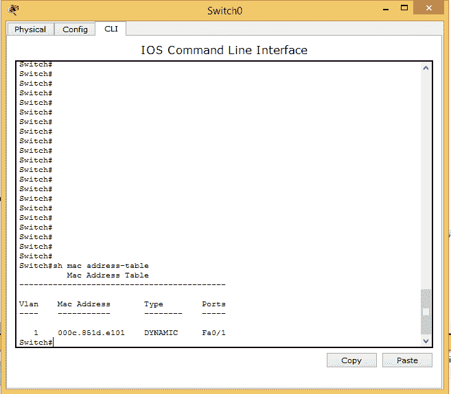 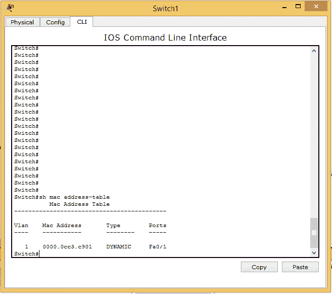

当用户试图 ping 主机 C 时，他看到生成了两个数据包:一个是 ICMP 数据包，另一个是 ARP 数据包。

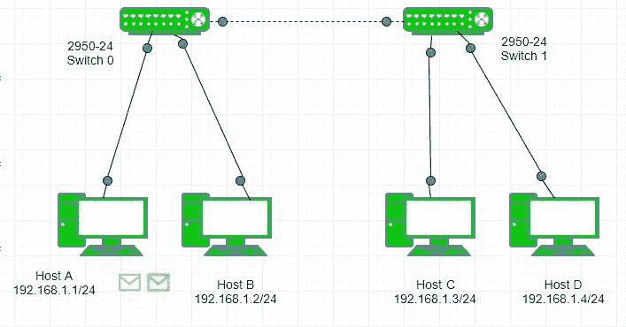

首先，将解析 ARP，即 ARP 请求由主机 a 在网络中广播

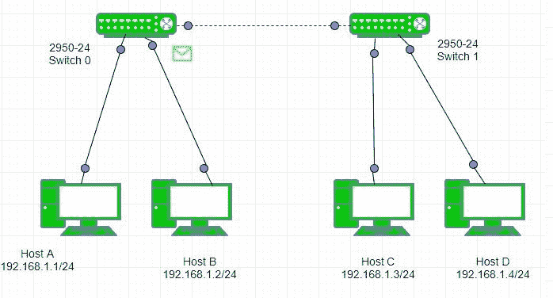

交换机 0 接收广播 ARP 请求，并将更新其媒体访问控制表。

**注意–**开关 0 已经有了开关 1 的条目。交换机 0 将帧广播回交换机 1 和电脑。主机 B 将丢弃该帧，因为它的目的地不是它。

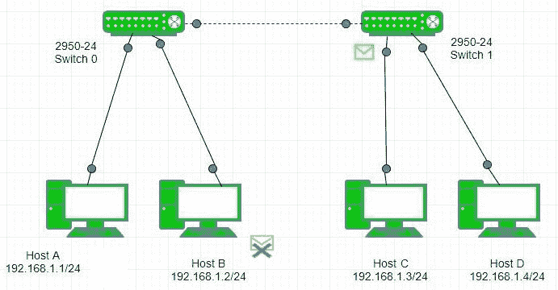

现在，交换机 1 将接收到该帧，并将首先更新其 MAC 表。

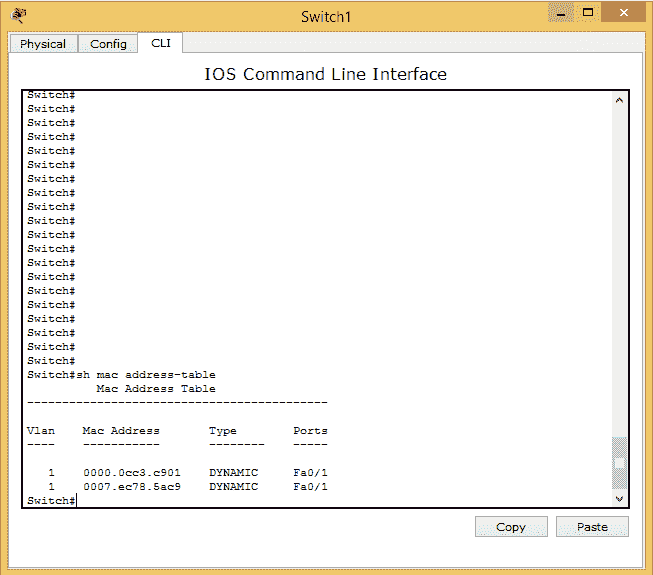

**注意–**在这里，交换机 1 已经获知了交换机 0 和主机 A 在同一个端口 fa0/1 上的不同 MAC 地址，因为主机 A 连接到交换机 0 的 fa0/1 上，因此，显示了同一个端口 fa0/1。现在，交换机 1 将向主机 C 和主机 D 广播 ARP 帧，因为它们位于同一个广播域中。

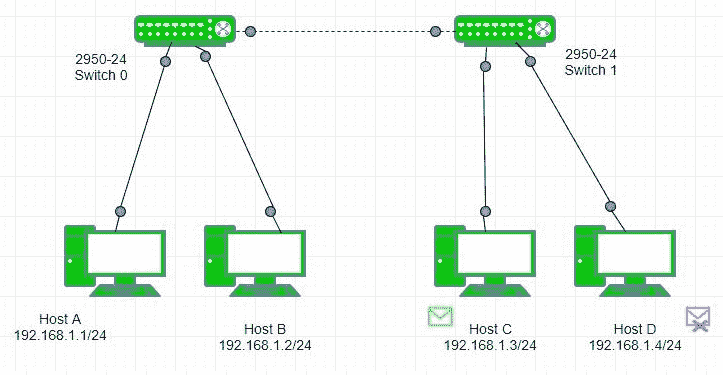

主机 C 将生成一个 ARP 回复，单播到交换机。交换机 1 将更新其媒体访问控制表，为主机 C 添加一个条目

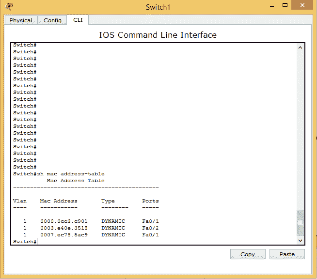

交换机(交换机 0 和交换机 1)这次都将向主机 A 单播此 ARP 回复，因为这次交换机已经获知了主机 A 的 MAC 地址

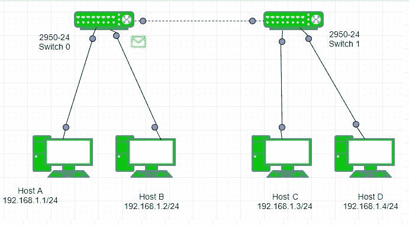

该帧被成功传送到解析 ARP 的主机 A。

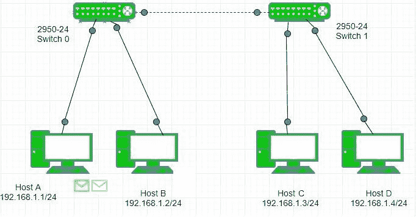

现在，ICMP 回应请求被单播到主机 c。

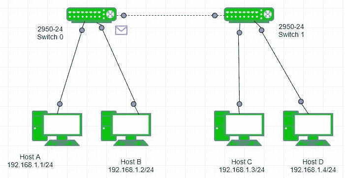

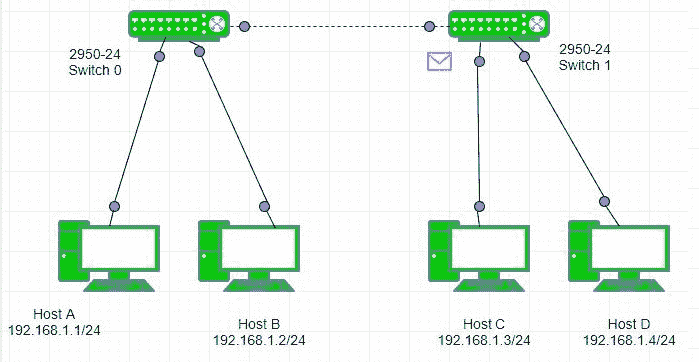

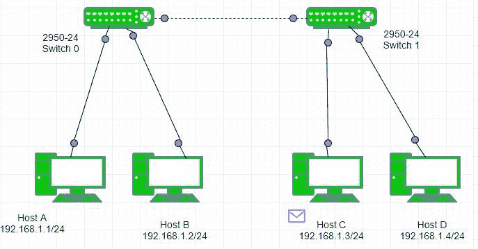

ICMP 回送回复被单播到主机 a。

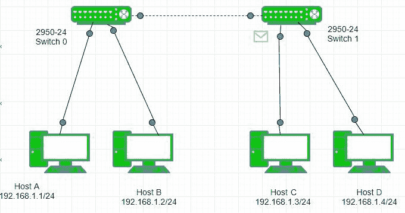

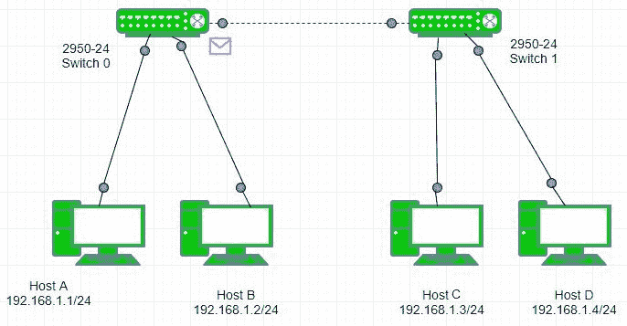

**记得–**
**交换机什么时候广播？**如果主机已经广播了一个帧，那么接收该帧的交换机无论如何都会通过其端口进一步广播该帧。
**交换机什么时候会做泛洪(未知单播)？**如果主机单播了一个帧，而交换机的 Mac 表中没有目的 Mac 地址，那么交换机将泛洪通过除接收帧的端口之外的所有端口。
**交换机什么时候会单播？**如果交换机的 Mac 表中有目的主机的条目，则该帧将是单播帧。