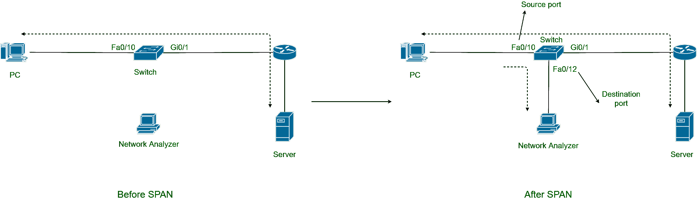

# 交换机端口分析器(SPAN)

> 原文:[https://www.geeksforgeeks.org/switch-port-analyzer-span/](https://www.geeksforgeeks.org/switch-port-analyzer-span/)

**交换机端口分析器(SPAN)** 是交换机专用工具，它复制通过交换机端口的[以太网](https://www.geeksforgeeks.org/local-area-network-lan-technologies/)帧，并将这些帧发送到特定端口。交换机本身不分析这些复制的帧，它将帧从特定端口发送到网络分析器。网络分析器可以是专用构建硬件设备或运行在主机上的应用程序。对这些帧的分析是为了排除网络故障。有时还会进行框架分析来挖掘框架的内容，以发现隐藏在框架内部的任何恶意内容。

事实上，你也可以在你的电脑上安装网络分析仪(例如 [Wireshark](https://www.geeksforgeeks.org/introduction-to-wireshark/) 网络分析仪)，开始分别分析以太网卡和无线网卡的以太网帧和 802.11 帧。

**Span 的工作:**
考虑下图，包含交换机、服务器、PC 和网络分析仪。在交换机上配置 SPAN 之前，帧通常从 PC 流向服务器，反之亦然。但是在交换机上配置 SPAN 后，交换机开始复制通过其端口的帧，并将它们发送到网络分析器。

**Figure –** Frame copying and forwarding in SPAN

交换机在将帧传输出端口后复制帧，然后将其发送到网络分析器。在 SPAN 会话中定义了“从哪些端口复制帧以及将复制的帧发送到哪里”的规则。您可以在交换机上定义许多 SPAN 会话。

SPAN 会话中可能有多个源端口，但只有一个目标端口。复制帧的端口称为源端口，发送复制帧的端口称为目的端口。可以在端口上为双向或单向流量定义 SPAN 会话。还可以在虚拟局域网上定义跨转会话，然后交换机将从该虚拟局域网中的所有端口复制帧。但是您不能同时定义包含端口和 vlans 的会话。span 会话必须只包含端口或 vlans。

**远程 SPAN 和封装的远程 SPAN :**
考虑一下情况，如果配置了 SPAN 的交换机上没有目标端口，该怎么办。思科为这个问题提供了两个解决方案，RSPAN 和厄斯潘。

RSPAN 使用 vlan 将帧封装在 802.1Q 帧头(定义帧属于特定 vlan 的头)中，并通过网络发送。ERSPAN 适用于第 3 层交换机，它将 SPAN 流量封装在 GRE 隧道中，并将流量转发到网络。

**关于 SPAN 的一些重要规则:**

*   一个 SPAN 会话只包含一个目标端口。
*   没有两个 SPAN 会话具有相同的目标端口。
*   目标端口不能用作源端口。
*   目的端口不能正常工作，它不再学习媒体访问控制地址。
*   一个 SPAN 会话可能包含多个源端口。
*   SPAN 会话不能混合端口和 vlans。