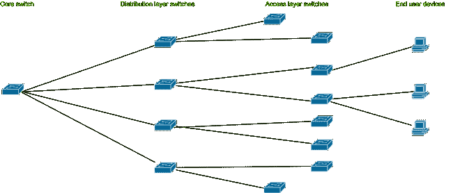
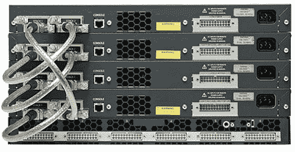

# 交换机堆叠概念

> 原文:[https://www.geeksforgeeks.org/switch-stacking-concept/](https://www.geeksforgeeks.org/switch-stacking-concept/)

交换机堆叠是一种绑定多个交换机的方法，以便它们可以充当单个交换机。该方法适用于接入层交换机。现在你想知道这些接入层交换机是什么？

实际上，局域网中有三种类型的交换机。它们是核心层、分布式层和接入层交换机。

<figure class="table">

| 开关类型 | 描述 |
| --- | --- |
| 接入层交换机 | 连接到最终用户设备的交换机。 |
| 分布层交换机 | 连接所有接入层和核心交换机的交换机。它们将网络流量从核心层分配到接入层交换机。它们通常比接入层交换机更强大。 |
| 核心交换机 | 这些是局域网中最内部的交换机。所有局域网流量都通过边缘路由器到达此交换机，然后将流量传输到分布层交换机。 |

**图-** 局域网中的交换机类型

假设您是网络管理员，必须在多层办公楼中设置局域网。将会有大量接入层交换机，您必须在每台交换机上逐个配置几乎相似的配置。在现实世界中，开关位于最近的线路中。它们在最近的布线中彼此靠近放置。其中一个开关负责堆栈的所有类型的操作，被称为**堆栈主设备**。堆叠主机和堆叠中的其他交换机是**堆叠成员**。它将整个交换机堆栈显示为网络的一个设备。配置所有开关可能会很麻烦&费时。因此，为了应对这些情况，使用了一种称为交换机堆叠的交换机功能来组合放置在最近的布线中的交换机。此功能允许网络工程师在最近的一条线路上堆叠交换机。

为了充分利用所有优势，交换机具有特殊的硬件和接口。一种特殊类型的网络用于连接堆叠中的交换机。交换机有一个专门用于堆叠的端口，称为**堆叠端口**。交换机堆叠通过堆叠端口以循环方式相互连接。

**图–**思科 Catalyst 3750 交换机堆栈

**使用交换机堆叠的好处:**

1.  所有交换机端口似乎都是单个交换机的一部分。
2.  由交换机堆栈维护的单个媒体访问控制地址表。
3.  堆栈只有一个管理 IP 地址。
4.  所有交换机都可以由单个管理 IP 管理。
5.  像 STP、OSPF 这样的各种协议运行在单个交换机上，而不是所有交换机上。
6.  单身 VLAN 管理。
7.  整个交换机作为一台交换机进行管理，包括所有密码、虚拟局域网和接口。
8.  每当我们想要向堆栈中添加新交换机时，主交换机都会自动对其进行配置。
9.  节约成本和时间。

**我们需要在哪里使用交换机堆叠？**
让我们考虑一个公司有 32 个端口交换机的小情况。现在公司想要 40 端口交换机，而不是 32 端口交换机。公司可以通过两种方式处理这种情况:

1.  公司可以购买新的 40 端口交换机，并在初始阶段对其进行重新配置(购买成本更高，配置时间更长。).
2.  公司可以使用交换机堆叠的概念，在现有的 32 端口交换机上再增加 8 端口交换机。

公司可能更倾向于选择第二种方案，因为它具有成本效益，并且需要较少的人力和时间。

</figure>