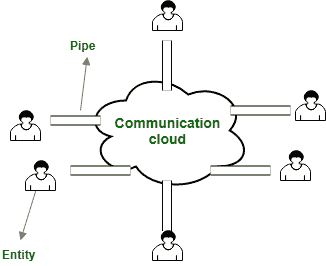

# 西比尔攻击

> 原文:[https://www.geeksforgeeks.org/sybil-attack/](https://www.geeksforgeeks.org/sybil-attack/)

Sybil 攻击是对等网络中常见的一种攻击类型，其中网络中的一个节点同时主动操作多个身份，并破坏信誉系统中的权威/权力。此攻击的主要目的是获得网络中的大多数影响力，以在系统中执行非法(关于网络中设置的规则和法律)操作。单个实体(计算机)具有创建和操作多个身份(用户帐户、基于 IP 地址的帐户)的能力。对于外部观察者来说，这些多重假身份似乎是真正的独特身份。

### 西比尔袭击史

这次袭击是以《西比尔》一书的主题命名的(主题名是西比尔·多塞特)。一篇名为[西比尔攻击](https://www.freehaven.net/anonbib/cache/sybil.pdf)的论文是由微软研究院的约翰·杜塞写的。

**几个例子:**

*   最近所谓的俄罗斯干涉美国大选是一种 sybil 攻击，在这种攻击中，脸书的多个假账户被操作。这种攻击属于伪 sybil 攻击的范畴，因为所使用的平台(脸书)本身没有受到损害。
*   Sybil 攻击在 Tor 网络上进行。
*   区块链网络中 51%的攻击。
*   在亚马逊和其他电子商务平台上，只有一个身份(如此大的计算能力是不道德的)的多个虚假评论可以从孟加拉国等国家雇佣。

### 形式模型

西比尔攻击论文中使用的模型很简单。它包括:

*   **E entities = c(correct) entities + f(faulty) entities**

    **正确–**诚实遵守网络中设置的协议和规则的实体(其诚实性得到验证)。
    **故障–**行为武断且无法预测的实体。他们不诚实地遵守网络中的协议和规则。

*   **通信云:**一种非常通用的云，不同实体之间的消息通过它传播。
*   **pipe:** to connect an entity with the communication cloud

    

    ### 梅毒发作的类型

    *   在直接攻击中，诚实节点直接受到 sybil 节点的影响。
    *   在间接攻击中，诚实节点受到直接与 sybil 节点通信的节点的攻击。这个中间节点受到危害，因为它受到 sybil 节点的恶意影响。

    ### 比特币网络如何防范 sybil 攻击？

    比特币网络使用工作证明(PoW)共识算法来证明添加到区块链的任何区块的真实性。需要相当大的计算能力来完成工作，这为矿工做诚实的工作提供了激励(比特币奖励；目前每开采一个区块 12.5 个比特币),对有缺陷的作品没有奖励。事务由每个节点验证，如果块中包含错误的事务，则被拒绝为无效。一种称为 51%攻击的 sybil 攻击在比特币网络中实际上也是不可能的，因为矿工太多，单个组织很难控制 51%的矿工。

    ### 预防梅毒发作的方法

    **赋予不同成员不同的权力–**这是基于信誉体系。不同权力等级的成员被赋予不同的声誉等级。

    **创建身份的成本–**为了防止网络中出现多个虚假身份，我们可以为每个旨在加入网络的身份投入成本。需要注意的一点是，让同时操作多个假身份变得不可行比创建新身份更有意义。多重身份可以加强安全性、匿名性、防止审查。

    **加入网络前的身份验证–**

    *   **直接验证:**已经建立的成员验证网络的新加入者
    *   **间接验证:**已建立的成员验证一些其他成员，这些成员又可以验证其他新的网络加入者。由于验证新加入者的成员是由一个已建立的实体验证和确认的，新加入者被信任是诚实的。

    **注意:**即使以上技术让网络上做 sybil 攻击变得困难，但这样的攻击也不是没有可能。