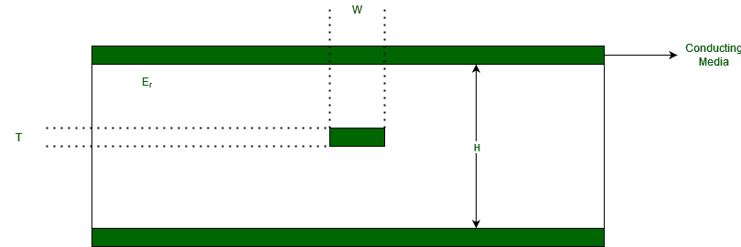

# 对称带状线

> 原文:[https://www.geeksforgeeks.org/symmetric-stripline/](https://www.geeksforgeeks.org/symmetric-stripline/)

这是一种[传输媒体](https://www.geeksforgeeks.org/types-transmission-media/)。这是创建传输线的可靠方法之一。它是一条横向电磁传输线。这是罗伯特·m·巴雷特发明的。

在计算值的情况下，您可以考虑以下参数。带状线是一条宽为 W 单位、厚为 T 单位的导电材料带，上面是电介质材料，下面是电介质材料。这主要用于印刷电路板设计和布线，以将一个组件连接到另一个组件。

t =厚度 W =宽度 Er =相对介电常数 H =接地层之间的距离

**带状线的特性:**

1.  夹在两个接地层之间的扁平金属条。
2.  衬底的绝缘材料形成电介质，通常由称为 FR7 的阻燃材料制成。
3.  它是非分散的。
4.  没有截止频率。
5.  良好的抗电磁感应能力。
6.  与微带相比，传播速度较慢。
7.  也可以支持更高阶的 TM 和 TE 模式，但这通常是避免的。
8.  介电损耗引起的衰减与任何瞬变电磁线的衰减形式相同。
9.  带状线上的 TEM 模场必须满足拉普拉斯方程。

**计算对称带状线特性阻抗的公式:**

![ Z_{0}=\frac{60}{\sqrt{E_{r}}}ln[\frac{4H}{0.67\pi W(0.8+\frac{T}{W})}] ](img/65d8e4ee7feeaeee41a7dd7a24534054.png "Rendered by QuickLaTeX.com")