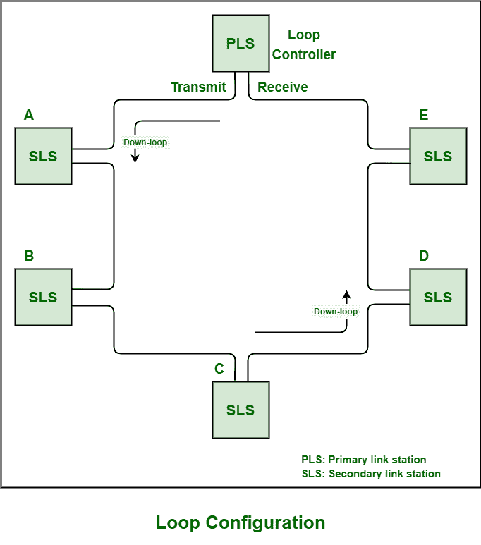
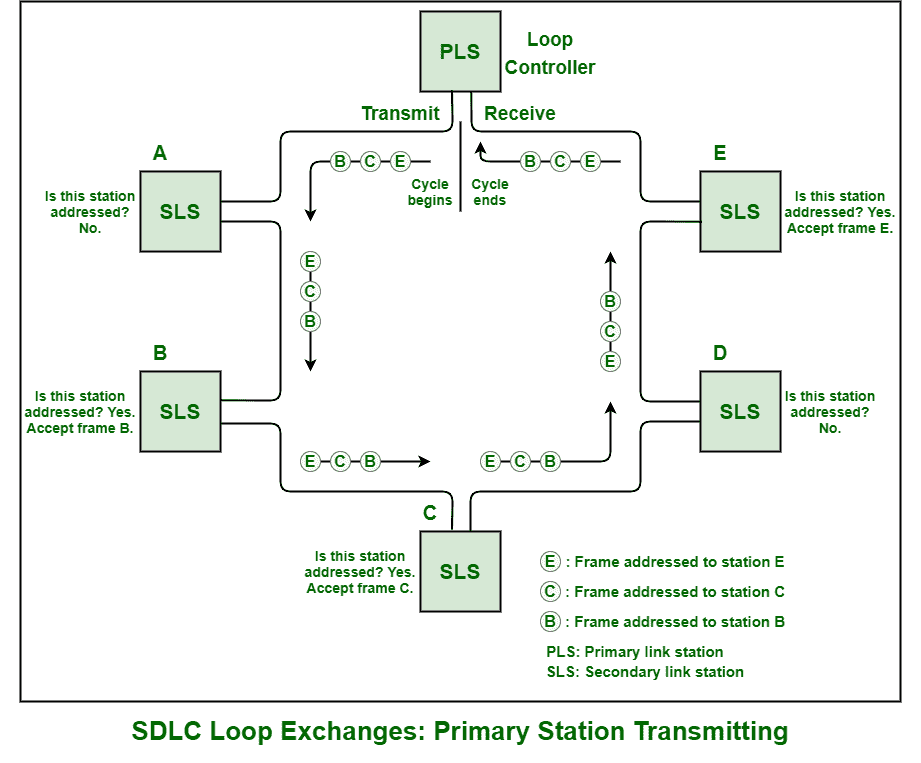
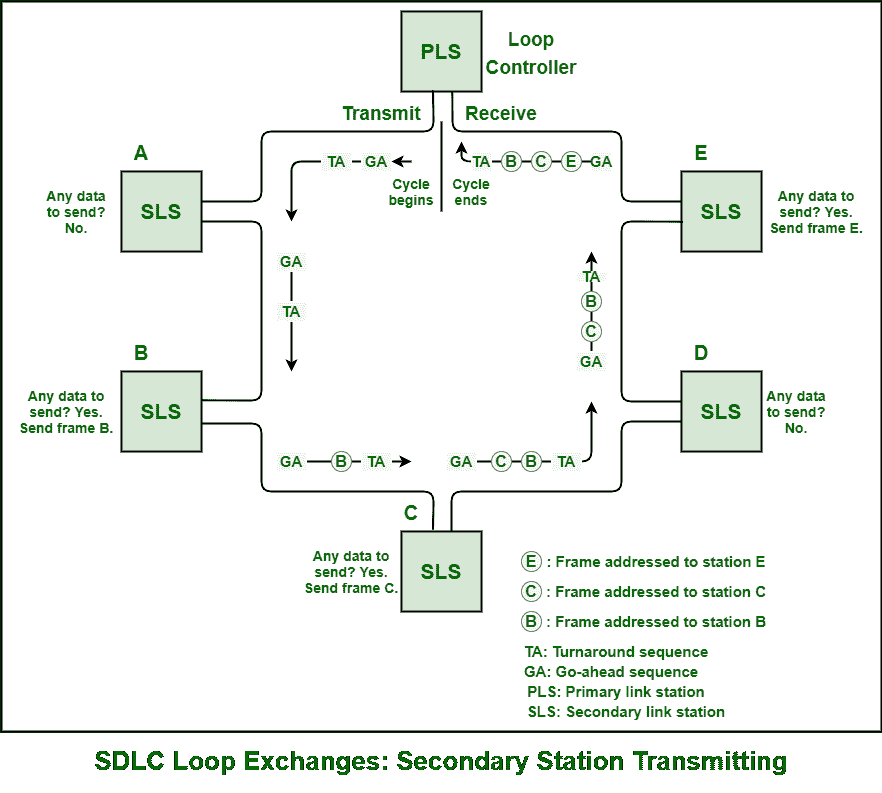

# 同步数据链路控制(SDLC)环路操作

> 原文:[https://www . geesforgeks . org/synchronic-data-link-control-SDLC-loop-operation/](https://www.geeksforgeeks.org/synchronous-data-link-control-sdlc-loop-operation/)

环路配置基本上是一条通信链路，用于将数据或信息从一个链路站传输到另一个链路站，从而形成整个环路。在主站的发送端口，链路连接开始，以串行方式连接一个或多个从站，然后在主站的接收端口结束。在下面，我们可以看到包含总共五个辅助站的环路。

**SDLC 环路运行:**

1.  **主站发送:**
    主站基本上向一个或多个从站传输数据帧或数据包。被发送或传送的每个帧都包含该帧所指向的站(即次站)的地址。当主站成功传输数据帧时，它跟随最后一帧的最后一个标志以及总共八个连续的逻辑 0，即所谓的周转序列，然后跟随连续的逻辑 1，即所谓的前进序列(01111111)。

依次，每个从站解码每个数据帧的地址字段，然后移除寻址到它们的这些数据帧。次级站基本上是作为任何下行次级站的中继器出现的。他们将数据帧传送到下行链路站。该站基本上使用 CFGR 命令使许多诊断操作由辅助站执行。

*   **Secondary Station Transmitting :**
    Secondary station cannot perform task on their own. They cannot transmit or transfer any of the data frames of their own unless and until they receive a data frame with P bit set. The initial or first secondary station that basically receives a data frame addressed to it with the P bit set alters or converts the seventh logic 1 in the go-ahead sequence to a logic 0, therefore developing a flag. If anyhow it does not convert the go-ahead sequence that is received after the turnaround into a flag, then secondary station lose the opportunity to transmit or transfer data frames.

    来自次级站的每个响应帧通常被放入或插入刚好在周转序列之后或来自上行站的次级响应之后。只有当主站接收到它自己的周转序列、一系列响应帧以及继续序列时，周期才成功完成。次站只需要停止发送传输来中止或结束传输，而不需要它自己的中止序列。在传输期间，如果从站接收到八个连续的 0 位，它应该中止或结束或终止其传输，这种终止被称为关闭序列。主站负责建立该关断序列。

    