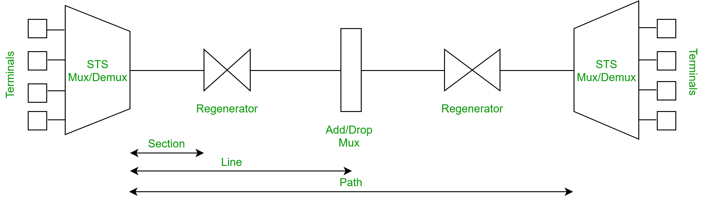
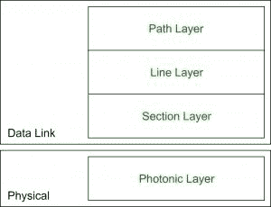

# 同步光网络(SONET)

> 原文:[https://www . geesforgeks . org/synchronic-optical-network-SONET/](https://www.geeksforgeeks.org/synchronous-optical-network-sonet/)

SONET 代表同步光网络。SONET 是由 Bellcore 开发的一种通信协议，用于使用光纤在相对较大的距离上传输大量数据。使用 SONET，多个数字数据流可以通过光纤同时传输。

**要点:**

*   由贝尔科开发
*   在北美使用
*   由美国国家标准协会标准化
*   类似于欧洲和日本使用的 SDH(同步数字体系)。

**为什么 SONET 被称为同步网络？**
单个时钟(主参考时钟，中国)处理整个网络中信号&设备的传输时序。

**SONET 网元:**

1.  **STS 多路复用器:**
    *   执行信号的多路复用
    *   将电信号转换成光信号
2.  **STS 解复用器:**
    *   执行信号的解复用
    *   将光信号转换成电信号
3.  **再生器:**

4.  **分插复用器:**

**为什么使用 SONET？**
SONET 用于将电信号转换成光信号，这样它可以传播更长的距离。

**SONET 连接:**

*   **部分:**连接两个相邻设备的网络部分。
*   **线路:**连接两个相邻多路复用器的网络部分。
*   **路径:**网络的端到端部分。

**SONET 层:**

SONET 包括四个功能层:

1.  **路径层:**
    *   它负责信号从其光源到其光学目的地的移动。
    *   STS Mux/Demux 提供路径层功能。
2.  **线层:**
    *   它负责信号在物理线路上的移动。
    *   STS 多路复用器/多路分解器和分插多路复用器提供线路层功能。
3.  **剖面层:**
    *   它负责信号在物理区域的移动。
    *   网络的每个设备都提供了剖面层功能。
4.  **光子层:**
    *   它对应于现场视察模型的物理层。
    *   它包括光纤通道的物理规格(有光= 1，无光= 0)。

**SONET 的优势:**

*   向远距离传输数据
*   低电磁干扰
*   高数据速率
*   大带宽