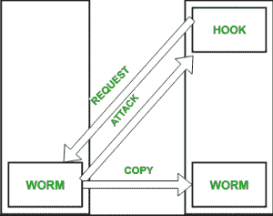

# 系统安全

> 原文:[https://www.geeksforgeeks.org/system-security/](https://www.geeksforgeeks.org/system-security/)

先决条件–[基本网络攻击](https://www.geeksforgeeks.org/basic-network-attacks/)、[病毒类型](https://www.geeksforgeeks.org/types-of-virus/)、
计算机系统的安全是一项至关重要的任务。这是一个确保操作系统机密性和完整性的过程。
如果一个系统的资源在任何情况下都按照预期的方式使用和访问，那么这个系统就是安全的，但是没有一个系统能够保证绝对的安全，免受各种恶意威胁和未经授权的访问。

系统的安全性可能受到两种违规行为的威胁:

*   **威胁:**有可能对系统造成严重破坏的程序。
*   **攻击:**试图破坏安全性并对资产进行未经授权的使用。

影响系统的安全违规可分为恶意和意外两类。**恶意威胁**，顾名思义是一种有害的计算机代码或网络脚本，旨在创建导致后门和安全漏洞的系统漏洞。**意外威胁**则相对更容易防范。示例:[拒绝服务 DDoS 攻击](https://www.geeksforgeeks.org/computer-network-denial-of-service-ddos-attack/)。

安全性可能会因上述任何违规行为而受到损害:

*   **违反保密:**这种类型的违反涉及未经授权读取数据。
*   **破坏完整性:**该破坏涉及未经授权修改数据。
*   **可用性破坏:**涉及未经授权的数据销毁。
*   **窃取服务:**涉及未经授权使用资源。
*   **拒绝服务:**涉及阻止合法使用系统。如前所述，这种攻击本质上可能是偶然的。

**安全系统目标–**
基于上述违规行为，以下安全目标旨在:

1.  **完整性:**
    系统中的对象不能被任何未经授权的用户访问&任何没有足够权限的用户都不能修改重要的系统文件和资源。
2.  **保密:**
    系统的对象必须只能由有限数量的授权用户访问。不是每个人都应该能够查看系统文件。
3.  **可用性:**
    系统的所有资源必须可供所有授权用户访问，即只有一个用户/进程无权占有所有系统资源。如果出现这种情况，可能会发生拒绝服务。在这种情况下，恶意软件可能会抢占资源&，从而阻止合法进程访问系统资源。

威胁可分为以下两类:

1.  **程序威胁:**
    黑客为劫持安全或改变正常进程的行为而编写的程序。
2.  **系统威胁:**
    这些威胁涉及滥用系统服务。他们努力创造一个操作系统资源和用户文件被滥用的环境。它们也被用作发起程序威胁的媒介。

**程序威胁的类型–**

1.  **Virus:** 
    An infamous threat, known most widely. It is a self-replicating and a malicious thread which attaches itself to a system file and then rapidly replicates itself, modifying and destroying essential files leading to a system breakdown. 

    此外，计算机病毒的类型可以简单描述如下:
    –文件/寄生–将自身附加到文件中
    –引导/内存–感染引导扇区
    –宏–用高级语言编写，如 VB，并影响 MS Office 文件
    –源代码–搜索和修改源代码
    –多态–每次复制的变化
    –加密–加密病毒+解密代码
    –隐形–通过修改部分避免被检测到 像读取系统
    调用
    –隧道传输一样，它将自己安装在中断服务例程和设备驱动程序
    –多部分中，感染系统的多个部分

2.  **Trojan Horse:** 
    A code segment that misuses its environment is called a Trojan Horse. They seem to be attractive and harmless cover program but are a really harmful hidden program which can be used as the virus carrier. In one of the versions of Trojan, User is fooled to enter its confidential login details on an application. Those details are stolen by a login emulator and can be further used as a way of information breaches. 

    另一个变化是间谍软件，间谍软件伴随着用户选择安装的程序，并下载广告显示在用户的系统上，从而创建弹出浏览器窗口，当用户访问某些网站时，它会捕获基本信息并将其发送到远程服务器。这种攻击也被称为**转换频道**。

3.  **陷阱门:**
    程序或系统的设计者可能会在软件中留下一个只有他才能使用的漏洞，陷阱门的工作原理类似。陷阱门很难检测到，因为要分析它们，需要仔细检查系统所有组件的源代码。

4.  **逻辑炸弹:**
    仅在特定情况下发起安全攻击的程序。

**系统威胁的类型–**
除了程序威胁，各种系统威胁也在危及我们系统的安全:

**1。蠕虫:**
一种通过网络传播的感染程序。与病毒不同，它们主要针对局域网。受蠕虫影响的计算机攻击目标系统，并在其上编写一个小程序“钩子”。该钩子进一步用于将蠕虫复制到目标计算机。这个过程递归地重复，很快局域网的所有系统都受到影响。它使用产卵机制来复制自己。蠕虫会生成自己的副本，耗尽大部分系统资源，并锁定所有其他进程。

蠕虫的基本功能可以表示为:

**2。端口扫描:**
这是黑客识别系统漏洞进行攻击的手段。这是一个自动化的过程，包括创建到特定端口的 TCP/IP 连接。为了保护攻击者的身份，端口扫描攻击是从**僵尸系统**发起的，僵尸系统是以前独立的系统，也为其所有者服务，同时被用于这种臭名昭著的目的。

**3。拒绝服务:**
此类攻击的目的不是收集信息或销毁系统文件。相反，它们被用于破坏系统或设施的合法使用。
这些攻击一般都是基于网络的。它们分为两类:
–第一类攻击使用大量系统资源，无法执行任何有用的工作。

例如，从网站下载一个文件，然后使用所有可用的 CPU 时间。
–第二类攻击涉及破坏设施的网络。这些攻击是滥用一些基本的 TCP/IP 原则的结果。
TCP/IP 的基本功能。

**采取的安全措施–**
为了保护系统，可以在以下级别采取安全措施:

*   **物理:**
    包含计算机系统的站点必须受到物理保护，以防武装和恶意入侵者。工作站必须小心保护。
*   **人类:**
    只有合适的用户才有权限访问系统。必须避免网络钓鱼(收集机密信息)和垃圾箱搜索(收集基本信息以获得未经授权的访问权限)。
*   **操作系统:**
    系统必须保护自己免受意外或有目的的安全破坏。
*   **网络系统:**
    几乎所有的信息都是通过网络在不同的系统之间共享的。拦截这些数据可能和闯入电脑一样有害。从今以后，网络应该得到适当的保护，以防止这种攻击。

通常，反恶意软件程序用于定期检测和移除此类病毒和威胁。此外，为了保护系统免受网络威胁，还使用了[防火墙](https://www.geeksforgeeks.org/computer-network-firewall-methodologies/)。