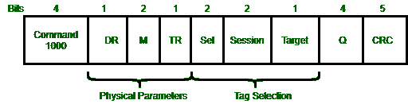

# 标签识别信息格式

> 原文:[https://www . geesforgeks . org/tag-identificati on-message-formats/](https://www.geeksforgeeks.org/tag-identification-message-formats/)

下图显示了查询消息的格式，作为阅读器到标签消息的一个示例。下行链路速率是有限的，从 27 kbps 到 128 kbps，因此消息是紧凑的。为了将消息识别为查询，命令字段带有代码 1000。

*   读取器传输和标签响应的物理层参数由下一个标志 DR、M 和 TR 决定。

*   三个字段选择要响应的标签，这三个字段是 Sel、会话、目标。它们是否已经在这些会话中被识别，并且标签保持对并发会话的跟踪。读者能够选择标识符的子集。通过使用不同的会话，多个读取器可以在重叠的覆盖区域中操作。

*   q 是这个命令最重要的参数。从 0 到 2 Q -1，定义标签将响应的时隙范围。为了保护消息字段，循环冗余校验是存在的。可以看出，在 5 位时，它比大多数 CRC 短。而查询消息也比大多数数据包短得多。

*   标签到阅读器的消息更简单。当阅读器处于控制状态时，它知道响应于它的每一次传输会有什么消息。比如 EPC 标识符，它们只是携带数据。

*   最初，标签只是为了识别的目的。为了类似非常小的计算机，标签随着时间的推移而增长。一些研究标签能够运行小程序来收集和处理数据，一些标签有传感器。这项技术的一个版本是“物联网”，它将物理世界中的对象连接到互联网。