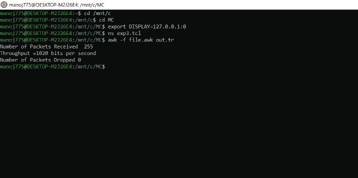

# 通过 TCP 创建 FTP 流量的 TCP 脚本

> 原文:[https://www . geesforgeks . org/TCL-script-to-create-FTP-traffic-over-TCP/](https://www.geeksforgeeks.org/tcl-script-to-create-ftp-traffic-over-tcp/)

在本文中，我们将了解如何编写一个工具命令脚本来模拟两个节点之间的 TCP 连接，并在 ns2 中在它们之间传递 FTP 流量。我们还将知道如何显示丢弃、接收和发送的吞吐量数据包。

**简介:**
程序中使用的路由算法是距离矢量路由协议。如果你不熟悉网络模拟器和工具命令语言，你可以先查看这个[https://www . geesforgeeks . org/basic of-NS2-and-otcltcl-script/](https://www.geeksforgeeks.org/basics-of-ns2-and-otcltcl-script/)。现在，让我们一步一步地讨论通过 TCP 创建 FTP 流量的 TCP 脚本的实现部分，如下所示。

**步骤-1 :**
首先，我们需要创建一个网络模拟器对象，并将路由协议( **rtproto** )初始化为距离矢量路由协议( **DV** )。

```
set ns [new Simulator]
$ns rtproto DV
```

**步骤-2 :**
接下来我们使用网络模拟器对象中的**节点**实例创建两个节点节点 0 和节点 1。

```
set node0 [$ns node]
set node1 [$ns node]
```

**步骤-3 :**
下一步是创建跟踪文件和 nam 文件。在这里它们分别被命名为 out.tr 和 out.nam。我们所需要做的就是使用一个跟踪文件对象来创建一个名为 out.tr 的新跟踪文件，并以写模式打开该文件。下一步是在模拟过程中使用 **trace-all** 将所有路由信息跟踪到跟踪文件。对于 nam 文件，我们也使用 **namtrace-all** 进行同样的操作。

```
set tf [open out.tr w]
$ns trace-all $tf
set nf [open out.nam w]
$ns namtrace-all $nf
```

**步骤-4 :**
我们现在使用双工链路实例在节点之间创建双工链路。这里我们需要指定三个参数:数据速率(1Mb)、延迟(10ms)和队列种类( **DropTail** )。

```
$ns duplex-link $node0 $node1 1Mb 10ms DropTail
```

**步骤 5 :**
代理是指在网络中的节点之间传送信息。我们现在需要 TCP 代理来完成这项任务。代理初始化如下。此外，代理分别连接到节点 0 和节点 1。下一步是连接这些代理。

```
set tcp2 [new Agent/TCP]
$ns attach-agent $node0 $tcp2
set sink2 [new Agent/TCPSink]
$ns attach-agent $node1 $sink2
$ns connect $tcp2 $sink2
```

**步骤-6 :**
我们的下一步是初始化 FTP 流量并连接到源 tcp2。这可以通过创建一个 FTP 对象并将流量附加到 tcp2 来实现。

```
set traffic_ftp2 [new Application/FTP]
$traffic_ftp2 attach-agent $tcp2
```

**第 7 步:**
接下来，我们添加一个**完成**过程，将所有数据刷新到跟踪文件中，然后运行 nam 文件。

```
proc finish {} {

global ns nf tf
$ns flush-trace
close $nf
close $tf
exec nam out.nam &
exit 0

}
```

**步骤-8 :**
我们通过调度 FTP 代理的事件和运行命令，最终关闭了 **tcl** 文件。这里的流量从时间 1.0 开始，到 3.0 停止。模拟在时间 5.0 结束。它可以定制更长或更短的持续时间。文件以运行实例结束。

```
$ns at 1.0 "traffic_ftp2 start"
$ns at 3.0 "traffic_ftp2 stop"
$ns at 5.0 "finish"
$ns run
```

**awk 文件创建:**
我们来了解一下如何创建一个 **awk 文件**来查看收到、丢弃的数据包数量以及整体吞吐量，如下所示。

**步骤 1:初始化部分–**

*   awk 文件从 **BEGIN** 块中指定的初始化部分开始。它包含所有必需的常量或变量初始化。这里我们需要变量发送、接收和丢弃来分别跟踪这些发送、接收和丢弃的数据包。接下来，我们需要开始和结束流量的开始和停止值。

```
BEGIN{
send=0;
received=0;
dropped=0;
start=1.0;
stop=3.0;
}
```

**第 2 步:内容块执行–**

*   下一个块是内容块。在这一部分中将逐行执行。有一些变量$1，$5 有不同的含义。这样的约定映射到跟踪文件中的某个模式或逻辑。表达式“/+/”表示发送了数据包，“r”表示收到了数据包，“d”表示丢弃了数据包。对于所有这样的动作，使用映射$1。$5 是一个标志，用于映射字符串“TCP”。

```
{
if($1=="/+/")
{
send++;
}

if($5=="tcp")
{
if($1=="r")
{
received++;
}
}

if($1=="d"){
dropped++;
}
}  
```

**步骤 3:结束块–**

*   **END** 块是 awk 文件中用于打印接收数据包数量和总吞吐量的最后一块。如果 ftp 流量没有初始化，则不会发送或接收任何数据包。在这种情况下，跟踪文件是空的。否则，我们可以打印所需的参数。

```
END{
if(send=="0" && received=="0")
{
print "empty trace file\t"
}
print "Number of Packets Received  " received
print "Throughput =" (received*8)/(start-stop) "bits per second"
print "Number of Packets Dropped = " dropped
}
```

**网络模拟器可视化:**
我们可以将网络模拟器中的输出可视化如下。

*   单击图中以绿色突出显示的开始按钮，流量从 1.0 开始，到 3.0 结束。同时，awk 文件计算并存储需要计算的值。


*   此外，为了评估流量，我们可以计算 awk 文件中的吞吐量和丢弃的数据包。以下命令用于运行 awk 文件。

```
awk -f filename.awk filename.tr
```

*   获得的输出如下所示。



**注意–**
由于节点之间的连接没有在任何时刻终止，因此不会有任何丢包。然而，模拟可以被定制为包括在特定间隔的这种终止，并且在这种情况下可能存在丢弃的分组。