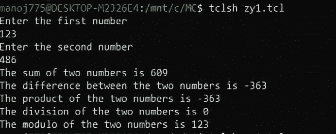

# TCL 脚本演示程序

> 原文:[https://www . geesforgeks . org/TCL-脚本到演示-程序/](https://www.geeksforgeeks.org/tcl-script-to-demonstrate-procedures/)

在本文中，我们将了解如何在 TCL 中使用过程。过程就像我们在任何其他编程语言中使用的函数，如 C、Java、Python 等。就像函数一样，过程接受参数并返回一些值。让我们来看一个简单的程序，它一步一步地调用程序来打印加、减、乘、除和模两个数。

**先决条件–**
如果你想了解 TCL 脚本的基础知识，请浏览本文[。](https://www.geeksforgeeks.org/basics-of-ns2-and-otcltcl-script/)

**概述:**
我们将通过逐块探索代码来尝试理解 TCL 中一个过程的语法。此外，我们还将查看 C 编程中过程的语法，以便进行比较并更好地理解。

**TCL 脚本演示程序:**
下面我们来讨论一下步骤如下。

**第一步:**
我们先来定义一下我们的程序。我们使用 **proc** 关键字来实现。创建程序 **addnumbers {}** 、sub numbers **{}** 、 **mulnumbers {}** 、 **divnumbers {}** 和 **modnumbers {}** 来分别计算两个数的和、差、积、除和模。

```
TCL script -

//Addition
proc addnumbers { a b } { 
    return [expr $a + $b]
     }

//Subtraction
proc subnumbers { a b } { 
    return [expr $a - $b] 
    } 

//Multiplication
proc mulnumbers { a b } { 
    return [expr $a * $b]
     } 

//Division
proc divnumbers { a b } { 
    return [expr $a / $b] 
    } 

//Modulus
proc modnumbers { a b } {
    return [expr $a % $b] 
    }
```

如上所示，语法可以概括如下。

```
proc procedurename {arguments} {
#body of the procedure
}
```

**注意–**
语法必须如上所示。如果忽略空格或在新行中键入左大括号，结果将是错误的。TCL 中的所有条件语句都遵循相同的语法。还要注意，像函数这样的过程可能有也可能没有返回类型。现在让我们看看上面这组函数在 C 编程中是什么样子的。

## C

```
//Addition
int addnumbers(int a, int b) {
               return a + b; }

//Subtraction
int subnumbers(int a, int b) {
               return a - b; }

//Multiplication
int mulnumbers(int a, int b) {
               return a * b; }

//Division
float divnumbers(float a, float b) {
               return a / b; }

//Modulus
int modnumbers(int a, int b) {
               return a % b; }
```

**步骤-2 :**
下一步是使用 get 读取两个数字 a 和 b。

```
puts "Enter the first number"
gets stdin a
puts "Enter the second number"
gets stdin b
```

**步骤-3 :**
最后一步是打印所有需要的值。在这里，我们还将查看 C 编程中的语法，以了解我们如何在 TCL 中调用函数。

```
puts "The sum of two numbers is [addnumbers $a $b]"
puts "The difference between the two numbers is [subnumbers $a $b]"
puts "The product of the two numbers is [subnumbers $a $b]"
puts "The division of the two numbers is [divnumbers $a $b]"
puts "The modulo of the two numbers is [modnumbers $a $b]"
```

因此，我们在上面看到的调用过程的语法如下所示。

```
[procedurename $argument1 $argument2 .....]
```

现在我们来对比一下 C 编程中调用函数的语法。

```
functionname(argument1,argument2,.....)
```

**步骤-4 :**
最后，我们查看整个代码，输出如下。

**代码–**

```
//Addition
proc addnumbers {a b} {
    return [expr $a+$b] 
    }

//Subtraction
proc subnumbers {a b} {
    return [expr $a-$b]
    }

//Multiplication
proc mulnumbers {a b} {
    return [expr $a*$b]  
    }

//Division
proc divnumbers {a b} {
    return [expr $a/$b]
    }

//Modulus
proc modnumbers {a b} {
  return [expr $a%$b]  
  } 

//Input-1
puts "Enter the first number"
gets stdin a

//Input-2
puts "Enter the second number"
gets stdin b

//called procedures
puts "The sum of two numbers is [addnumbers $a $b]"
puts "The difference between the two numbers is [subnumbers $a $b]"
puts "The product of the two numbers is [subnumbers $a $b]"
puts "The division of the two numbers is [divnumbers $a $b]"
puts "The modulo of the two numbers is [modnumbers $a $b]"
```

**输出:**



a=123 和 b=486 的输出