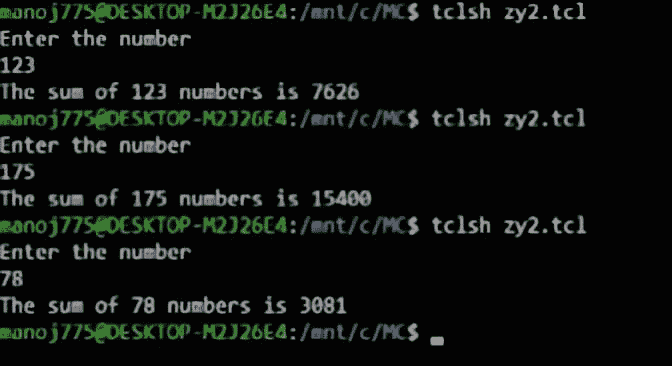

# TCL 脚本演示递归程序

> 原文:[https://www . geesforgeks . org/TCL-脚本-演示-递归-过程/](https://www.geeksforgeeks.org/tcl-script-to-demonstrate-recursive-procedures/)

在本文中，我们将通过一组独特的调用自己的 TCL 过程。您可能已经猜到，这些过程称为递归过程。这些类似于其他语言中的递归函数。因此，为了更好地理解它们，我们将考虑在 C 编程中作为递归函数编写的相同过程，以便更好地理解语法。

**先决条件–**
如果你想了解更多关于 TCL 的信息，请浏览以下文章。

*   [https://www . geesforgeks . org/basic of-NS2-and-otcltcl-script/](https://www.geeksforgeeks.org/basics-of-ns2-and-otcltcl-script/)
*   [https://www . geesforgeks . org/TCL-script-to-判定一个数字是正、负还是零-使用 if-else-statement/](https://www.geeksforgeeks.org/tcl-script-to-determine-whether-a-number-is-positive-negative-or-zero-using-if-else-statement/)
*   [https://www . geesforgeks . org/TCL-script-to-find-sum-n-自然数-使用循环-语句/](https://www.geeksforgeeks.org/tcl-script-to-find-sum-of-n-natural-numbers-using-looping-statements/)

**示例–**
我们将考虑一个简单的示例，其中我们的目标是通过递归调用**sumofnumbers { }**来找到 n 个自然数的和。让我们分块理解这段代码。

**Step-1 :**
我们的第一步是定义一个调用自身的过程，直到 n=1。我们使用 **proc** 关键字来定义一个过程。在我们这样做之前，让我们考虑一下一个常规过程是如何寻找 n 个自然数的和的。

```
proc sumofnnumbers {a} {
 set sum 0
 for {set i $a} {$i>=1} {incr i -1} {
    set sum [expr $sum+$i]
 }
 return $sum
}
```

正如您在上面看到的，我们使用传统的 **for-loop** 来定义程序。当然，我们可以从 1 数到 n，或者从 n 数到 1。在这种情况下，我们从 n 数到 1。

**Step-2 :**
我们可以用一个递归过程实现上面显示的相同过程，这个递归过程调用自己直到 n=1，并实现类似于传统循环语句的功能。

```
proc sumofnnumbers {a} {
if {$a>0} {
  return [expr $a+[sumofnnumbers [expr $a-1]]]
} else {
  return 0
}
}
```

**注:**

*   过程的语法必须如上所示。如果忽略空格或在新行上打开大括号，结果将是错误的。
*   同样的程序可以用来求 n 个自然数的乘积。您所需要做的就是用“*”替换“+”，并在 else 块中返回 1 而不是 0。

**第三步:**
让我们将同一个代码块与 C 语言中的代码块进行比较，以更好地理解语法。

```
int sumofnnumbers(int a)
{
if(a>0)
 {
   return a+sumofnnumbers(a-1);
 }
else
 {
   return 0;
 }
}
```

**步骤-4 :**
下一步是提示用户输入一个数字，并将其作为参数传递给程序–**sumofnumbers { }**。我们使用**获取**从用户处获取输入。

```
puts "Enter the number"
gets stdin a
puts "The sum of $a numbers is [sumofnnumbers $a]"
```

**第 5 步:**
输出的整个代码如下。

**代码–**

```
proc sumofnnumbers {a} {
if {$a>0} {
  return [expr $a+[sumofnnumbers [expr $a-1]]]
} else {
  return 0
}
}
puts "Enter the number"
gets stdin a
puts "The sum of $a numbers is [sumofnnumbers $a]"
```

**输出:**

