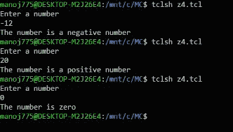

# TCL 脚本使用 if-else 语句

确定一个数字是正数、负数还是零

> 原文:[https://www . geesforgeks . org/TCL-script-to-判定一个数字是正-负-还是-零-使用 if-else-statement/](https://www.geeksforgeeks.org/tcl-script-to-determine-whether-a-number-is-positive-negative-or-zero-using-if-else-statement/)

在本文中，我们将了解工具命令语言中 **if-else** 语句的语法。我们将理解 TCL 脚本，在一个例子的帮助下，使用 if-else 语句来确定一个数字是正数、负数还是零。我们一个一个来讨论。

**先决条件–**
你也可以通过这篇文章了解更多关于 TCL 的信息，如下。
T4。

**概述:**
为了更好地理解它，我们将通过一个涵盖其所有变体的例子。为了进一步理解这个语句，我们将把它的语法与 C 语言的语法进行比较。

**示例–**
让我们举一个简单的例子，我们希望找出一个数字是正数、负数还是零。让我们按照以下步骤理解这段代码。

**Step-1 :**
我们的第一步是读取输入的号码。我们提示用户，使用**获取**进行输入。

```
puts "Enter a number"
gets stdin number
```

**步骤-2 :**
我们的下一步是适当的 if-else 条件映射。这可以通过以下方式完成。

```
if {$number>0} {
puts "The number is a positive number"
} elseif {$number<0} {
puts "The number is a negative number"
} else {
puts "The number is zero"
}
```

**注意–**
if-else 的语法必须如上所示。如果忽略空格或在新行中键入左大括号，结果将是错误的。

**第 3 步:**
现在让我们将上面这段代码与 [**C 语言**](https://www.geeksforgeeks.org/c-language-set-1-introduction/) 中的代码进行比较，以便更好地理解语法，如下所示。

```
if(number>0)
{
printf("The number is a positive number");
} else if(number<0)
{
printf("The number is a negative number");
}
else
{
printf("The number is zero");
}
```

**第 4 步:**
输出的整个代码如下。

**代码–**

```
puts "Enter a number "
gets stdin number
if {$number>0} {
puts "The number is a positive number"
} elseif {$number<0} {
puts "The number is a negative number"
} else {
puts "The number is zero"
}
```

**输出:**

