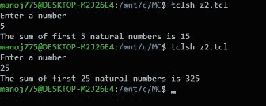

# TCL 脚本使用循环语句找到 n 个自然数的和

> 原文:[https://www . geesforgeks . org/TCL-script-to-find-sum-n-自然数-使用循环-语句/](https://www.geeksforgeeks.org/tcl-script-to-find-sum-of-n-natural-numbers-using-looping-statements/)

在本文中，我们将讨论 TCL 脚本的概述，并将通过一个示例来介绍使用循环语句查找 n 个自然数之和的 TCL 脚本。我们一个一个来讨论。

**先决条件–**
您可以通过此链接浏览本文，了解一些基础知识。[https://www . geesforgeks . org/basic of-NS2-and-otcltcl-script/](https://www.geeksforgeeks.org/basics-of-ns2-and-otcltcl-script/)。

**概述:**
我们将通过一个简单的例子来理解工具命令语言中的 **while** 循环和 **for** 循环的语法。在这个例子中，我们将首先使用 while 循环来找到前 n 个自然数的和，然后我们将看到如何使用 for 循环来完成同样的操作。我们还会将语法与熟悉的语言进行比较，以便更好地理解它。

**While-loop 实现:**
我们将讨论如下实现步骤。

**步骤-1 :**
第一步是在提示后从用户处读取一个数字。阅读我们使用的数字 get，我们使用 put 给出提示。

```
puts "Enter a number"
gets stdin b
```

**Step-2 :**
我们的下一步是将和初始化为 0，迭代变量 I 初始化为 0。在此之后，我们可以拥有代码的 while 循环实现。

```
set sum 0
set i 0
while {$i<=$b} {
 set sum [expr $sum+$i]
 incr i
}
```

**注意–**
while 循环的语法必须如上所示。如果忽略空格或在新行中键入左大括号，结果将是错误的。

**步骤 3 :**
上面指定的 while 循环的实现在 C 编程中如下所示。

```
sum=0;
i=0;
while(i<=b)
{
sum=sum+i;
i++;  
}
```

**步骤-4 :**
最后，整个代码和输出如下。
**代码–**

```
puts "Enter a number"
gets stdin b
set sum 0
set i 0
while {$i<=$b} {
 set sum [expr $sum+$i]
 incr i
}
puts "The sum of first $b natural numbers is $sum"
```

**输出:**



**For-loop 实现:**
我们将讨论如下实现步骤。

**Step-1 :**
前两行代码与 while 循环中的代码相同。那么，让我们看看 for 循环实现部分。

```
set sum 0
for {set i 1} {$i<=$b} {incr i} {
set sum [expr $sum+$i]
}
```

**注意–**
for 循环的语法必须如上所示。如果忽略空格或在新行中键入左大括号，结果将是错误的。

**步骤 2 :**
上面指定的 for 循环的实现在 C 编程中如下所示。

```
sum=0;
for(i=1;i<=n;i++)
{
sum=sum+i;
}
```

**步骤-3 :**
最后，让我们按如下方式查看整个代码及其输出。
**代码–**

```
puts "Enter a number"
gets stdin b
set sum 0
for {set i 1} {$i<=$b} {incr i} {
set sum [expr $sum+$i]
}
puts "The sum of first $b natural numbers is $sum"
```

**输出:**

