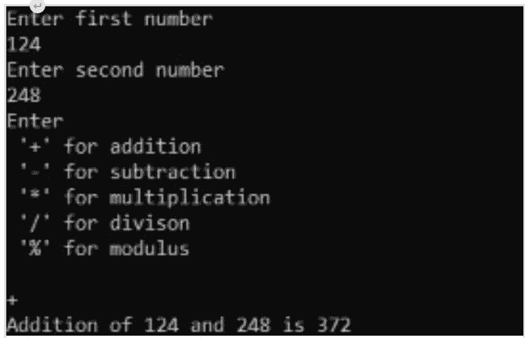
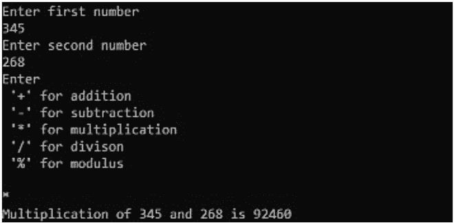
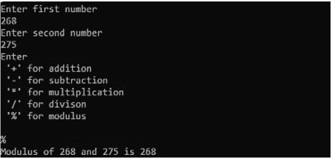

# 使用 switch 语句执行适当算术运算的 TCL 脚本

> 原文:[https://www . geesforgeks . org/TCL-script-to-perform-算术运算-使用-switch-statement/](https://www.geeksforgeeks.org/tcl-script-to-perform-appropriate-arithmetic-operations-using-switch-statement/)

在本文中，我们将概述使用 switch 语句执行适当算术运算的 TCL 脚本，并将借助一个示例来实现。我们一个一个来讨论。

**先决条件–**
如果你想了解更多关于 TCL 的信息，请浏览这篇文章。

**概述:**
我们将通过一个简单的例子来理解工具命令语言中 switch 语句的基本语法。在本例中，我们的目标是基于我们指定的符号执行算术运算。例如，如果我们指定“+”，那么加法必须按类似方式执行。

**使用 switch 语句执行适当算术运算的步骤:**
这里，我们将实现 TCL 脚本，使用 switch 语句按如下步骤逐步执行适当的算术运算。

**第一步:输入数字:**
首先，我们需要读取两个数字 a 和 b。

```
puts "Enter the first number "
gets stdin a
puts "Enter the second number "
gets stdin b
```

**第二步:阅读输入:**
其次，我们需要提示输入想要的字符，并且必须阅读。

```
puts "Enter \n '+' for addition\n '-' for subtraction\n '*' for multiplication\n
'/' for division"
gets stdin ch
```

**第三步:写 switch 语句:**
现在，我们需要写一个 Switch 语句，来映射到合适的符号。

```
switch $ch {
 "+" {
        set result [expr $a+$b]
        puts "Addition of $a and $b is $result"
     }
 "-" {
        set result [expr $a-$b]
        puts "Subtraction of $a and $b is $result"
     }
 "*" {
        set result [expr $a*$b]
        puts "Multiplication of $a and $b is $result"  
     }
 "/" {
        set result [expr $a*$b]
        puts "Division of $a and $b is $result"  
     }
 "%" {
        set result [expr $a%$b]
        puts "Modulo of $a and $b is $result"  
     }
 default {
         puts "Enter the appropriate input"
         }
}
```

**注意–**
switch 语句的语法应该如上所示。如果忽略空格或在新行中键入左大括号，结果将是错误的。当然，我们只对 TCL 中的字符使用双引号。

**第 4 步:理解语法:**
现在为了更好地理解语法，C 编程版的加法(+)案例如下所示。

```
case '+':
 result=a+b;
 printf("Addition of %d and %d is %d",a,b,result);
 break;
```

如您所见，我们在 TCL 中不使用关键字 **case** 后跟冒号“ **:** ”。相反，我们直接指定所需的 action 语句，后跟花括号中的主体。中断语句对于 TCL 脚本不是必需的。

**第 5 步:TCL 脚本使用** **开关执行适当的算术运算语句:**
现在，让我们看看使用 TCL 的完整代码是如何如下的。

**代码–**

```
puts "Enter the first number "
gets stdin a
puts "Enter the second number "
gets stdin b
puts "Enter\n '+' for addition\n '-' for subtraction\n '*' for multiplication\n '/' for division"
gets stdin ch
switch $ch {
 "+" {
        set result [expr $a+$b]
        puts "Addition of $a and $b is $result"
     }
 "-" {
        set result [expr $a-$b]
        puts "Subtraction of $a and $b is $result"
     }
 "*" {
        set result [expr $a*$b]
        puts "Multiplication of $a and $b is $result"  
     }
 "/" {
        set result [expr $a*$b]
        puts "Division of $a and $b is $result"  
     }
 "%" {
        set result [expr $a%$b]
        puts "Modulo of $a and $b is $result"  
     }
 default {
         puts "Enter the appropriate input"
         }
}
```

**输出:**
一组输入的输出如下。

**添加–**



**用于乘法–**



**模量–**

