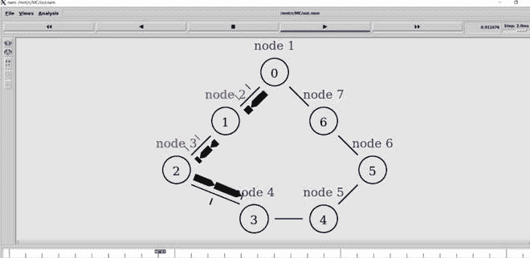
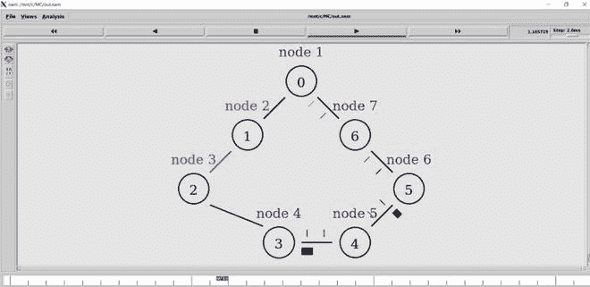

# TCL 脚本模拟 ns2 中的链路状态路由

> 原文:[https://www . geesforgeks . org/TCL-脚本-模拟-链接-状态-路由-in-ns2/](https://www.geeksforgeeks.org/tcl-script-to-simulate-link-state-routing-in-ns2/)

在本文中，我们将了解如何使用网络模拟器编写一个 TCL 脚本来模拟其中一个路由协议链路状态路由(也称为 dijkstra 算法)。要了解更多关于 TCL 脚本的基础知识，您可以查看本文[。](https://www.geeksforgeeks.org/basics-of-ns2-and-otcltcl-script/)

**TCL 脚本模拟 ns2 中的链路状态路由:**
要实现 TCL 脚本模拟 ns2 中的链路状态路由，我们将经历模拟 LS (Link State)路由的各个步骤，每个步骤有几行代码如下。

**步骤-1:初始化网络:**
第一步是初始化网络模拟器，我们通过创建一个网络模拟器对象来完成。之后，我们将 **rtproto** (路由协议)初始化为链路状态( **LS** )。

```
set ns [new Simulator]
$ns rtproto LS
```

**第 2 步:创建节点数:**
我们接下来创建一个随机的节点数，比如说 7。我们使用**节点**实例如下创建这些节点。

```
set node1 [$ns node]
set node2 [$ns node]
set node3 [$ns node]
set node4 [$ns node]
set node5 [$ns node]
set node6 [$ns node]
set node7 [$ns node]
```

**步骤-3:创建跟踪文件:**
我们的下一步是创建跟踪文件和 nam 文件。nam 文件用于查看模拟器输出，而跟踪文件跟踪流程中的所有路由信息。为此，我们创建跟踪文件和 nam 文件对象，然后以写模式打开文件。 **trace-all** 实例用于将所有路由信息跟踪到跟踪文件中，类似地 **namtrace-all** 用于 nam 文件。

```
set tf [open out.tr w]
$ns trace-all $tf
set nf [open out.nam w]
$ns namtrace-all $nf
```

**步骤-4:标记节点:**
在下一步中，如果我们愿意，我们可以标记节点。这里我们将它们从节点 0 标记到节点 6。我们还可以通过为标签分配不同的颜色来自定义标签，从而更清楚地查看模拟。这里我们将使用红色和蓝色。

```
$node1 label "node 1"
$node1 label "node 2"
$node1 label "node 3"
$node1 label "node 4"
$node1 label "node 5"
$node1 label "node 6"
$node1 label "node 7"
$node1 label-color blue
$node2 label-color red
$node3 label-color red
$node4 label-color blue
$node5 label-color blue
$node6 label-color blue
$node7 label-color blue
```

**步骤-5:创建双工链路:**
下一步是在最终形成环的节点之间创建双工链路。这可以通过使用双工链路实例并指定三个参数来实现:数据速率(1.5Mb)、延迟(10ms)和队列种类( **DropTail** )。

```
$ns duplex-link $node1 $node2 1.5Mb 10ms DropTail
$ns duplex-link $node2 $node3 1.5Mb 10ms DropTail
$ns duplex-link $node3 $node4 1.5Mb 10ms DropTail
$ns duplex-link $node4 $node5 1.5Mb 10ms DropTail
$ns duplex-link $node5 $node6 1.5Mb 10ms DropTail
$ns duplex-link $node6 $node7 1.5Mb 10ms DropTail
$ns duplex-link $node7 $node1 1.5Mb 10ms DropTail
```

**第 6 步:确定节点之间链接的方向:**
现在我们需要适当确定节点之间链接的方向，以获得适当的对齐。**双工链路操作**实例也用于此目的。

```
$ns duplex-link-op $node1 $node2 orient left-down
$ns duplex-link-op $node2 $node3 orient left-down
$ns duplex-link-op $node3 $node4 orient right-down
$ns duplex-link-op $node4 $node5 orient right
$ns duplex-link-op $node5 $node6 orient right-up
$ns duplex-link-op $node6 $node7 orient left-up
$ns duplex-link-op $node7 $node1 orient left-up
```

**第 7 步:连接 TCP 代理:**
下一步是在两个节点连接 TCP 代理(使用连接代理)，假设节点 1 和节点 4。我们可以通过创建源和接收器对象并使用 connect 实例连接它们来实现这一点。

```
set tcp2 [new Agent/TCP]
$ns attach-agent $node1 $tcp2
set sink2 [new Agent/TCPSink]
$ns attach-agent $node4 $sink2
$ns connect $tcp2 $sink2
```

**步骤-8:创建 FTP 流量:**
我们的下一步是创建 FTP 流量并附加到 TCP 源。然后，流量流经节点 1 和节点 4。我们可以通过创建一个 FTP 代理并将其附加到 tcp2 来实现这一点。

```
set traffic_ftp2 [new Application/FTP]
$traffic_ftp2 attach-agent $tcp2
```

**步骤-9:添加完成过程:**
下一步是添加完成过程，将所有数据刷新到跟踪文件中，然后运行 nam 文件。

```
proc finish{} {

global ns nf
$ns flush-trace
close $nf
exec nam out.nam &
exit 0

}
```

**步骤-10:调度 FTP :**
最后一步是按要求的时间间隔调度 FTP 流量。我们还可以使用 **rtmodel-at** 实例在某个时间戳禁用任意一对节点之间的链接，然后在某个时间后启用它。这主要是为了测试的目的。这里我们已经禁用了节点 2 和 3 之间的链接。程序以运行命令结束。

```
$ns at 0.5 "traffic_ftp2 start"
$ns rtmodel-at 1.0 down $node2 $node3
$ns rtmodel-at 2.0 up $node2 $node3
$ns at 3.0 "traffic_ftp2 start"
$ns at 4.0 "traffic_ftp2 stop"
$ns at 5.0 "finish"
$ns run
```

**输出:**
最终输出可以可视化如下。



禁用链接前的模拟

如上图所示，从节点 1 到节点 4 有正常的数据包流。现在，我们在时间 1 禁用节点 2 和 3 之间的链接，模拟发生如下变化。禁用的链路显示为红色，此时数据包流改变方向，而不是原来的路由到节点 4。



当节点 2 和节点 3 之间的链路被禁用时的模拟