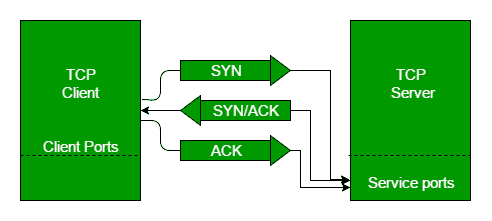
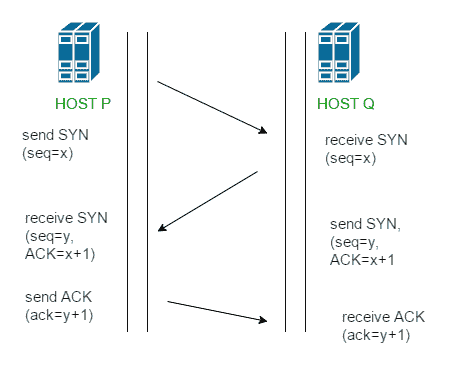

# TCP 三次握手过程

> 原文:[https://www.geeksforgeeks.org/tcp-3-way-handshake-process/](https://www.geeksforgeeks.org/tcp-3-way-handshake-process/)

这也可以看作是建立 TCP 连接的一种方式。在进入细节之前，让我们看一些基础知识。TCP 代表**传输控制协议**，表示它做了一些事情来可靠地控制数据的传输。

设备之间通过互联网进行通信的过程按照当前的 **TCP/IP** 套件模型(OSI 参考模型的剥离版本)进行。应用层是一堆 TCP/IP 模型的顶层，网络引用的应用程序(如客户端的网络浏览器)从这里与服务器建立连接。从应用层，信息被传输到传输层，在这里我们的主题进入画面。这一层的两个重要协议是–TCP， **UDP(用户数据报协议)**，其中 TCP 很流行(因为它为建立的连接提供了可靠性)。但是，您可以在查询域名系统服务器时找到 UDP 的应用程序，以获得网站使用的域名的二进制等效物。

TCP 提供可靠的通信，这种通信被称为**肯定应答重传(PAR)** 。传输层的协议数据单元称为段。现在，使用 PAR 的设备会重新发送数据单元，直到收到确认。如果在接收端接收的数据单元被损坏(它用用于错误检测的传输层的校验和功能检查数据)，接收端将丢弃该数据段。因此，发送方必须重新发送未收到肯定确认的数据单元。您可以从上述机制中认识到，为了建立可靠的 TCP 连接，发送方(客户端)和接收方(服务器)之间会交换三个数据段。让我们深入研究这种机制是如何工作的:

*   **步骤 1 (SYN):** 在第一步中，客户端想要与服务器建立连接，因此它发送带有 SYN(同步序列号)的段，该段通知服务器客户端可能开始通信，以及它以什么序列号开始段
*   **步骤 2 (SYN + ACK):** 服务器通过设置 SYN-ACK 信号位来响应客户端请求。确认(ACK)表示收到的数据段的响应，SYN 表示数据段可能以什么序列号开始
*   **步骤 3(确认):**在最后一部分中，客户端确认服务器的响应，并且它们都建立了可靠的连接，通过该连接它们将开始实际的数据传输