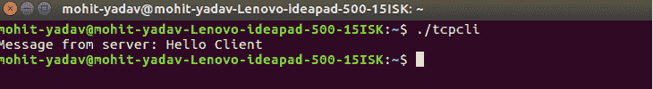
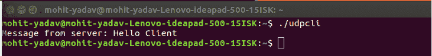

# TCP 和 UDP 服务器使用选择

> 原文:[https://www . geesforgeks . org/TCP-and-UDP-server-use-select/](https://www.geeksforgeeks.org/tcp-and-udp-server-using-select/)

**先决条件:**T2【TCP】T4【UDP】

在之前的文章中，我们已经看到了一个 **TCP** 服务器和一个 **UDP** 服务器。但是现在我们可以将并发的 TCP echo 服务器和迭代的 UDP 服务器组合成一个服务器，使用 select 来复用 TCP 和 UDP 套接字。

**选择**功能用于在 TCP 和 UDP 套接字之间进行选择。该函数向内核发出指令，等待多个事件中的任何一个事件发生，并仅在一个或多个事件发生或经过指定时间后唤醒进程。

**示例**–只有当这些条件之一出现时，内核才会返回

*   {1，2，3}中的任何描述符都可以读取
*   {4，5，6}中的任何描述符都可以写入了
*   时间过去了 5 秒钟

整个过程可以分为以下几个步骤:

**服务器:**

1.  创建传输控制协议，即监听套接字
2.  创建一个 UDP 套接字
3.  将两个套接字都绑定到服务器地址。
4.  为 select 初始化一个描述符集，并计算我们将等待的最多 2 个描述符
5.  呼叫选择并获取就绪描述符(TCP 或 UDP)
6.  如果准备好的描述符是 TCP 的，处理新的连接；如果准备好的描述符是 UDP 的，处理接收数据报

UDP 客户端:

1.  创建一个 UDP 套接字。
2.  向服务器发送消息。
3.  等待，直到收到服务器的响应。
4.  关闭套接字描述符并退出。

**TCP 客户端:**

1.  创建一个 TCP 套接字。
2.  调用 connect 与服务器建立连接。
3.  当连接被接受时，给服务器写一条消息。
4.  阅读服务器的响应。
5.  关闭套接字描述符并退出。

**必要功能:**

```
int select(int maxfd, fd_set *readsset, fd_set *writeset, 
fd_set *exceptset, const struct timeval *timeout);
Returns: positive count of descriptors ready, 0 on timeout, -1 error
```

**论据:**

*   **maxfd:** 最大描述符就绪数。
*   **超时:**等待 select 返回的时间。

```
struct timeval{
long tv_sec;
long tv_usec;
};
if timeout==NULL then wait forever
if timeout == fixed_amount_time then wait until specified time
if timeout == 0 return immediately.
```

*   **readset:** 我们希望内核测试读取的描述符集。
*   **writeset:** 我们希望内核测试写入的描述符集。
*   **例外集:**我们希望内核测试异常条件的描述符集。

```
int read(int sockfd, void * buff, size_t nbytes);
Returns:  number of bytes read from the descriptor. -1 on error
```

**论据:**

1.  **sockfd:** 接收数据的描述符。
2.  **缓冲区:**应用程序缓冲区套接字描述符数据被复制到该缓冲区。
3.  **n 字节:**要复制到应用程序缓冲区的字节数。

**服务器 c**

## C

```
// Server program
#include <arpa/inet.h>
#include <errno.h>
#include <netinet/in.h>
#include <signal.h>
#include <stdio.h>
#include <stdlib.h>
#include <strings.h>
#include <sys/socket.h>
#include <sys/types.h>
#include <unistd.h>
#define PORT 5000
#define MAXLINE 1024
int max(int x, int y)
{
    if (x > y)
        return x;
    else
        return y;
}
int main()
{
    int listenfd, connfd, udpfd, nready, maxfdp1;
    char buffer[MAXLINE];
    pid_t childpid;
    fd_set rset;
    ssize_t n;
    socklen_t len;
    const int on = 1;
    struct sockaddr_in cliaddr, servaddr;
    char* message = "Hello Client";
    void sig_chld(int);

    /* create listening TCP socket */
    listenfd = socket(AF_INET, SOCK_STREAM, 0);
    bzero(&servaddr, sizeof(servaddr));
    servaddr.sin_family = AF_INET;
    servaddr.sin_addr.s_addr = htonl(INADDR_ANY);
    servaddr.sin_port = htons(PORT);

    // binding server addr structure to listenfd
    bind(listenfd, (struct sockaddr*)&servaddr, sizeof(servaddr));
    listen(listenfd, 10);

    /* create UDP socket */
    udpfd = socket(AF_INET, SOCK_DGRAM, 0);
    // binding server addr structure to udp sockfd
    bind(udpfd, (struct sockaddr*)&servaddr, sizeof(servaddr));

    // clear the descriptor set
    FD_ZERO(&rset);

    // get maxfd
    maxfdp1 = max(listenfd, udpfd) + 1;
    for (;;) {

        // set listenfd and udpfd in readset
        FD_SET(listenfd, &rset);
        FD_SET(udpfd, &rset);

        // select the ready descriptor
        nready = select(maxfdp1, &rset, NULL, NULL, NULL);

        // if tcp socket is readable then handle
        // it by accepting the connection
        if (FD_ISSET(listenfd, &rset)) {
            len = sizeof(cliaddr);
            connfd = accept(listenfd, (struct sockaddr*)&cliaddr, &len);
            if ((childpid = fork()) == 0) {
                close(listenfd);
                bzero(buffer, sizeof(buffer));
                printf("Message From TCP client: ");
                read(connfd, buffer, sizeof(buffer));
                puts(buffer);
                write(connfd, (const char*)message, sizeof(buffer));
                close(connfd);
                exit(0);
            }
            close(connfd);
        }
        // if udp socket is readable receive the message.
        if (FD_ISSET(udpfd, &rset)) {
            len = sizeof(cliaddr);
            bzero(buffer, sizeof(buffer));
            printf("\nMessage from UDP client: ");
            n = recvfrom(udpfd, buffer, sizeof(buffer), 0,
                        (struct sockaddr*)&cliaddr, &len);
            puts(buffer);
            sendto(udpfd, (const char*)message, sizeof(buffer), 0,
                (struct sockaddr*)&cliaddr, sizeof(cliaddr));
        }
    }
}
```

**TCP_Client.c**

## C

```
// TCP Client program
#include <netinet/in.h>
#include <stdio.h>
#include <stdlib.h>
#include <string.h>
#include <sys/socket.h>
#include <sys/types.h>
#define PORT 5000
#define MAXLINE 1024
int main()
{
    int sockfd;
    char buffer[MAXLINE];
    char* message = "Hello Server";
    struct sockaddr_in servaddr;

    int n, len;
    // Creating socket file descriptor
    if ((sockfd = socket(AF_INET, SOCK_STREAM, 0)) < 0) {
        printf("socket creation failed");
        exit(0);
    }

    memset(&servaddr, 0, sizeof(servaddr));

    // Filling server information
    servaddr.sin_family = AF_INET;
    servaddr.sin_port = htons(PORT);
    servaddr.sin_addr.s_addr = inet_addr("127.0.0.1");

    if (connect(sockfd, (struct sockaddr*)&servaddr,
                            sizeof(servaddr)) < 0) {
        printf("\n Error : Connect Failed \n");
    }

    memset(buffer, 0, sizeof(buffer));
    strcpy(buffer, "Hello Server");
    write(sockfd, buffer, sizeof(buffer));
    printf("Message from server: ");
    read(sockfd, buffer, sizeof(buffer));
    puts(buffer);
    close(sockfd);
}
```

UDP _ client . c

## C

```
// UDP client program
#include <arpa/inet.h>
#include <netinet/in.h>
#include <stdio.h>
#include <stdlib.h>
#include <strings.h>
#include <sys/socket.h>
#include <sys/types.h>
#define PORT 5000
#define MAXLINE 1024
int main()
{
    int sockfd;
    char buffer[MAXLINE];
    char* message = "Hello Server";
    struct sockaddr_in servaddr;

    int n, len;
    // Creating socket file descriptor
    if ((sockfd = socket(AF_INET, SOCK_DGRAM, 0)) < 0) {
        printf("socket creation failed");
        exit(0);
    }

    memset(&servaddr, 0, sizeof(servaddr));

    // Filling server information
    servaddr.sin_family = AF_INET;
    servaddr.sin_port = htons(PORT);
    servaddr.sin_addr.s_addr = inet_addr("127.0.0.1");
    // send hello message to server
    sendto(sockfd, (const char*)message, strlen(message),
        0, (const struct sockaddr*)&servaddr,
        sizeof(servaddr));

    // receive server's response
    printf("Message from server: ");
    n = recvfrom(sockfd, (char*)buffer, MAXLINE,
                0, (struct sockaddr*)&servaddr,
                &len);
    puts(buffer);
    close(sockfd);
    return 0;
}
```

**编译和运行上述代码的步骤:**

1.  编译服务器程序(gcc server.c -o ser)
2.  使用()运行服务器。/ser)
3.  在另一个终端上，编译 tcp 客户端程序(gcc tcp_client.c -o tcpcli)
4.  运行 tcp 客户端(。/tcpcli)
5.  在另一个终端上，编译 udp 客户端程序
6.  运行 udp 客户端(。/udpcli)

**上述代码的输出:**

  