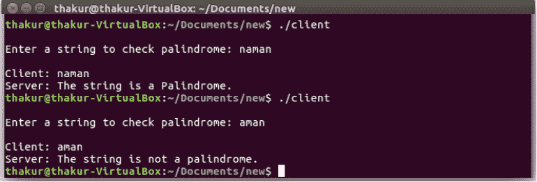
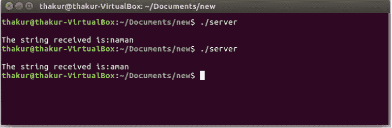

# 检查给定字符串是否回文的 TCP 客户端-服务器程序

> 原文:[https://www . geesforgeks . org/TCP-client-server-program-to-check-如果给定字符串是回文/](https://www.geeksforgeeks.org/tcp-client-server-program-to-check-if-a-given-string-is-palindrome/)

**先决条件:**

*   [C/c++](https://www.geeksforgeeks.org/socket-programming-cc/)中的 Socket 编程，
*   [TCP 和 UDP 服务器使用选择](https://www.geeksforgeeks.org/tcp-and-udp-server-using-select/)，
*   [UDP 服务器-客户端在 C 中的实现](https://www.geeksforgeeks.org/udp-server-client-implementation-c/)
*   [TCP 客户端-服务器在 C 中的实现](https://www.geeksforgeeks.org/tcp-server-client-implementation-in-c/)

本文描述了一个客户机和服务器设置，其中客户机连接，向服务器发送一个字符串，服务器显示原始字符串，并使用套接字连接向客户机发送确认字符串是否是回文。

**示例:**

```
Input: naman
Output: Palindrome

Input: geek
Output: Not Palindrome

```

**接近**:

*   在这种情况下，首先建立一个客户机-服务器连接。
*   当连接建立时，客户端将通过发送系统调用向服务器发送用户输入字符串。
*   在服务器端，服务器将等待客户端发送的字符串。
*   服务器通过读取系统调用读取字符串。
*   之后，服务器将[检查字符串是否为回文](https://www.geeksforgeeks.org/c-program-check-given-string-palindrome/)，并将确认信息发送回客户端。

**编译:**

1.  首先，运行服务器程序为

    ```
    gcc server.c -o server
    ./server
    ```

2.  在另一个终端上运行客户端程序

    ```
    gcc client.c -o client
    ./client
    ```

3.  服务器程序正在等待客户端发送的字符串。
4.  在客户端输入字符串。
5.  服务器程序将打印原始字符串。
6.  客户端程序将打印结果。

下面是上述方法的实现:

## 传输控制协议服务器

```
// defines in_addr structure
#include <arpa/inet.h>

// contains constants and structures
// needed for internet domain addresses
#include <netinet/in.h>

// standard input and output library
#include <stdio.h>

// contains string functions
#include <string.h>

// for socket creation
#include <sys/socket.h>

// contains constructs that facilitate getting
// information about files attributes.
#include <sys/stat.h>

// contains a number of basic derived types
// that should be used whenever appropriate
#include <sys/types.h>

main()
{
    struct sockaddr_in client, server;
    int s, n, sock, g, j, left, right, flag;
    char b1[20], b2[10], b3[10], b4[10];

    // creating socket
    s = socket(AF_INET, SOCK_STREAM, 0);

    // assign IP, PORT
    server.sin_family = AF_INET;

    // this is the port number of running server
    server.sin_port = 2000;
    server.sin_addr.s_addr = inet_addr("127.0.0.1");

    // Binding newly created socket
    // to given IP and verification
    bind(s, (struct sockaddr*)&server, sizeof server);
    listen(s, 1);
    n = sizeof client;

    sock = accept(s, (struct sockaddr*)&client, &n);
    for (;;) {
        recv(sock, b1, sizeof(b1), 0);

        // whenever a request from a client came.
        // It will be processed here.
        printf("\nThe string received is:%s\n", b1);
        if (strlen(b1) == 0)
            flag = 1;
        else {
            left = 0;
            right = strlen(b1) - 1;
            flag = 1;
            while (left < right && flag) {
                if (b1[left] != b1[right])
                    flag = 0;
                else {
                    left++;
                    right--;
                }
            }
        }
        send(sock, &flag, sizeof(int), 0);
        break;
    }
    close(sock);

    // close the socket
    close(s);
}
```

## TCP 客户端

```
// defines in_addr structure
#include <arpa/inet.h>

// contains constants and structures
// needed for internet domain addresses
#include <netinet/in.h>

// standard input and output library
#include <stdio.h>

// contains string functions
#include <string.h>

// for socket creation
#include <sys/socket.h>

// contains constructs that facilitate getting
// information about files attributes.
#include <sys/stat.h>

// contains a number of basic derived types
// that should be used whenever appropriate
#include <sys/types.h>

main()
{
    struct sockaddr_in client;
    int s, flag;
    char buffer[20];

    // socket create
    s = socket(AF_INET, SOCK_STREAM, 0);

    // assign IP, PORT
    client.sin_family = AF_INET;
    client.sin_port = 2000;
    client.sin_addr.s_addr = inet_addr("127.0.0.1");

    // connect the client socket to server socket
    connect(s, (struct sockaddr*)&client, sizeof client);

    for (;;) {
        printf("\nEnter a string to check palindrome: ");
        scanf("%s", buffer);

        printf("\nClient: %s", buffer);
        send(s, buffer, sizeof(buffer), 0);
        recv(s, &flag, sizeof(int), 0);

        if (flag == 1) {
            printf("\nServer: The string is a Palindrome.\n");
            break;
        }
        else {
            printf("\nServer: The string is not a palindrome.\n");
            break;
        }
    }

    // close the socket
    close(s);
}
```

**Output:**

*   **Server Side:**

    [](https://media.geeksforgeeks.org/wp-content/uploads/20190801151451/TCP-Client-Server-Program-for-Palindrome-Server-Side.jpg)

*   **Client Side:**

    [](https://media.geeksforgeeks.org/wp-content/uploads/20190801151449/TCP-Client-Server-Program-for-Palindrome-Client-Side.jpg)