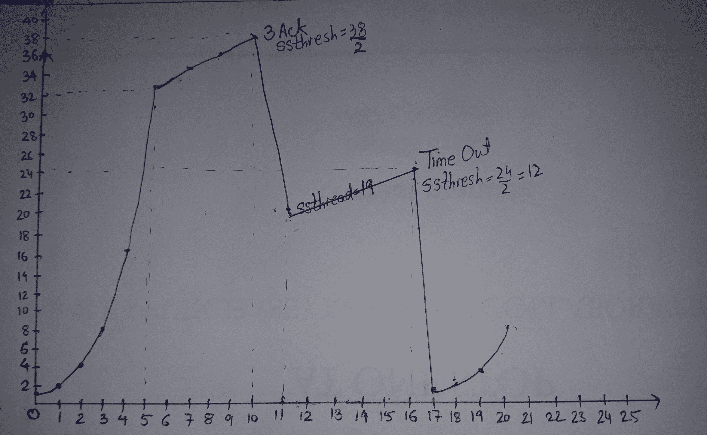

# TCP 拥塞控制

> 原文:[https://www.geeksforgeeks.org/tcp-congestion-control/](https://www.geeksforgeeks.org/tcp-congestion-control/)

**先决条件–**[基本拥塞控制知识](https://www.geeksforgeeks.org/computer-networks-congestion-control/)

TCP 使用拥塞窗口和拥塞策略来避免拥塞。以前，我们假设只有接收者可以指定发送者的窗口大小。我们忽略了另一个实体，网络。如果网络不能像发送方创建的那样快速传递数据，它必须告诉发送方放慢速度。换句话说，除了接收者，网络是决定发送者窗口大小的第二个实体。

**TCP 中的拥塞策略–**

1.  缓慢启动阶段:缓慢启动增量与阈值成指数关系
2.  拥塞避免阶段:达到阈值后，增量为 1
3.  拥塞检测阶段:发送方返回慢速启动阶段或拥塞避免阶段。

**慢启动阶段:指数增量–**在此阶段，在每次 RTT 之后，拥塞窗口大小呈指数增量。

```
Initially cwnd = 1
After 1 RTT, cwnd = 2^(1) = 2
2 RTT, cwnd = 2^(2) = 4
3 RTT, cwnd = 2^(3) = 8

```

**拥塞避免阶段:附加增量–**该阶段在阈值(也称为*阈值*之后开始。 *cwnd* (拥堵窗口)的尺寸增加了添加剂。在每个 RTT cwnd 之后= cwnd + 1。

```
Initially cwnd = i
After 1 RTT, cwnd = i+1
2 RTT, cwnd = i+2
3 RTT, cwnd = i+3

```

**拥塞检测阶段:乘法递减–**如果发生拥塞，拥塞窗口大小减小。发送方猜测拥塞发生的唯一方法是需要重新传输一个数据段。需要重传来恢复丢失的数据包，该数据包被认为是由于拥塞而被路由器丢弃的。重传可以发生在以下两种情况之一:当实时操作系统定时器超时或收到三个重复确认时。

*   **Case 1 : Retransmission due to Timeout –** In this case congestion possibility is high.

    (a) ssthresh 减小到当前窗口大小的一半。
    (b)设置 cwnd = 1
    (c)再次以慢启动阶段启动。

*   **Case 2 : Retransmission due to 3 Acknowledgement Duplicates –** In this case congestion possibility is less.

    (a) ssthresh 值减少到当前窗口大小的一半。
    (b)设置 cwnd= ssthresh
    (c)从拥塞避免阶段开始

    **示例–**假设一个 TCP 协议经历了慢启动行为。在第 5 轮传输中，阈值(ssthresh)值为 32 的传输进入拥塞避免阶段，并持续到第 10 轮传输。在第 10 轮传输中，接收器接收到 3 个重复确认，并进入加法增加模式。超时发生在第 16 轮传输。绘制传输周期(时间)与 TCP 段拥塞窗口大小的关系图。

    

    **GATE CS 角问题–**

    练习下列问题将帮助你测试你的知识。所有的问题在前几年的 GATE 考试或 GATE 模拟考试中都被问过。强烈建议你练习一下。

    1.  [GATE CS 2008，第 56 题](https://www.geeksforgeeks.org/gate-gate-cs-2008-question-56/)
    2.  [GATE CS 2012，问题 65](https://www.geeksforgeeks.org/gate-gate-cs-2012-question-45/)
    3.  [GATE CS 2014(第 1 集)，第 65 题](https://www.geeksforgeeks.org/gate-gate-cs-2014-set-1-question-37/)
    4.  [GATE IT 2005，问题 73](https://www.geeksforgeeks.org/gate-gate-it-2005-question-73/)

    本文由 [**SHAURYA UPPAL**](https://www.linkedin.com/in/shaurya-uppal-3b7a6373/) 供稿。如果你喜欢 GeeksforGeeks 并想投稿，你也可以使用[write.geeksforgeeks.org](https://write.geeksforgeeks.org)写一篇文章或者把你的文章邮寄到 review-team@geeksforgeeks.org。看到你的文章出现在极客博客主页上，帮助其他极客。

    如果你发现任何不正确的地方，或者你想分享更多关于上面讨论的话题的信息，请写评论。