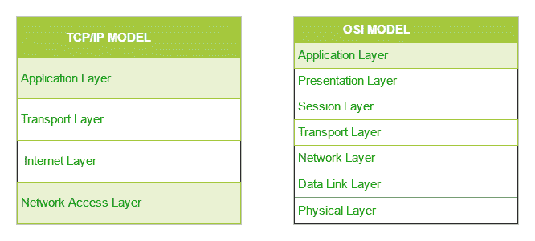

# TCP/IP 模型

> 原文:[https://www.geeksforgeeks.org/tcp-ip-model/](https://www.geeksforgeeks.org/tcp-ip-model/)

先决条件–现场视察模型的[层](https://www.geeksforgeeks.org/layers-osi-model)

我们刚才看到的 **OSI 模型**只是一个参考/逻辑模型。它被设计成通过将通信过程分成更小和更简单的组件来描述通信系统的功能。但是当我们谈论 TCP/IP 模型时，它是由国防部(DoD)在 20 世纪 60 年代设计和开发的，并且基于标准协议。它代表传输控制协议/互联网协议。 **TCP/IP 模型**是现场视察模型的简明版本。它包含四层，不像现场视察模型中的七层。这些层是:

1.  流程/应用层
2.  主机到主机/传输层
3.  互联网层
4.  网络接入/链路层

TCP/IP 和现场视察模型的图表比较如下:

TCP/IP 与现场视察模型的区别:

| 传输控制协议 | 开放式系统互联参考模型(Open System Interconnect Reference Model) |
| 传输控制协议。 | 开放系统互连是指开放系统互连。 |
| TCP/IP 有 4 层。 | OSI 有 7 层。 |
| TCP/IP 更可靠 | 现场视察不太可靠 |
| TCP/IP 没有非常严格的界限。 | 现场视察有严格的界限 |
| TCP/IP 遵循横向方法。 | 现场视察遵循垂直方法。 |
| TCP/IP 在应用层本身同时使用会话层和表示层。 | 现场视察使用不同的会话和表示层。 |
| TCP/IP 开发了协议，然后建模。 | 现场视察发展了模型，然后是协议。 |
| TCP/IP 中的传输层不能保证数据包的传送。 | 在现场视察模型中，传输层为数据包的传送提供保证。 |
| TCP/IP 模型网络层只提供连接较少的服务。 | 无连接和面向连接两种服务都是由 OSI 模型中的网络层提供的。 |
| 协议在 TCP/IP 模式下不容易被替代。 | 而在现场视察模型中，协议被更好地覆盖，并且很容易随着技术的变化而被取代。 |

第一层是代表发送方的流程层和代表接收方的网络接入层。在这篇文章中，我们将代表接收者发言。

### 1.网络接入层–

该层对应于现场视察模型的数据链路层和物理层的组合。它寻找硬件寻址，该层中的协议允许数据的物理传输。
我们刚才讲了 ARP 是互联网层的协议，但是声明它是互联网层的协议还是网络接入层的协议有冲突。它被描述为驻留在第 3 层，由第 2 层协议封装。

### 2.互联网层–

这一层与现场视察网络层的功能相似。它定义了负责整个网络上数据逻辑传输的协议。驻留在该层的主要协议有:

1.  **IP–**代表互联网协议，它负责通过查看数据包报头中的 IP 地址，将数据包从源主机传送到目的主机。IP 有 2 个版本:
    IPv4 和 IPv6。IPv4 是大多数网站目前使用的版本。但是 IPv6 正在增长，因为与用户数量相比，IPv4 地址的数量是有限的。
2.  **ICMP–**代表互联网控制消息协议。它封装在 IP 数据报中，负责向主机提供有关网络问题的信息。
3.  **ARP–**代表地址解析协议。它的工作是从已知的 IP 地址中找到主机的硬件地址。ARP 有几种类型:反向 ARP、代理 ARP、无偿 ARP 和反向 ARP。

### 3.主机到主机层–

这一层类似于现场视察模型的传输层。它负责端到端的通信和无错误的数据传输。它保护上层应用程序免受数据复杂性的影响。该层中存在的两个主要协议是:

1.  **传输控制协议(TCP)–**众所周知，它可以在终端系统之间提供可靠且无错误的通信。它执行数据的排序和分段。它还具有确认功能，并通过流量控制机制控制数据流。这是一个非常有效的协议，但是由于这样的特性而有很多开销。开销增加导致成本增加。
2.  **用户数据报协议(UDP)–**另一方面不提供任何此类功能。如果您的应用程序不需要可靠的传输，那么它就是 go-to 协议，因为它非常经济高效。与面向连接的协议 TCP 不同，UDP 是无连接的。

    ### 4.应用层–

    该层执行现场视察模型的前三层功能:应用层、表示层和会话层。它负责节点到节点的通信，并控制用户界面规范。该层中存在的一些协议有:HTTP、HTTPS、FTP、TFTP、Telnet、SSH、SMTP、SNMP、NTP、DNS、DHCP、NFS、X Window、LPD。有关这些协议的一些信息，请查看应用层中的[协议。链接文章中未列出的协议有:](https://www.geeksforgeeks.org/protocols-application-layer/)

    1.  **HTTP 和 HTTPS–**HTTP 代表超文本传输协议。万维网使用它来管理网络浏览器和服务器之间的通信。HTTPS 代表 HTTP-Secure。它是 HTTP 和 SSL(安全套接字层)的结合。在浏览器需要填写表单、登录、验证和执行银行交易的情况下，这是高效的。
    2.  **SSH–**SSH 代表安全外壳。这是一个类似于远程登录的终端仿真软件。SSH 更受欢迎的原因是因为它能够维护加密连接。它通过 TCP/IP 连接建立安全会话。
    3.  **NTP–**NTP 代表网络时间协议。它用于将我们计算机上的时钟与一个标准时间源同步。它在银行交易等情况下非常有用。假设在没有 NTP 的情况下出现以下情况。假设您执行一个事务，其中您的计算机在下午 2:30 读取时间，而服务器在下午 2:28 记录时间。如果不同步，服务器可能会严重崩溃。

    本文由**阿契夫·肖汉**和**帕拉克·贾恩**供稿。如果你喜欢 GeeksforGeeks 并想投稿，你也可以使用[contribute.geeksforgeeks.org](http://www.contribute.geeksforgeeks.org)写一篇文章或者把你的文章邮寄到 contribute@geeksforgeeks.org。看到你的文章出现在极客博客主页上，帮助其他极客。

    如果你发现任何不正确的地方，或者你想分享更多关于上面讨论的话题的信息，请写评论。