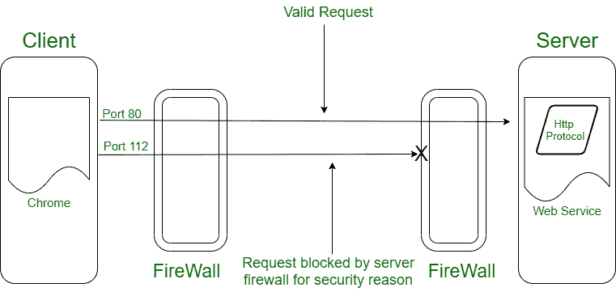
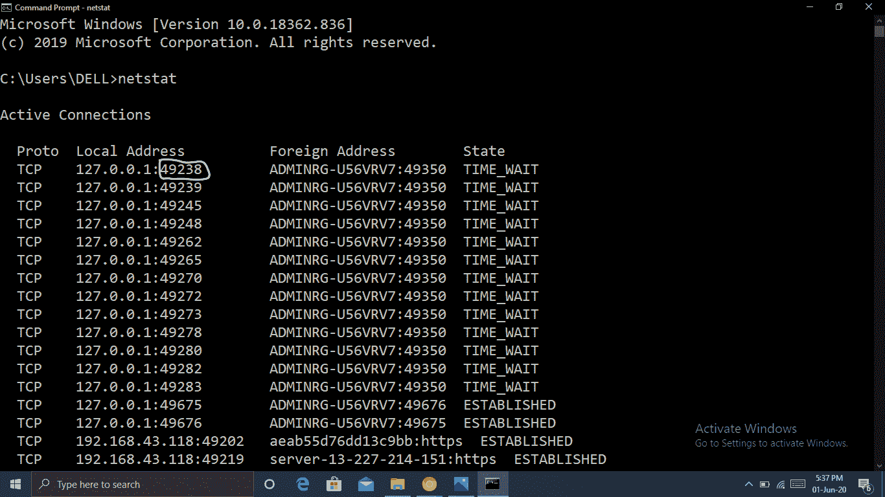

# TCP/IP 端口及其应用

> 原文:[https://www . geesforgeks . org/TCP-IP-port-and-its-applications/](https://www.geeksforgeeks.org/tcp-ip-ports-and-its-applications/)

前提–[互联网和 Web 编程](https://www.geeksforgeeks.org/internet-and-web-programming/)、[互联网和 Web](https://www.geeksforgeeks.org/the-internet-and-the-web/?ref=rp) 、[传输层](https://www.geeksforgeeks.org/tcp-and-udp-in-transport-layer/)
**端口**中的 TCP 和 UDP 可以作为互联网的网关。为了便于不同的应用程序同时进行连接，每个连接到 web 的设备都以不同的方式使用端口。当我们同时使用网络、下载一些文件、使用打印机等时，所有操作都是使用不同的端口进行的。例如， [HTTP](https://www.geeksforgeeks.org/http-non-persistent-persistent-connection/) 传输使用端口号 80，而 [Telnet](https://www.geeksforgeeks.org/difference-ssh-telnet/) 使用 23。

众所周知，设备(即计算机)由其 IP 地址来标识。由于多个服务(选项卡)或应用程序由网络浏览器同时运行，要运行网络应用程序，仅 IP 地址是不够的。

**网络端口**便于识别浏览器/计算机中运行的应用程序或服务，其方式与 [IP 地址](https://www.geeksforgeeks.org/introduction-of-classful-ip-addressing/)相同。

看一个类似的情况——假设你拥有一栋建筑。街道地址对应 IP 地址。还有，中途有一个端口号，每栋楼也有一个楼号。

**端口号**也是不同的类型，有唯一的编号。端口共存于一个 IP 地址中，因为每个服务都有其唯一的端口。

像谷歌或 MSN 这样的顶级公司使用知名端口(0 到 10231)提供服务；当请求时，某些特定功能被分配到注册端口(1024 到 49151)；还有专用或动态端口(49152 至 65536)，任何希望使用专用服务器和临时目的的人都可以使用。

你最好知道端口号。如果你知道你的软件，你会很好地控制它。由于应用程序使用特定的端口，因此它们应该始终对工作开放。虽然关闭它们肯定可以提高您的端口安全性，但您有责任保持特定端口的打开或关闭。如果您的某个应用程序无法连接到互联网，您也可以打开或关闭特定端口。有些端口被防火墙阻止，因此您可能需要手动允许它在需要时绕过它们。

**Figure –** working of firewall

The need for a port number is discussed for now. But, who assigns a unique port number for different services/applications ?
A web browser when connected to a web server, a port in range (49152- 65535) is self-allocated by web browser, which is called an ephemeral port.

在下图中，所有唯一的服务都被分配了一个唯一的端口号，您可以在本地地址的第五个元组中看到。请在命令中尝试 netstat 以获取详细信息。

**注意–**
客户端端口号是动态分配的，一旦会话关闭，就可以重用。