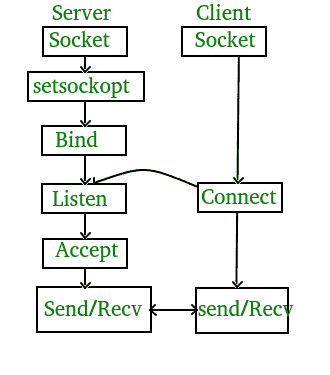

# TCP 服务器-客户端在 C 中的实现

> 原文:[https://www . geesforgeks . org/TCP-server-client-implementation-in-c/](https://www.geeksforgeeks.org/tcp-server-client-implementation-in-c/)

先决条件–[C/c++](https://www.geeksforgeeks.org/socket-programming-cc/)、 [TCP 和 UDP 服务器使用 select](https://www.geeksforgeeks.org/tcp-and-udp-server-using-select/) 、 [UDP 服务器-客户端在 C 中的实现](https://www.geeksforgeeks.org/udp-server-client-implementation-c/)
如果我们使用 TCP 在客户端和服务器之间创建连接，那么它几乎没有类似的功能，TCP 适用于要求高可靠性的应用程序，传输时间相对不那么关键。它被其他协议使用，如 HTTP、HTTPs、FTP、SMTP、Telnet。TCP 按照指定的顺序重新排列数据包。绝对保证传输的数据保持完整，并按照发送的顺序到达。TCP 进行流量控制，在发送任何用户数据之前，需要三个数据包来建立套接字连接。TCP 处理可靠性和拥塞控制。它还进行错误检查和错误恢复。错误的数据包从源重传到目的地。

整个过程可以分解为以下步骤:



整个过程可以分为以下几个步骤:

**TCP 服务器–**

1.  使用 create()，创建 TCP 套接字。
2.  使用 bind()，将套接字绑定到服务器地址。
3.  使用 listen()，将服务器套接字置于被动模式，等待客户端靠近服务器进行连接
4.  使用 accept()，此时，客户机和服务器之间建立了连接，它们准备好传输数据。
5.  回到步骤 3。

**TCP 客户端–**

1.  创建 TCP 套接字。
2.  将新创建的客户端套接字连接到服务器。

传输控制协议服务器:

## C

```
#include <stdio.h>
#include <netdb.h>
#include <netinet/in.h>
#include <stdlib.h>
#include <string.h>
#include <sys/socket.h>
#include <sys/types.h>
#define MAX 80
#define PORT 8080
#define SA struct sockaddr

// Function designed for chat between client and server.
void func(int connfd)
{
    char buff[MAX];
    int n;
    // infinite loop for chat
    for (;;) {
        bzero(buff, MAX);

        // read the message from client and copy it in buffer
        read(connfd, buff, sizeof(buff));
        // print buffer which contains the client contents
        printf("From client: %s\t To client : ", buff);
        bzero(buff, MAX);
        n = 0;
        // copy server message in the buffer
        while ((buff[n++] = getchar()) != '\n')
            ;

        // and send that buffer to client
        write(connfd, buff, sizeof(buff));

        // if msg contains "Exit" then server exit and chat ended.
        if (strncmp("exit", buff, 4) == 0) {
            printf("Server Exit...\n");
            break;
        }
    }
}

// Driver function
int main()
{
    int sockfd, connfd, len;
    struct sockaddr_in servaddr, cli;

    // socket create and verification
    sockfd = socket(AF_INET, SOCK_STREAM, 0);
    if (sockfd == -1) {
        printf("socket creation failed...\n");
        exit(0);
    }
    else
        printf("Socket successfully created..\n");
    bzero(&servaddr, sizeof(servaddr));

    // assign IP, PORT
    servaddr.sin_family = AF_INET;
    servaddr.sin_addr.s_addr = htonl(INADDR_ANY);
    servaddr.sin_port = htons(PORT);

    // Binding newly created socket to given IP and verification
    if ((bind(sockfd, (SA*)&servaddr, sizeof(servaddr))) != 0) {
        printf("socket bind failed...\n");
        exit(0);
    }
    else
        printf("Socket successfully binded..\n");

    // Now server is ready to listen and verification
    if ((listen(sockfd, 5)) != 0) {
        printf("Listen failed...\n");
        exit(0);
    }
    else
        printf("Server listening..\n");
    len = sizeof(cli);

    // Accept the data packet from client and verification
    connfd = accept(sockfd, (SA*)&cli, &len);
    if (connfd < 0) {
        printf("server accept failed...\n");
        exit(0);
    }
    else
        printf("server accept the client...\n");

    // Function for chatting between client and server
    func(connfd);

    // After chatting close the socket
    close(sockfd);
}
```

传输控制协议客户端:

## C

```
#include <netdb.h>
#include <stdio.h>
#include <stdlib.h>
#include <string.h>
#include <sys/socket.h>
#define MAX 80
#define PORT 8080
#define SA struct sockaddr
void func(int sockfd)
{
    char buff[MAX];
    int n;
    for (;;) {
        bzero(buff, sizeof(buff));
        printf("Enter the string : ");
        n = 0;
        while ((buff[n++] = getchar()) != '\n')
            ;
        write(sockfd, buff, sizeof(buff));
        bzero(buff, sizeof(buff));
        read(sockfd, buff, sizeof(buff));
        printf("From Server : %s", buff);
        if ((strncmp(buff, "exit", 4)) == 0) {
            printf("Client Exit...\n");
            break;
        }
    }
}

int main()
{
    int sockfd, connfd;
    struct sockaddr_in servaddr, cli;

    // socket create and varification
    sockfd = socket(AF_INET, SOCK_STREAM, 0);
    if (sockfd == -1) {
        printf("socket creation failed...\n");
        exit(0);
    }
    else
        printf("Socket successfully created..\n");
    bzero(&servaddr, sizeof(servaddr));

    // assign IP, PORT
    servaddr.sin_family = AF_INET;
    servaddr.sin_addr.s_addr = inet_addr("127.0.0.1");
    servaddr.sin_port = htons(PORT);

    // connect the client socket to server socket
    if (connect(sockfd, (SA*)&servaddr, sizeof(servaddr)) != 0) {
        printf("connection with the server failed...\n");
        exit(0);
    }
    else
        printf("connected to the server..\n");

    // function for chat
    func(sockfd);

    // close the socket
    close(sockfd);
}
```

**编译–**
服务器端:
gcc server.c -o 服务器
。/服务器

客户端:
gcc 客户端. c -o 客户端
。/client

**输出–**

服务器端:

```
Socket successfully created..
Socket successfully binded..
Server listening..
server accept the client...
From client: hi
     To client : hello
From client: exit
     To client : exit
Server Exit... 
```

客户端:

```
Socket successfully created..
connected to the server..
Enter the string : hi
From Server : hello
Enter the string : exit
From Server : exit
Client Exit... 
```