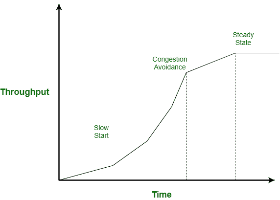
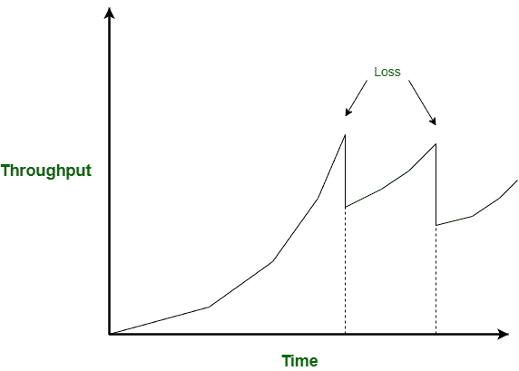
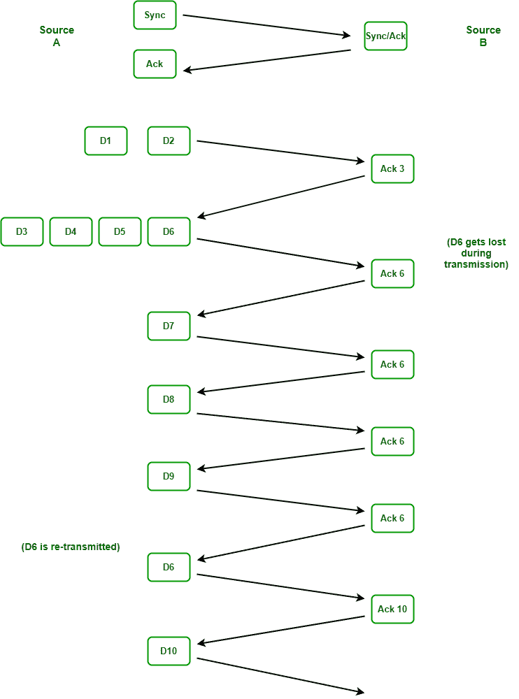

# 视频流的 TCP 与 UDP 对比

> 原文:[https://www . geesforgeks . org/TCP-vs-UDP-for-video-streaming/](https://www.geeksforgeeks.org/tcp-vs-udp-for-video-streaming/)

**先决条件:** [TCP/IP 模型](https://www.geeksforgeeks.org/tcp-ip-model/)[用户数据报协议(UDP)](https://www.geeksforgeeks.org/user-datagram-protocol-udp/)

在这个娱乐、教育、游戏和各种生活必需品每天都在直播的现代互联网时代，对不间断视频流的需求非常强烈。要深入探讨哪种协议更适合视频流，必须熟悉 [TCP](https://www.geeksforgeeks.org/services-and-segment-structure-in-tcp/) 和 [UDP](https://www.geeksforgeeks.org/user-datagram-protocol-udp/) 协议。

**传输数据包中的 TCP:**

*   TCP 是一种与其伙伴协商正式会话的协议。TCP 发送数据并接受确认。
*   TCP 保证交付。
*   它还根据对网络发送数据能力的估计来调整其发送速率。它估计带宽、损耗和延迟，如果这些已经恶化，它将降低流速，如果它们已经改善，它将增加流速。
*   如果数据包在传输过程中丢失，最终会被重新传输。

**TCP 的正常传输:**
TCP 逐渐增加发送的数据量，直到链路饱和。首先，它启动缓慢，并以不断增加的速度发送越来越多的数据。在拥塞避免阶段，为了避免拥塞，它逐渐增加数据。在最后阶段，它将数据调整到接收器可以轻松处理的速率，称为稳定状态。

**TCP 对丢失数据包的反应:**
当数据包丢失时，要么是由于网络缓冲区溢出，要么是接收方获得的数据超过了缓冲区，丢失的数据包不会被确认，因此 TCP 认为它发送数据太快，因此它会重新开始缓慢的传输。当第二个数据包被丢弃时，流量会再次被切断。如果丢弃是连续的，那么速率会下降很多，以至于一次只发送一个包。

我们可以看看下面描述 TCP 对丢失数据包的反应的场景–

在这种情况下，源甲向接收方乙发送 10 个数据包 D1 到 D10，在传输过程中，丢失了一个数据包 D6。

*   源 A 与源 b 建立 TCP 连接
*   甲向源乙发送 D1 数据包和 D2 数据包
*   b 请求数据包 D3。
*   甲发送 D3 连同数据包 D4，D5 和 D6。
*   但是 D6 在传输过程中迷路了，比如说由于 B 的缓冲区溢出。
*   然后乙要求数据包 D6。
*   a 这次只发送一个数据包，又是一个缓慢的开始。
*   乙又找 D6。
*   a 继续单独发送数据包 D8 和 D9，而 B 继续请求 D6。
*   接收方没有发送 4 个确认请求 D6，TCP 现在假设数据包丢失，否则假设它在网络中被错误路由。所以，阿终于重传 D6。
*   乙现在要求数据包 D10。
*   a 发送 D10，然后执行连接关闭过程。

我们观察到，单个丢弃的数据包会导致缓慢的启动过程和不允许流量增加的拥塞避免过程。它一次下降回一个数据包。因此，一次数据包丢失，我们的吞吐量就减少了 50%。
我们得出某些结论–

*   TCP 对数据包丢失、延迟和可用带宽很敏感。
*   TCP 使用慢速启动、拥塞避免和估计[往返时间](https://www.geeksforgeeks.org/what-is-rttround-trip-time/) (RTT)的延迟来进行调整。

因此，如果您的客户端要求的带宽超过了发送方所能提供的带宽，并且存在数据丢失，那么延迟是不可避免的。现在，如果我们想到实况视频流，并且由于上面提到的一些原因，发生了分组丢失，那么实况流的性能将严重恶化，因为协议将忙于重新传输丢失的分组。这将导致观众落后于视频直播的实际播放量。

**UDP :**
UDP 也是一种传输层协议。它不知道数据是否成功到达。一旦应用程序提供数据，它就会发送，一旦操作系统说好，它就会发送。它基本上不知道接收或失败。UDP 做三件事–

*   它使用端口号识别发送和接收过程。
*   它会对 UDP 头进行错误检查。
*   它记录了对 UDP 报头的检查。

因此，我们看到 UDP 不提供任何方式来检索丢失的数据包。它不关心每个数据包是否到达目的地。如果您再次想到实时视频流，数据包的丢失不会延迟视频以找回丢失的数据包。视频的质量将根据损失的程度而恶化，从屏幕角落的一个小方块被扭曲到整个屏幕，但视频的节奏将保持与实际的直播流一致。

**实时协议:**

*   UDP 本身并没有像 TCP 那样提供很多功能。但是用另一种协议对它进行分层，我们可以实现一些与 TCP 相同的功能。
*   在语音或视频会议中，通过插入一种称为实时协议(RTP)的协议来添加一些 TCP 功能。如果我们将 RTP 报头与 UDP 放在一起，RTP 将添加序列号、一些时间戳和音频或视频源的标识符，并且它还将允许称为 RTCP 的协议报告丢失。
*   在将实时传输协议与 UDP 结合使用时，语音数据包会根据编解码器输出以统一的间距发送。
    例如，在语音中，它们每 20 毫秒(1/50 秒)发送一次。在视频中，当一个 IP 包被填满时，它们就会被发送。

因此，如果几个连续的数据包丢失，音频会暂时下降，我们会注意到这一点，UDP 对语音丢失非常敏感。但是如果你丢失了一个包，那是一秒钟声音的 50 分之一，而你的耳朵对这一点并不敏感。但就视频而言，由于绘制单帧需要如此多的视频包，质量可能会降低，并且在屏幕上以小方块或小切片的形式变得明显，这些小方块或小切片会变成不同的颜色，因为数据不是为了正确绘制而出现的。在实时音频或视频传输中，网络通常不应出现大于 0.25%的损耗。

因此，UDP 与其他协议如实时传输协议、网络实时传输协议和 RTSP 协议相结合，可以提供比 TCP 更好的视频流体验。