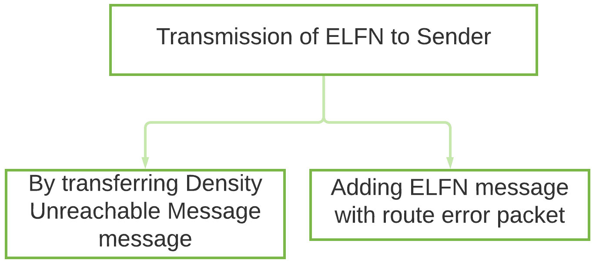
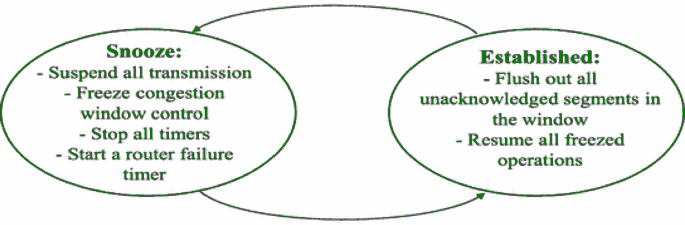

# 带有显式链路故障通知的 TCP(TCP-ELNN)

> 原文:[https://www . geesforgeks . org/TCP-with-explicit-link-failure-notification-TCP-elfn/](https://www.geeksforgeeks.org/tcp-with-explicit-link-failure-notification-tcp-elfn/)

[带有显式链路故障通知的 TCP](https://www.geeksforgeeks.org/tcp-ip-model/) 是一种端到端的方法，用于 TCP Ad Hoc 无线网络中，通过将路径中断信息与拥塞信息解耦来提高性能。

TCP-ELFN 不依赖于任何路由协议，因为当出现路径故障时，它只需要明确的链路故障通知。当网络临时分区时，路径故障可能会持续更长时间，这可能会导致生成消耗带宽和功率的周期性探测数据包，从而降低性能并增加网络拥塞。

当在 TCP-ELFN 中发现新路径时，拥塞窗口可能无法反映网络拓扑和 TCP 接收器中期望的可实现传输速率。TCP-ELFN 处理显式链路故障通知，并使用 TCP 探测数据包来寻找网络中的路径重建。

ELFN 数据包由检测路径中断的节点生成。

当使用 TCP-ELFN 的发送方收到 ELFN 数据包时，发送方会执行以下操作:

1.  发送方禁用恢复时间目标(RTO)，并进入待机状态。
2.  新路由的定期识别由发送方完成。发送方为此目的定期生成探测数据包。
3.  如果发送方收到探测数据包的确认(ack)消息和新的路径信息，恢复时间目标(RTO)将被启用，待机状态将被终止。
4.  TCP 拥塞窗口大小减少到一半。

