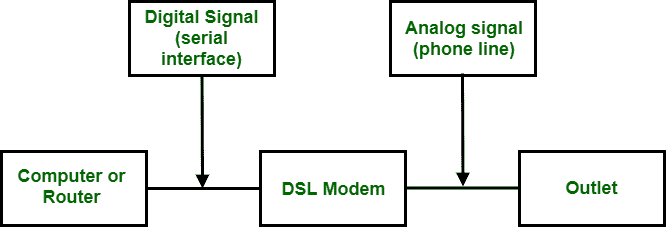

# 数字用户线路技术

> 原文:[https://www . geesforgeks . org/technologies-of-digital-subscriber-line/](https://www.geeksforgeeks.org/technologies-of-digital-subscriber-line/)

[数字用户线路(DSL)](https://www.geeksforgeeks.org/digital-subscriber-line-dsl/) 最有希望支持现有本地环路上的高速互联网连接。基本上是一套技术。这个集合也被称为 xDSL，其中 x 可以被 A、V、H 或 s 代替。

数字用户线路

数字用户线路技术:

1.  不对称数字用户线路
2.  ADSL Lite 或通用 ADSL 或无分裂 ADSL
3.  HDSL
4.  adsl _ symmetricdsl)
5.  VDSL(甚高比特率数字用户线)

**ADSL(非对称 DSL):**

DSL 系列中的第一项技术是 ADSL。它就像一个 56K 调制解调器，也就是说，它在下游方向提供比上游方向更高的速度。这就是为什么它被称为不对称的原因。在这种情况下，仅住宅用户的可用带宽分配不均。这种服务不适合商业客户，对于更大的带宽也是如此。

**ADSL Lite:**

新版本的 ADSL 称为 ADSL Lite 或通用 ADSL 或无分裂 ADSL。ADSL 调制解调器直接插入电话插孔并连接到计算机，它使用 256 个 8 位调制的 DMT 载波。由于语音信号产生的错误可能混入其中，一些载波可能不可用。它能够提供最大 1.5 Mbps 的下行数据速率和 512 Kbps 的上行数据速率。

**HDSL(高比特率 DSL):**

它被用作 T-1 线的替代品。T-1 线使用的编码是交替标记反转，在高频时容易衰减。长度限制为 1 公里，并且需要更长距离的中继器，这导致成本增加。因此，HDSL 使用 2B1Q 编码，这导致对衰减不太敏感。随着使用这种数据速率增加到 2 Mbps 和长度，限制增加到 3.86 公里。为了实现全双工传输，它使用两根双绞线电缆。

**SDSL(对称 DSL):**

由于在 HDSL 使用的是双绞电缆，所以这是 HDSL 的单绞电缆版本。它在每个方向上支持 768 kbps，并提供全双工对称通信。由于它提供对称通信，所以它也可以作为 ADSL 的替代。

**VDSL(甚高比特率 DSL):**

它也被用作替代方法，即类似于 ADSL。它使用同轴、光纤和双绞线进行短距离传输。它能够为上游提供 25-55 兆比特/秒的比特率，为下游提供 3.2 兆比特/秒的比特率

**总结:**以下是 DSL 的技术汇总表。下表中的值是近似值，可能因实施方式而异。

| 技术 | 下游速度 | 上游费率 | 英尺距离 | 双绞线 | 线路代码 |
| --- | --- | --- | --- | --- | --- |
| 非对称数字式用户线路 | 1.5-6.1 Mbps | 16-640 kbps | Twelve thousand | one | 深水活动目标(Deep Mobile Target) |
| ADSL 一点点 | 1.5 Mbps | 500 kbps | Eighteen thousand | one | 深水活动目标(Deep Mobile Target) |
| HDSL | 1.5-2.0 Mbps | 1.5-2.0 Mbps | Twelve thousand | Two | 2B1Q |
| SDSL(消歧义) | 768 kbps | 768 kbps | Twelve thousand | one | 2B1Q |
| VDSL | 25-55 Mbps | 3,2 Mbps | 3000-10,000 | one | 深水活动目标(Deep Mobile Target) |

**DSL 的特点 <u>:</u>**

*   它有助于满足不同场景下的网络需求，如 DSL、光纤/电缆和 3G/4G 加密狗。
*   它支持 ISP 服务提供商，所以我们可以说它与大多数服务提供商兼容。
*   它还支持高质量的电话。
*   有一个可用的应用程序来管理调制解调器。