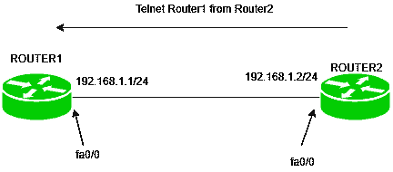

# 思科设备中的 TELNET 和 SSH

> 原文:[https://www . geesforgeks . org/telnet-and-ssh-in-Cisco-devices/](https://www.geeksforgeeks.org/telnet-and-ssh-in-cisco-devices/)

我们可以通过控制台电缆访问思科路由器或交换机，或者通过众所周知的协议远程登录或 ssh(安全外壳)进行远程访问。Telnet 和 ssh 都是应用层协议，用于远程访问和管理设备。

**1。Telnet:**
如前所述，Telnet 是一种应用层协议，使用 TCP 端口号 23，用于远程访问设备。

**特性–**

1.  它不支持身份验证。
2.  数据以明文形式发送，因此不太安全。
3.  没有使用加密机制。
4.  设计仅适用于本地网络。

**配置–**



有一种简单的拓扑，其中两台路由器直接相互连接，即路由器 1 和路由器 2。路由器 1 的 fa0/0 端口上有 IP 地址 192.168.1.1/24，路由器 2 的 fa0/0 端口上有 IP 地址 192.168.1.2/24。
在这里，我们将在路由器 1 上启用 telnet，并通过路由器 2 进行访问。
在路由器 1 上配置远程登录:

```
Router1(config)#line vty 0 4
Router1(config-line)#password GeeksforGeeks 
Router1(config-line)#exit
```

这里，0 4 意味着我们一次可以有 5 个并发会话。
通过路由器 2 进入:

```
Router2#telnet 192.168.1.1
Router1>
```

**注意–**在思科设备上，如果您想要访问设备，您必须使用 vty 线路。

**故障排除–**
使用 telnet 或 ssh 时，请记住以下几点:

1.  The (client) device through which you want to take access should be reachable to the (server) device you want to take access.

    如果设备是可达的，并且您不能远程登录，那么您没有在 vty 线路上设置密码。使用远程登录或 SSH 时，必须在 vty 线路上设置密码。

**注意–**
AAA 服务也可用于在线 vty 线路上设置密码。设备(路由器)或 ACS 服务器的本地数据库可以用作 vty 线路的密码。
但这里我们只讨论简单的配置。

**2。安全外壳(SSH):**
SSH 也是一种应用程序客户端-服务器协议，用于远程访问设备。它使用 TCP 端口号 23。

**特性–**

1.  与 telnet 不同，它提供身份验证方法。
2.  发送的数据是加密形式的。
3.  它被设计成在公共网络中工作。
4.  它使用公钥进行加密机制。

简而言之，SSH 比 telnet 更安全，几乎已经取代了 telnet。

**配置–**


我们使用的是相同的简单拓扑。路由器 1 的 fa0/0 端口上有 IP 地址 192.168.1.1/24，路由器 2 的 fa0/0 端口上有 IP 地址 192.168.1.2/24。
我们将从路由器 2 ssh 路由器 1 在路由器 1 上配置 ssh。

```
Router(config)#ip domain-name GeeksforGeeks.com
Router(config)#hostname Router1
Router1(config)#line vty 0 4
Router1(config-line)#transport input ssh
Router1(config-line)password GeeksforGeeks 
Router1(config-line)#login
Router1(config)#crypto key generate rsa label Cisco modulus 1024
```

这里，请注意，由于 ssh 使用域名和密码进行加密，因此有必要给出域名。如果没有提供域名和主机名，则不会生成 crypro 密钥。我们为 vty 线路登录提供了密码，最后我们创建了 1024 字节的密钥，并将其标记为 Cisco。

**注意–**
只有当您的路由器支持类似路由器 3700 的安全功能时，才会执行最后一个命令“加密密钥生成 rsa 标签 Cisco modulus 1024”。
如果不支持该命令，请键入命令:

```
Router1(config)#line vty 0 4
Router1(config-line)#crypto key generate rsa 
```

之后，它会询问您想要生成密钥的大小，因此键入 **512 或 1024**
现在，我们将尝试从路由器 2 ssh 到路由器 1。

```
Router2#ssh -l Cisco 192.168.1.1 
```

这里，-l 表示登录，后跟用户名，然后是我们想要远程访问的设备的 IP 地址。
**故障排除–**
配置 ssh 时，请考虑以下事项:

1.  应该提供域名和主机名。
2.  应该生成加密密钥
3.  应提供 vty 线路上的密码(即不使用本地数据库)。

**注意–**
如果使用路由器的本地数据库，即在路由器本地而不是 vty 线路上配置的用户名和密码，则将使用登录本地命令。

```
Router1(config-line)#login local
```