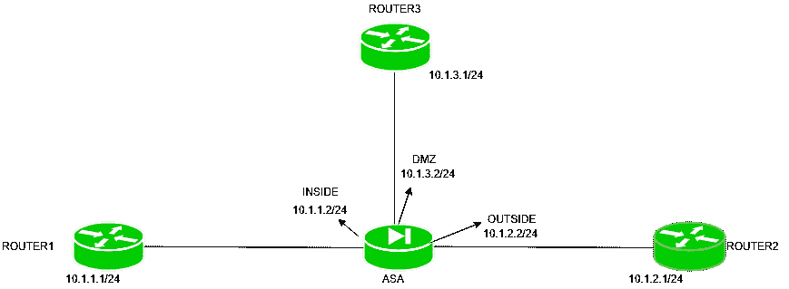

# 自适应安全设备(ASA)上的 TELNET 和 SSH

> 原文:[https://www . geesforgeks . org/telnet-and-ssh-on-adaptive-security-appliance-asa/](https://www.geeksforgeeks.org/telnet-and-ssh-on-adaptive-security-appliance-asa/)

先决条件–[自适应安全设备(ASA)](https://www.geeksforgeeks.org/computer-network-adaptive-security-appliance-asa-features/)
用户可以通过控制台对设备进行管理访问，或者使用 telnet 或 SSH 进行远程访问。同样，ASA(自适应安全设备)CLI 访问可以通过控制台或使用远程登录或 SSH 进行，GUI 访问可以通过(ASDM-一种工具)进行。

**1。ASA 上的 Telnet:**
Telnet 是一种应用层协议，使用 TCP 端口号 23。它用于远程访问设备，但使用较少，因为不太安全。客户端和服务器之间交换的数据包是明文的。
如果我们想在 ASA 上配置 Telnet，必须遵循 3 个步骤。

*   **启用 Telnet 服务–**
    默认情况下，登录密码在 ASA 上配置为“cisco”。如果我们想更改它，请使用命令。

```
asa(config)#password GeeksforGeeks 
```

或者通过使用命令

```
asa(config)#passwd GeeksforGeeks 
```

其中 GeeksforGeeks 是我们设置的密码。

*   **分配可以发起 telnet 连接的 IP 地址–**
    在路由器中，如果我们已经启用了 telnet 服务，并且没有应用任何 ACL，那么任何 IP 地址都可以与路由器进行 telnet 连接，但是在 ASA 中，我们必须分配可以利用 ASA 的 Telnet 服务的 IP 地址。
    可以通过命令完成:

```
asa(config)#telnet  {source_IP_address} {subnet_ask} {source_interface}   
```

在这里，我们必须首先提到{source_IP_address}，通过它 ASA 可以接受 telnet 连接。当然可以是一个 IP 地址，也可以是整个网络。然后是{source_IP_address}的子网掩码。然后，我们不得不提到{source_interface}。它是 ASA 的接口，ASA 将通过它期待远程登录连接。

*   **设置 telnet 超时–**
    这是在 ASA 终止会话之前，telnet 会话可以空闲的时间。时间范围从 1 到 2440 分钟。默认超时为 5 分钟。
    用于它的命令是:

```
asa(config)#telnet timeout {minutes} 
```

**限制–**
ASA 配置了多个接口，不允许从安全级别最低的接口进行远程登录。

**配置示例–**



这里是一个小型拓扑，其中三个路由器，即路由器 1 (IP 地址-10.1.1.1/24)、路由器 2 (IP 地址-10.1.2.1/24)、路由器 3 (IP 地址-10.1.3.1/24)连接到 ASA (IP 地址-10.1.1.2/24 在内部接口上，安全级别为-100，IP 地址-10.1.2.2/24 在外部接口上，安全级别为-0，10.1.1)

在本任务中，我们将分别允许路由器 1 (10.1.1.1/24)、路由器 2 (10.1.2.1/24)和路由器 3 (10.1.3.1/24)的所有接口(内部、外部、非军事区)进行远程登录。
假设已经在所有路由器和 ASA 上完成了 IP 寻址。现在，在 ASA 上为所有路由器的 IP 地址启用 telnet，并以极客身份提供密码。

```
asa(config)#password GeeksforGeeks
asa(config)#telnet 10.1.1.1 255.255.255.255 INSIDE
asa(config)#telnet timeout 10
asa(config)#telnet 10.1.2.1 255.255.255.255 OUTSIDE
asa(config)#telnet timeout 10
asa(config)#telnet 10.1.3.1 255.255.255.255 DMZ
asa(config)#telnet timeout 10
```

并使用命令远程登录 ASA

```
Router#telnet {ASA_interface_IP_address} 
```

**示例–**

```
Router1#telnet 10.1.1.2
```

同样，在路由器 2 和路由器 3 上。
现在，在这个场景中，路由器 1 和路由器 3 将能够远程登录 ASA，但是路由器 2 将不能远程登录，因为 ASA 接口(OUTSIDE)的安全级别最低。

**注意–**
如果我们想要使用 ASA 的本地数据库，那么首先我们必须通过命令创建一个本地数据库。

```
asa(config)#username Cisco password GeeksforGeeks 
```

然后通过命令强制 ASA 使用本地数据库进行登录。

```
asa(config)#aaa authentication telnet console LOCAL
```

请注意，LOCAL 区分大小写。

**2。ASA 上的 SSH:**
SSH 是一种应用层协议，用于远程访问设备。它使用 TCP 端口号 22，并且比 Telnet 更安全，因为它的数据包是加密的。
SSH 的配置方式也与 telnet 相同，但命令不同。

要在 ASA 上启用 SSH，有 2 个步骤:

*   **启用 SSH 服务–**
    要在 ASA 上启用 SSH，首先通过命令生成加密密钥。

```
asa(config)#crypto key generate rsa modulus {modulus_value} 
```

生成加密密钥后，通过命令在 ASA 上创建本地数据库。

```
asa(config)#username cisco password GeeksforGeeks 
```

其中 cisco 是用户名，密码是 GeeksforGeeks。

*   **告诉可以在 ASA 上访问 ssh 的设备的 IP 地址–**
    就像在 Telnet 中一样，我们要允许一些允许通过 ssh 访问 ASA 的 IP 地址。这可以通过命令完成:-

```
asa(config)#ssh {source_IP_address} {subnet_ask} {source_interface}   
```

在这里，我们必须首先提到{source_IP_address}，通过它 ASA 可以接受 ssh 连接。然后是{source_IP_address}的子网掩码。然后，我们不得不提到{source_interface}。它是 ASA 的接口，ASA 将通过它来预期 ssh 流量。

*   **设置 ssh 超时–**
    这是在 ASA 终止会话之前 SSH 会话可以空闲的时间。时间范围从 1 到 2440 分钟。默认超时为 5 分钟。
    用于它的命令是:

```
asa(config)#ssh timeout {minutes} 
```

如果我们想使用本地数据库进行 ssh 登录，那么使用一个命令

```
asa(config)#aaa authentication ssh console LOCAL
```

**配置示例–**


使用相同的拓扑，其中三个路由器，即路由器 1 (IP 地址-10.1.1.1/24)、路由器 2 (IP 地址-10.1.2.1/24)、路由器 3 (IP 地址-10.1.3.1/24)连接到 ASA (IP 地址-10.1.1.2/24 在内部接口，安全级别-100，IP 地址-10.1.2.2/24 在外部接口，安全级别-0，10.1.3)

在本任务中，我们将允许路由器 1 (10.1.1.1/24)和路由器 3 (10.1.3.1/24)的所有接口(内部、非军事区)上的 ssh。
假设已经在所有路由器和 ASA 上完成了 IP 寻址。现在，在 ASA 上为所有路由器的 IP 地址启用 ssh，并将用户名作为 Saurabh，密码作为 GeeksforGeeks。

```
asa(config)#crypto key generate rsa modulus 1024
asa(config)#username saurabh password GeeksforGeeks 
asa(config)#aaa authentication ssh console LOCAL 
asa(config)#ssh 10.1.1.1 255.255.255.255 INSIDE
asa(config)#ssh timeout 10
asa(config)#ssh 10.1.3.1 255.255.255.255 DMZ
asa(config)#telnet timeout 10
```

和 SSH，ASA 从路由器 1 通过使用一个命令。

```
Router1#ssh -l saurabh 10.1.1.2 
```

SSH，ASA 从路由器 2 通过使用一个命令。

```
Router3#ssh -l saurabh 10.1.3.2 
```

两者都将能够 ssh ASA，并且没有像使用 telnet 那样的 ASA 限制。