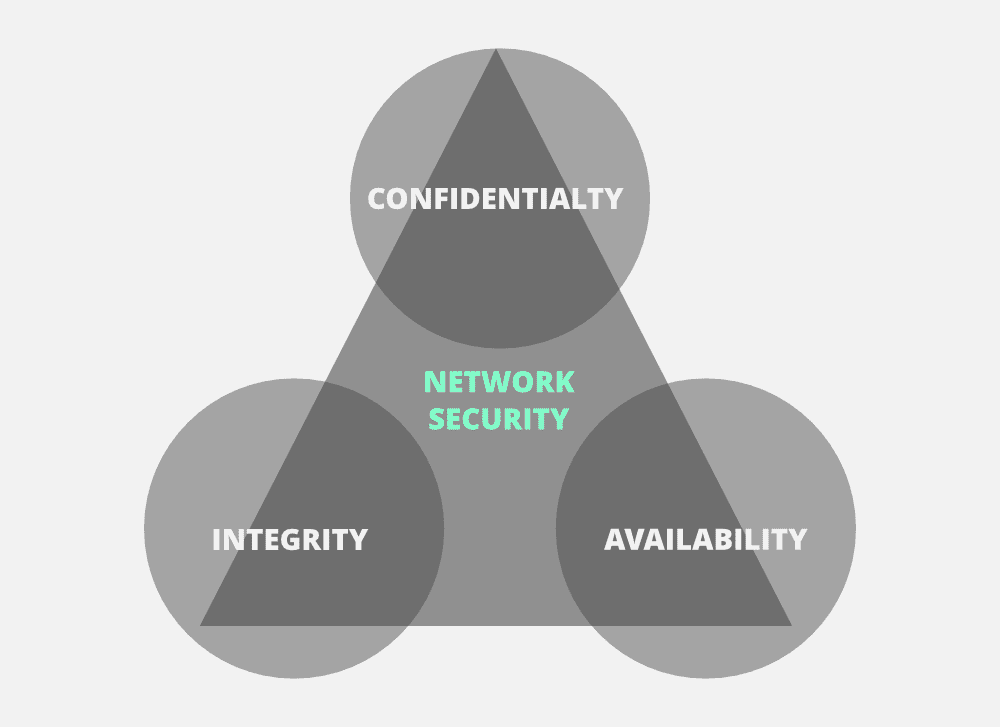
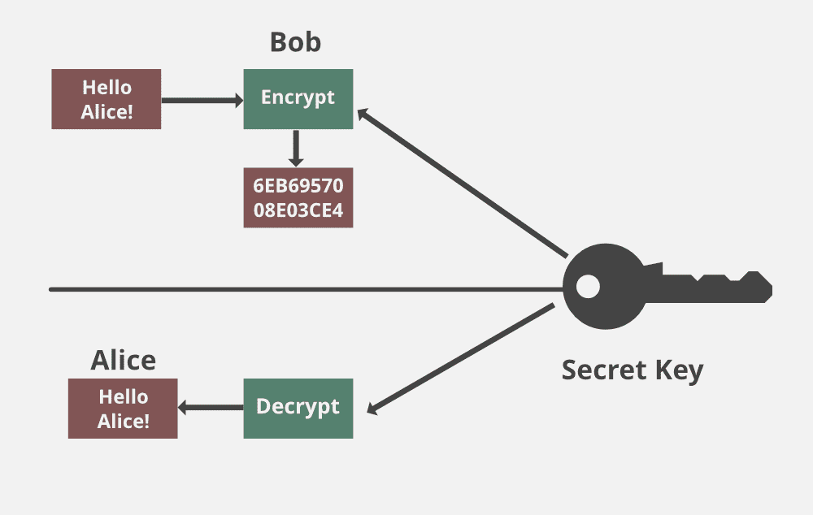
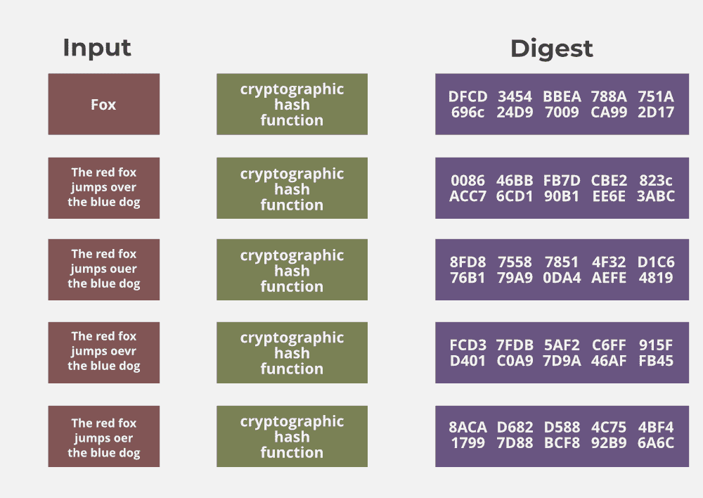
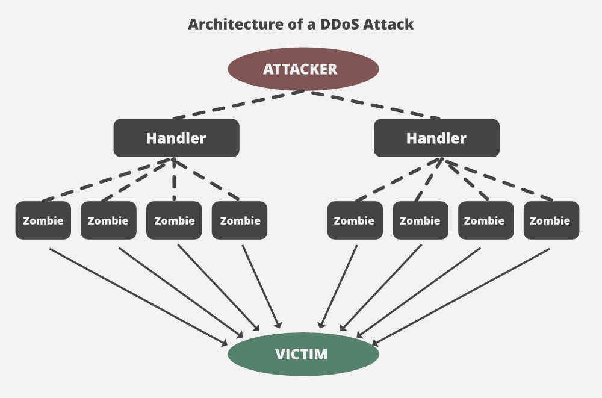

# 密码学中的中情局三元组

> 原文:[https://www . geesforgeks . org/the-CIA-triad in crypto/](https://www.geeksforgeeks.org/the-cia-triad-in-cryptography/)

当谈到网络安全时， **CIA** 三元组是最重要的模型之一，旨在指导组织内的信息安全策略。

中央情报局代表:

1.  机密
2.  完整
3.  有效性

这些是保护网络安全时应该牢记的目标。

**保密性:**
保密性是指只有授权的个人/系统才能查看敏感或机密信息。未经授权的个人不得访问通过网络发送的数据。攻击者可能试图使用互联网上可用的不同工具来捕获数据，并获取您的信息。避免这种情况的主要方法是使用加密技术来保护您的数据，这样即使攻击者获得了对您的数据的访问权限，他/她也无法解密它。加密标准包括 **AES** (高级加密标准)和 **DES** (数据加密标准)。另一种保护数据的方法是通过虚拟专用网隧道。虚拟专用网代表虚拟专用网络，帮助数据在网络上安全移动。

**正直:**
接下来要讲的是正直。这里的想法是确保数据没有被修改。数据损坏是指无法保持数据完整性。为了检查我们的数据是否被修改，我们使用了一个散列函数。
我们有两种常见的类型:SHA(安全哈希算法)和 MD5(消息直接 5)。现在 MD5 是 128 位散列，如果我们使用 SHA-1，SHA 是 160 位散列。我们还可以使用其他 SHA 方法，如 SHA-0、SHA-2、SHA-3。

让我们假设主机“A”希望向主机“B”发送数据以保持完整性。散列函数将在数据上运行，并产生一个任意的散列值 **H1** ，然后将其附加到数据上。当主机“B”收到数据包时，它对数据运行相同的哈希函数，该函数给出哈希值 **H2** 。现在，如果 **H1 = H2** ，这意味着数据的完整性得到了维护，内容没有被修改。

**可用性:**

这意味着网络应该随时可供用户使用。这适用于系统和数据。为了确保可用性，网络管理员应该维护硬件，进行定期升级，制定故障转移计划，并防止网络出现瓶颈。当网络资源耗尽时，DoS 或 DDoS 等攻击可能会导致网络不可用。对于依赖网络作为商业工具的公司和用户来说，这种影响可能是巨大的。因此，应该采取适当的措施来防止这种攻击。

