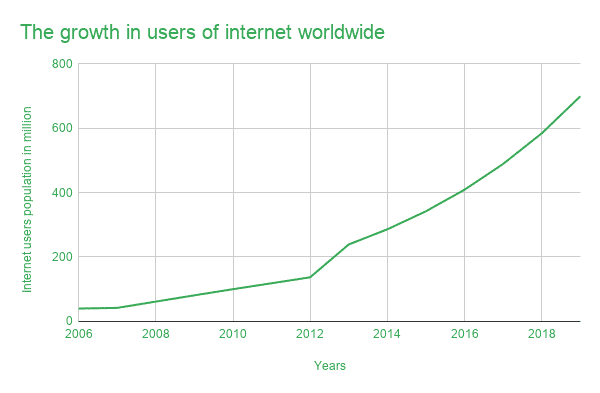

# IPv6 的崛起

> 原文:[https://www.geeksforgeeks.org/the-rise-of-ipv6/](https://www.geeksforgeeks.org/the-rise-of-ipv6/)

[IP 地址(互联网协议地址)](https://www.geeksforgeeks.org/introduction-of-classful-ip-addressing/)识别互联网上的计算机。它是由一些分隔符分隔的数字串。当您的设备在互联网上发送对某个页面的请求时，它会在请求中标记您的 IP 地址。IP 地址通常基于现实世界的位置。IP 的目的是管理设备和目标站点之间的连接。互联网上目前存在两种版本的“IP”——IP v4(IP 版本 4)和 IPv6 (IP 版本 6)。IPv4 和 IPV6 的长度分别为 32 位和 128 位。

**IP v4 历史:**

1983 年，ARPANET 是第一个部署 TCP/IP 协议的分组交换网络。IPv4 是第一个用于生产的版本。TCP/IP 协议是一个突破，我们由此获得了“互联网”这个术语，一个网络的互连。在此之前，这些组织面临的主要问题是“网络无法相互对话”。不同的组织连接到不同的网络，每个网络使用其协议发送和接收数据。

首先，少数企业和大学肯定了 TCP/IP 协议。现在这个数字已经扩大到数十亿。

这张图足以揭示过去几十年互联网用户的指数级增长。

【IPv4 问题:

IPv4 由 32 位组成，分为四组，如 43.233.55.2。32 位可以存储(32/8)，即 4 个字节，一个字节可以存储 0-255 (256 个值)的值。由此我们可以计算出，总共有 256^4(或，2 32 ) =4294967296，这大约是 43 亿个可用的 IPv4 地址，其中有些 IP 地址是专门预留的，所以可用的 IPv4 地址数量就更少了。但是世界上的设备已经超过了 43 亿台。现在，相关的问题是我们从哪里获得 IP 地址？

**IPv6 的崛起**

IPv6 由 128 位组成，是 IPv4 的 4 倍。IPv6 地址如下所示-[2405:4034:199:a487:3868:1af 7:2241:f4c 9]。可能的 IPv6 地址数量为 2 127 。这个数字如此之大，以至于连科学家都难以描述它。如果我们计算地球上沙粒的总数，那就更少了。但是，多个类地行星上的沙粒数量可以接近 2 127 。它如此之大，以至于我们预计未来不会面临 Ipv6 地址不足的问题。