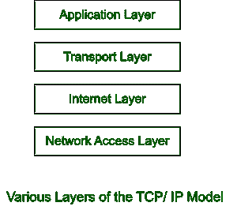
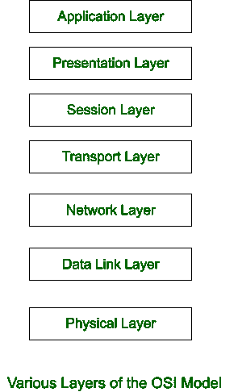

# 这也正是为什么我们有了 TCP/IP 模型

之后，还在使用 OSI 模型的原因

> 原文:[https://www . geeksforgeeks . org/这正是我们仍然使用 osi 模型的原因-当我们拥有 tcp-ip 模型/](https://www.geeksforgeeks.org/this-is-exactly-why-we-still-use-the-osi-model-when-we-have-tcp-ip-model/)

**什么是现场视察模型？**
OSI 是[开放系统互连](https://en.wikipedia.org/wiki/OSI_model)的缩写。国际标准化组织创建了现场视察模型。它是应用程序如何在互联网上通信的模型。为了促进不同设备和应用程序之间的互操作性，现场视察模型将计算功能描述为一套通用的规则和标准。
OSI 模型可以认为是一种通用的计算机网络语言。它建立在各个击破的概念上，它将通信系统分为七个抽象层，每个抽象层都在前一层的基础上分层。
OSI 由七个层次组成，每个层次执行不同的网络功能。现场视察模型将这一过程分解成七个更小、更容易实现的步骤。
每一层都被赋予一定的任务。每一层都是独立的，允许每一层的任务单独完成。
OSI 模型分为七层。–

*   物理层
*   数据链路层
*   网路层
*   传输层
*   会话层
*   表示层
*   应用层

**什么是 TCP/ IP 模式？**

[TCP/IP](https://en.wikipedia.org/wiki/Internet_protocol_suite) 是传输控制协议/互联网协议的缩写。我们刚刚看到的现场视察模型只是一个逻辑/参考模型。它的创建是为了通过将通信过程分解成更小、更易管理的组件来定义通信系统的功能。
然而，基于标准协议的 TCP/IP 概念是由国防部(DoD)在 20 世纪 60 年代设计和开发的。TCP/IP 是现场视察模型的简化版本。它有四层，而不是现场视察模型的七层。这些层如下:

*   应用层
*   传输层
*   互联网层
*   网络接入层

**为什么我们还在使用 OSI 模型？**
说到安全，从业者必须牢记一些事情。在网络堆栈中，开放系统互连架构提供了管理技术问题和风险所需的原则。
尽管信息安全正在向云优先环境转变，但 OSI 模型仍然适用。以下是现场视察模型仍然适用的原因

*   **帮助识别我们整个技术堆栈中的威胁–**
    几十年来，现场视察模型一直用于帮助信息技术专业人员了解网络并解决网络过程中任何时候可能出现的问题。
    因此，对于今天进行资产盘点的信息安全专业人士来说，它仍然很有用。使用不同的层，您可以对您的物理资产、您在组织网络上可能拥有的任何数据(及其保护方式)以及您的员工用来访问您的数据和资源的应用程序清单进行分类。该方法还可以帮助您根据漏洞和安全问题影响的层来解决它们。
*   **使以数据为中心的安全态势成为可能–**
    现场视察模型可以有效地帮助您确定企业内部最大的数据安全威胁是什么，因为它为清点企业资产提供了一个框架。了解公司大部分数据的存放位置，无论是内部还是云服务，都有助于定义您的信息安全策略。一旦掌握了这些知识，您就可以投资正确的解决方案，在适当的现场视察层中为您提供数据可见性。
    例如，如果您知道您的大量敏感数据存储在 SaaS 服务中，您将需要一个 API 驱动的数据发现解决方案，而不是端点管理器来监控和保护这些数据。
    鉴于许多数据合规制度要求您证明您的控制措施适合您数据所在的环境，因此拥有这种以数据为中心的视图不仅对安全性至关重要，而且对合规性也至关重要。
*   **通过安全第一的方法实现云的采用–**
    考虑到现场视察模型对于完成安全资源和资产清单的重要性，在迁移到云时使用它可能是有益的也就不足为奇了。这是因为现场视察模型将帮助您确定采用云可能会给贵公司带来的数据安全问题的确切类型。
*   **保护云基础设施–**
    一些专家开发了“更新”的现场视察模型，反映了 IaaS(基础设施即服务)和云架构中的操作层。虽然现场视察系统层可以以各种方式应用于云架构，但很明显，该模型在概念上是灵活的。

考虑到这一点，检查您自己的云架构并确定为您的环境设计修改后的现场视察模型是否会增强您的安全计划可能是值得的。

开放系统互连范例为网络对话和文档建立了统一的词汇。这允许您剖析和评估复杂通信过程的组件。虽然这种模式在今天的 TCP/IP 网络中没有直接实现，但它是一种有用的概念模型，可以将多种技术相互关联，并以适当的方式实现适当的技术。

它为协调系统互连目标的标准开发提供了一个共享的基础，同时允许将当前的标准放入整体参考模型的上下文中。这种方法可以用来设计新的标准，也可以用来思考现有的标准。我们可以用现场视察的模式来思考我们的网络。您可以集中精力分别保护、优化和排除每一层的故障。

**了解现场视察模型的层次:**

**1。物理层–**
物理层是现场视察参考模型中的最低层。它负责在设备之间建立物理连接。信息位存储在物理层。它负责将各个位从一个节点发送到另一个节点。当该层接收到数据时，它将接收到的信号转换为 0 和 1，并将其发送到数据链路层，后者重新组装帧。
物理层的功能如下–

*   **位同步–**
    物理层提供时钟，允许位同步。该时钟控制发送方和接收方，确保位级同步。
*   传输速率或每秒传输的位数同样由物理层定义。
*   物理层定义网络中设备/节点的排列，例如总线、星形或网状拓扑。
*   物理层还指定数据如何在两个链接设备之间传递。有单工、半双工和全双工传输模式。

**2。数据链路层–**
数据链路层负责节点之间的消息传输。该层的主要目的是确保通过物理层从一个节点到另一个节点的数据传输是无错误的。当数据包到达网络时，动态链接库负责使用其媒体访问控制地址将数据包传输到主机。

以下是数据链路层的功能

*   数据链路层负责成帧。它允许发送者向接收者发送一组与接收者相关的比特。这可以通过在帧的开头和结尾附加唯一的位模式来实现。
*   生成帧后，数据链路层会将发送方和/或接收方的物理地址(媒体访问控制地址)添加到每个帧的报头中。
*   数据链路层通过检测和重传中断或丢失的帧来实现错误控制。
*   因为两端的数据速率必须是恒定的，否则数据可能会被破坏，所以流量控制会在确认之前协调可以传输的数据量。
*   当许多设备共享单个通信信道时，数据链路层的媒体访问控制子层有助于确定哪个设备在任何特定时间对该信道拥有控制权。

**3。网络层–**
网络层负责不同网络上主机之间的数据传输。它还处理数据包路由，即从大量选项中选择发送数据包的最短路由。网络层将发送方和接收方的 IP 地址放在报头中。
网络层的功能如下–

*   网络层协议确定从源到目的地的哪条路由最合适。
*   网络层定义了寻址方案，以便唯一地识别网络上的每个设备。发送方和接收方的 IP 地址由网络层插入报头中。像这样的地址以一种独特而通用的方式识别每个小工具。

**4。传输层–**
应用层从传输层接收服务，网络层从传输层接收服务。数据段是传输层中的数据单元。它从头到尾负责整个消息的传递。如果检测到错误，传输层会确认数据传输成功，并重新传输数据。

以下是传输层的功能

*   该层从(会话)层获取消息，并将其分成更小的块。标题与创建的每个段相关联。消息由目的站的传输层重新组装。
*   传输层报头提供一种称为服务点地址或端口地址的地址形式，以便将消息传递给相关进程。传输层通过提供该地址来确保消息被传递到相关进程。

**5。会话层–**
该层负责建立连接、维护会话、认证用户和确保安全。
会话层的功能如下–

*   **同步–**
    该层允许进程将检查点插入到数据中，作为同步点。这些同步点有助于检测错误，从而可以正确地重新同步数据，不会过早地处理消息结尾，并避免数据丢失。
*   会话层使两个系统能够以半双工或全双工模式开始通信。该层便于建立、使用和终止两个进程之间的连接。

**6。表示层–**
翻译层也称为翻译层。来自应用层的数据在这里被检索和处理，以便它可以以适当的格式通过网络传输。
表示层的功能如下–

*   它实现了翻译。比如 ASCII 到 EBCDIC 的翻译。
*   它实现了数据加密。数据加密将信息转换成不同的格式或代码。密文是加密数据，而纯文本是解码数据。加密和解密数据时，使用键值。
*   它减少了必须通过网络发送的数据量。

**7。应用层–**
由网络应用程序实现的应用层位于现场视察参考模型堆栈的最顶层。应用程序生成必须通过网络发送的数据。
该层还充当应用服务连接到网络的窗口，并向用户显示它们接收到的信息。应用层的功能如下–

*   它允许用户通过网络虚拟终端连接到远程主机。在远程主机上，应用程序生成终端的软件仿真。用户的计算机与软件终端通信，软件终端与主机通信，反之亦然。然后，远程主机认为它正在与自己的一个终端通话，并让用户登录。
*   邮件和目录服务。
*   文件传输访问和管理。

**结论:**
抽象是可能的 [OSI 分层模型](https://www.interviewbit.com/networking-interview-questions/#layers-of-osi-model)(如上所述)。不要求较高层理解较低层如何履行职责。

此外，下层不需要理解上层在用下层的劳动成果做什么。由于这种抽象，您可以使用相同的网络浏览器和 HTTP 协议在互联网上进行通信，无论下层连接是拨号调制解调器、高速互联网连接还是两者之间的连接。

结果的速度或性能无疑会有所不同，但功能不会有所不同。因此，现场视察在当今世界仍然适用，因为它提供了网络中的基本概念。