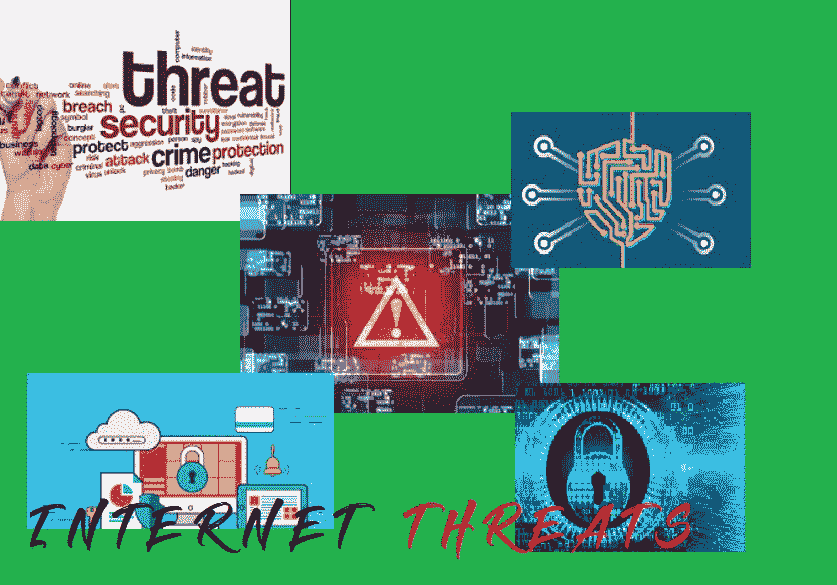

# 互联网上的威胁

> 原文:[https://www.geeksforgeeks.org/threats-on-internet/](https://www.geeksforgeeks.org/threats-on-internet/)

信息系统面临多种类型的威胁。事故、软件错误、硬件故障或火灾等环境影响可能会影响业务运营。这些威胁都需要适当的计划和活动范围。

犯罪威胁的实施者可能受到控制。恶意威胁还包括组织内部或外部的广泛威胁。活动可能来自个人、松散的 it 团体、有组织犯罪分子、公司或政府。虽然动机和犯罪威胁在评估风险时很重要，但对业务信息基础架构的任何攻击都可能导致严重的中断，并可能导致资金、生产力、市场份额或声誉的损失。

针对信息系统的犯罪活动越来越多。这一增长的部分原因是:

*   传统的商业犯罪目标正越来越多地转向基于计算机的业务。
*   关于基本计算机概念和开发可能性的一般知识在公众中变得越来越普及。
*   增加的连接性和无效的安全控制允许更好地访问信息和服务，同时提供匿名性。
*   一些刻板的业余“黑客”正在演变成更具犯罪动机的活动。

几乎物理世界中的每一种犯罪都有或者很可能很快会有一种基于计算机的在线犯罪。事实上，网络成为推进犯罪目标的另一个工具。话虽如此，对于大多数出于利润动机的罪犯来说，使用信息系统有几个基本标准。

信息系统提供低级别的认证，因此匿名程度更高。这减少了在某些情况下被逮捕的机会，甚至发现犯罪已经发生。

如今，针对信息系统的犯罪活动可分为以下几类:

1.  **Low-Level Intruders –**
    This group images up subset of stereotypical “hacker”. These individuals may evolve from online trespass and vandalism to more criminal activity such as theft of information, extortion, and credit card fraud. In addition, this group is pool of potential resources for more conditional criminal elements to exploit either directly or indirectly.

    例如，1995 年，一群松散的低级“黑客”因利用计算机系统窃取信用卡号码而被捕。这些号码被卖给了以欧洲为基地的有组织犯罪集团进行电信诈骗。

2.  **For-Profit Fraud –**
    Online activity of this group is highly variable and may include scams, extortion, deceptive advertising. theft, securities fraud or illegal fund transfers. Many of these çases are classified as computer assisted crimes. In other words, information systems are used as tool, not target.

    例如，文件欺诈涉及数百万美元的案件，涉及去年利用桌面出版软件和设备伪造工资单，从两家加州银行盗窃。

3.  **Organized Crime –**
    Many elements of organized crime are recognizing that they need to understand and use information systems to maintain their traditional level of influence and revenue. Motivation for organized crime to become involved in high technology information systems goes beyond simple fraud and extortion to include surveillance of law enforcement, money laundering, and secure and anonymous communication.
4.  **Fringe Groups – Political, Religious, and Anarchists –**
    Although this group rarely has fraudulent motives, there has been an increased use of information systems by some groups to further their agendas. Most of attacks in this arena have in solved either theft of information or denial of service attacks.

    最近的一个例子是德国混沌计算机俱乐部试图破坏法国电信和互联网基础设施，以抗议法国核试验。

5.  **Industrial Espionage and Sabotage –**
    Because few companies report cases of industrial espionage, accurate statistics are difficult to produce.
6.  **International Espionage and Information Warfare –**
    Several well documented cases have come to light of national intelligence agencies gathering economic information to assist their nation’s businesses in competitive situations. Some of methods for gathering this information have extended into attempts to access information and communication systems.
7.  **恐怖主义–**
    已经发现了几个迹象，表明传统的恐怖组织正在将信息系统视为潜在的工具和目标。特别是，从信用记录、金融机构和医疗保健提供商那里收集目标信息的能力似乎是爱尔兰共和军最近展示的一个越来越大的威胁。