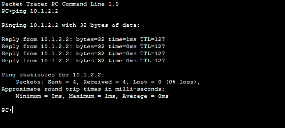

# 基于时间的访问列表

> 原文:[https://www.geeksforgeeks.org/time-based-access-list/](https://www.geeksforgeeks.org/time-based-access-list/)

先决条件–[访问列表(ACL)](https://www.geeksforgeeks.org/computer-network-access-lists-acl/)
访问列表主要用于包过滤。它是一系列连续的各种允许或拒绝条件，其中如果其中一个条件匹配，则执行该条件，而没有其他条件进一步匹配。此外，它在末尾包含一个隐式拒绝，因此规则应该至少有一个允许条件。
访问列表有多种类型，例如:

*   [标准访问列表](https://www.geeksforgeeks.org/computer-network-standard-access-list/)，
*   [扩展访问列表](https://www.geeksforgeeks.org/computer-network-extended-access-list/)，
*   [自反访问列表](https://www.geeksforgeeks.org/computer-network-reflexive-access-list/)，
*   命名访问列表，
*   Time based Access-list etc.

    但是在这里，我们将讨论基于时间的访问列表。

    **基于时间的访问列表–**
    基于时间的访问列表是一种允许基于时间段进行网络访问的访问列表。当您想要根据一天中的特定时间或一周中的特定日期来限制出站或入站流量时，这非常有用。

    例如，如果我们想拒绝员工在工作时间访问互联网，并允许在午餐时间访问。在这些类型的场景中，我们可以实现基于时间的拒绝访问互联网的访问列表。

    思科 IOS 软件版本 12.0.1.T 引入了基于时间的访问控制列表，以允许基于时间的访问控制。它最适合与网络时间协议同步，但也可以与路由器时钟同步。

    **程序–**
    要应用基于时间的访问列表，有一个简单的程序:

    1.  **定义时间范围–**首先我们要定义一个时间范围，在这个时间范围内可以借助关键字 absolute 或者 periodic 进行定义。
        **绝对:**定义了一个绝对时间。例如，如果我们想阻止星期二到星期五(绝对时间)到子网的 ICMP 流量，那么我们将使用绝对关键字。
        **周期性:**定义周期性时间。例如，如果我们想在每个工作日(星期一到星期五)阻止特定子网的 ICMP，那么我们可以使用 periodic 关键字。
    2.  **定义访问列表–**下一步，将定义一个访问列表，我们将在其中应用我们的时间范围。
    3.  **将访问列表应用于接口–**现在，访问列表将根据我们的需要应用于接口或线路。

    **配置–**

    

    有一个简单的拓扑，其中有 PC1( ip 地址- 10.1.1.2/24)、路由器(ip 地址-10.1.1.1/24 在 fa0/0 上，10.1.2.1/24 在 fa0/1 上)、PC2(ip 地址-10.1.2.2/24)和两台交换机，即 Sw1 和 Sw2，它们的所有端口都在 vlan 1 中。配置完这些之后，我们可以看到 PC1 能够 ping 通 PC2。

    

    在这种情况下，我们将拒绝 PC1 在定义的时间范围内 ping PC2，然后将该时间范围应用于访问列表。最后，我们将把它应用到路由器的一个接口上。此外，我们知道它最适合 NTP，但这里我们将使用路由器的本地时钟。

    我们可以通过命令查看路由器的时钟:

    ```
    router#show clock
    ```

    此外，我们可以通过命令更改时钟时间:

    ```
    router#clock set 0:10:0 1 July 2018 
    ```

    现在，我们将定义时间范围，首先指定阻止 PC1 ping PC2 的时间。

    ```
    router(config)#time-range time_flow
    router(config)#absolute start 00:15 1 July 2018 
                    end 00:20 1 July 2018
    ```

    time_flow 是时间范围的名称(可以给出任何名称)。我们提供了 7 月 1 日 00:15 到 00:20 的时间范围。
    这里已经显示了绝对关键字的用法。

    如果某些场景需要周期性的时间范围，则可以显示为:

    ```
    router(config)#time-range Periodic
    router(config)#periodic weekdays 0:15 to 0:20
    ```

    这里，周期是时间范围的名称。第二个命令意味着，在每周的 0:15 到 0:20(星期一到星期五)这几天，从 10.1.1.2 到 10.1.2.2(在我们将此时间范围应用于访问列表，然后将访问列表应用于接口之后，如下所述)不允许 ping。

    定义一个名为 Time_acl 的扩展访问列表，在该列表中，我们将允许 ICMP 流量在我们定义的时间范围内通过路由器。

    ```
    router(config)#ip access-list extended Time_acl
    router(config-ext-nacl)#deny icmp host 10.1.1.1 host 
                          10.1.2.2 time-range time_flow
    ```

    现在，我们将把这个访问列表应用到路由器的接口 fa0/1，在我们定义的时间范围(time_flow)内拒绝流量。

    ```
    router(config)#int fa0/1
    router(config-if)#ip access-group Time_acl out
    ```

    通过应用此方法，我们将无法在我们定义的时间范围内 ping 通 10.1.2.2。

    **优势–**

    *   易于实施
    *   它为管理员提供了对流量的更大控制，因为流量可以根据时间被拒绝或允许。