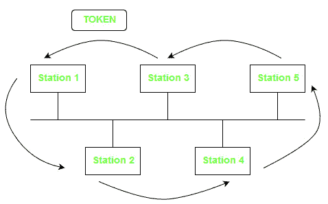
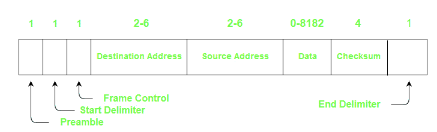

# 令牌总线(IEEE 802.4)

> 原文:[https://www.geeksforgeeks.org/token-bus-ieee-802-4/](https://www.geeksforgeeks.org/token-bus-ieee-802-4/)

**令牌总线(IEEE 802.4)** 是令牌传递局域网的流行标准。在令牌总线局域网中，物理介质是总线或树，使用同轴电缆创建逻辑环。令牌按顺序(顺时针或逆时针)从一个用户传递到另一个用户。每个站根据逻辑环中的顺序知道其“左”和“右”站的地址。站点只有在拥有令牌时才能传输数据。令牌总线的工作方式有点类似于[令牌环](https://www.geeksforgeeks.org/computer-network-efficiency-token-ring/)。

上图显示了在基于总线的令牌传递局域网中形成的逻辑环。逻辑环用箭头表示。

**帧格式:**
帧格式的各个字段有:

1.  **前置码–**用于位同步。它是一个 1 字节的字段。

2.  **起始定界符–**这些位标记帧的开始。它是一个 1 字节的字段。

3.  **帧控制–**该字段指定帧的类型–数据帧和控制帧。它是一个 1 字节的字段。

4.  **目的地址–**该字段包含目的地址。它是一个 2 到 6 字节的字段。

5.  **源地址–**该字段包含源地址。它是一个 2 到 6 字节的字段。

6.  **数据–**如果使用 2 字节地址，则该字段可能高达 8182 字节，如果是 6 字节地址，则为 8174 字节。

7.  **校验和–**该字段包含校验和位，用于检测传输数据中的错误。它是 4 字节字段。

8.  **结束分隔符–**该字段标记帧的结束。它是一个 1 字节的字段。

**参考:**
[**<u>图书–计算机网络作者:谭恩宝</u>**](https://amzn.to/3hfQerb)