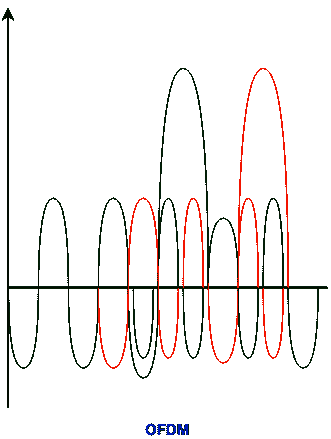

# 计算机网络面试 50 强问答

> 原文:[https://www . geesforgeks . org/top-50-计算机-网络-面试-问答/](https://www.geeksforgeeks.org/top-50-computer-networking-interview-questions-and-answers/)

**1。** **说出两种连接远程办公室的技术。**

虚拟专用网和云计算是连接远程办公室的两种技术。

**2。什么是互联网？**

互联网络是两个词的组合，inter 和 networking，这意味着完全不同的节点或网段之间的关联。这个连接区域单元是通过类似于路由器或网关的拦截器设备建立的。副学位互联网的第一个术语是互联。这种互连通常在公共、私有、商业、工业或政府网络之间进行。因此，副学士互联网络可以是由中间网络设备连接的各种单独的网络，它们作为一个巨大的网络运行。互联网是指应对制作和管理互联网作品的挑战的贸易、产品和程序。

**3。现场视察模型中软件层或用户支持层的名称。**

*   应用层
*   表示层
*   会话层

**4。现场视察模型中硬件层或网络支持层的名称。**

*   网路层
*   数据链路层
*   物理层

**5。定义 HTTPS 协议？**

HTTPS 的完整形式是安全的超文本传输协议。它是 HTTP 协议的高级版本。默认情况下，它的端口号是 443。它使用 SSL/TLS 协议来提供安全性。

**6。说出互联网模式中应用层提供的一些服务？**

互联网模式下应用层提供的一些服务如下:

*   邮件服务
*   目录服务
*   文件传输
*   存取管理
*   网络虚拟终端

**7。报头和尾部添加在 OSI 的哪一层？**

在数据链路层增加了尾部，在现场视察模型层 6、5、4、3 增加了头部。

**8。在 OSL 模型中，当数据包从下层移动到上层时会发生什么？**

在 OSL 模型中，当数据包从低层移动到高层时，报头会被删除。

**9。在 OSL 模型中，当数据包从上层移动到下层时会发生什么？**

在 OSL 模型中，当数据包从下层移动到上层时，会添加报头。这个标题包含有用的信息。

**10。什么是** **基于区域的** **防火墙？**

基于区域的防火墙是状态防火墙的一种高级方法。在有状态防火墙中，维护有状态数据库，其中记录了源 IP 地址、目的 IP 地址、源端口号、目的端口号。因此，仅允许回复，即如果流量是从网络内部生成的，则仅允许来自网络外部的回复(网络内部流量)。

思科 IOS 路由器可以通过两种方法做成防火墙:

1.  通过使用 CBAC:创建一个访问列表，并将其应用于接口，记住什么流量应该被允许或拒绝，以及在什么方向。这对管理员来说有额外的开销。
2.  使用基于区域的防火墙。

更多详情请参考[基于区域的防火墙](https://www.geeksforgeeks.org/zone-based-firewall/)文章。

**11 时。什么是服务器场？**

服务器群是由许多服务器互连在一起并位于同一物理设施中的集合。服务器群通过同时执行一个或多个应用程序或服务来提供多台服务器的综合计算能力。服务器群通常是企业数据中心的一部分或超级计算机的一个组件。服务器场也称为服务器集群或计算机农场。

**12 时。** **说出用户认证的三种方式。**

有生物测定(例如指纹、虹膜扫描)、令牌或密码。还有两级身份验证，采用其中两种方法。

**13。什么是保密性、完整性&可用性？**

**机密性–**表示信息不会泄露给未经授权的个人、实体和流程。例如，如果我们说我有一个 Gmail 帐户的密码，但有人在我登录 Gmail 帐户时看到了。在这种情况下，我的密码被泄露，保密性被破坏。

**完整性–**是指保持数据的准确性和完整性。这意味着不能以未经授权的方式编辑数据。例如，如果一名员工离开组织，那么在这种情况下，所有部门(如帐户)中该员工的数据都应更新，以反映“职务留下”的状态，以便数据完整准确，此外，只有授权人员才应被允许编辑员工数据。

**可用性–**意味着信息必须在需要时可用。例如，如果需要访问某个特定员工的信息来检查该员工是否超过了休假天数，在这种情况下，需要不同组织团队的协作，如网络运营、开发运营、事件响应和策略/变更管理。
拒绝服务攻击是阻碍信息可用性的因素之一。

**14。什么是 VPN？**

虚拟专用网代表虚拟专用网。虚拟专用网络(VPN)是一种通过不太安全的网络(如互联网)创建安全和加密连接的技术。虚拟专用网是一种使用公共网络(如互联网)扩展专用网络的方法。该名称仅表明它是一个虚拟的“专用网络”，即用户可以是位于远程位置的本地网络的一部分。它利用隧道协议来建立安全连接。更多详情请参考 [VPN 文章](https://www.geeksforgeeks.org/virtual-private-network-vpn-introduction/)

**15。什么是对称和非对称加密？**

**对称密钥加密:**
[<u>加密</u>](https://www.geeksforgeeks.org/encryption-its-algorithms-and-its-future/) 是改变任何消息的形式，以保护其不被任何人读取的过程。在对称密钥加密中，通过使用密钥对消息进行加密，并且使用相同的密钥对消息进行解密，这使得消息易于使用但不太安全。它还需要一种安全的方法将密钥从一方转移到另一方。

**非对称密钥加密:**
非对称密钥加密基于公钥和私钥加密技术。它使用两种不同的密钥来加密和解密消息。它比对称密钥加密技术更安全，但速度要慢得多。更多详情请参考[对称和非对称加密的区别](https://www.geeksforgeeks.org/difference-between-symmetric-and-asymmetric-key-encryption/)文章。

**16。IPsec 在哪一层工作？**

IPsec 在现场视察模型的第 3 层工作。

**17。什么是隧道模式？**

这是一种数据交换模式，其中两台通信计算机本身不使用 IPSec。相反，将局域网连接到传输网络的网关创建一个虚拟隧道，使用 IPSec 协议来保护通过它的所有通信。隧道模式最常用于网关之间，或网关的终端站，网关充当其背后主机的代理。隧道模式最常用于加密安全 IPSec 网关之间的流量，例如思科路由器和 PIX 防火墙之间的流量

**18。定义数字签名？**

因为名字听起来是数字签名文档的新选择。它确保消息被发送到预期用途，而不会被任何第三方(攻击者)篡改。简而言之，数字签名用于验证电子邮件的真实性。

或者我们可以这样说——数字签名是一种数学技术，用于验证消息、软件或数字文档的真实性和完整性。

**19。什么是授权？**

授权提供了在用户通过身份验证获得对网络资源的访问权限后对网络资源实施策略的功能。身份验证成功后，可以使用授权来确定允许用户访问哪些资源以及可以执行哪些操作。

**20。IPS 和防火墙有什么区别？**

**入侵防御系统**也称为入侵检测和防御系统。它是一个网络安全应用程序，用于监控网络或系统活动中的恶意活动。入侵防御系统的主要功能是识别恶意活动，收集关于该活动的信息，报告该活动并试图阻止或阻止它。入侵防御系统被认为是对[](https://www.geeksforgeeks.org/intrusion-detection-system-ids/)<u>入侵检测系统的补充，因为入侵防御系统和入侵检测系统都针对恶意活动操作网络流量和系统活动。IPS 通常记录与观察到的事件相关的信息，向安全管理员通知重要的观察到的事件，并生成报告。许多入侵防御系统也可以通过阻止检测到的威胁成功来对其做出响应。他们使用各种响应技术，包括入侵防御系统停止攻击本身、改变安全环境或改变攻击内容。</u>

<u>一个**防火墙**是一个网络安全设备，基于硬件或软件，它监控所有传入和传出的流量，并基于一组定义的安全规则接受、拒绝或丢弃该特定流量。</u>

<u>**21。什么是 IP 欺骗？**</u>

<u>**IP 欺骗**本质上是 [<u>黑客</u>](https://www.geeksforgeeks.org/types-of-hackers/) 用来获得对计算机的未授权访问的技术。早在 1980 年，学术界就开始讨论 IP 欺骗的概念。安全专家在理论层面上已经知道了 IP 欺骗类型的攻击。这主要是理论上的，直到罗伯特·莫里斯发现了被称为序列预测的 TCP 协议中的一个安全弱点。有时，IP 欺骗被用来掩盖 Dos 攻击的来源。事实上， [<u>Dos 攻击</u>](https://www.geeksforgeeks.org/types-of-dos-attacks/) 往往会屏蔽攻击来源的实际 IP 地址。</u>

<u>**22。** **是什么** **威胁、脆弱性和风险的意思？**</u>

<u>**威胁**是任何可以意外或故意利用漏洞并破坏或损坏**资产**的东西。资产可以是任何人、财产或信息。资产是我们试图保护的，威胁是我们试图防范的。**脆弱性**意味着我们的保护工作存在差距或薄弱环节。</u>

<u>风险只不过是资产、威胁和脆弱性的交集。</u>

```
A+T+V = R
```

<u>**23。DNS 服务器的主要用途是什么？**</u>

<u>域名系统代表域名服务器。它将互联网域名和主机名转换为 IP 地址，反之亦然。域名系统技术允许在你的网络浏览器和我们的电脑上输入名字，从而在互联网上自动找到那个地址。域名系统的一个关键要素是全球范围内的域名系统服务器集合。它有责任通过为每个域名指定一个权威的 [](https://en.wikipedia.org/wiki/Authoritative_name_server) 名称服务器来分配域名并将这些名称映射到互联网资源。互联网维护两个主要的名称空间，如域名层次结构和互联网协议地址空间。</u>

<u>**24。DNS 的协议和端口号是什么？**</u>

<u>协议–TCP/UDP</u>

<u>端口号- 53</u>

<u>**25。传输介质在 OSI 模型中的地位如何？**</u>

<u>在现场视察模型中，传输介质支持第 1 层(物理层)。</u>

<u>**26。** **双绞线电缆中绞合的重要性是什么？**</u>

<u>双绞线电缆由两根缠绕在一起的绝缘铜线组成。扭转对于最小化电磁辐射和外部干扰很重要。</u>

<u>**27。** **什么样的错误是校验和检测不到的？**</u>

<u>在校验和中，不能检测到多个位错误。</u>

<u>**28。** **光纤** **链路** **采用了哪种复用** **技术？**</u>

<u>波分复用通常用于光纤链路。</u>

<u>**29。** **光纤有哪些优势？**</u>

*   <u>带宽高于铜缆</u>
*   <u>功耗更低，允许远距离传输数据</u>
*   <u>光缆抗电磁干扰</u>
*   <u>光缆的尺寸是铜线的 4.5 倍</u>
*   <u>因为与铜线相比，电缆更轻、更细，所以它们使用的面积更小</u>
*   <u>由于重量更轻，安装极其容易。</u>
*   <u>光缆极难分接，因为它们不会产生电磁能量。这些光缆传输数据非常安全。</u>
*   <u>这种电缆与大多数酸性元素相反，这些酸性元素接触铜线，本质上也是柔性的。</u>
*   <u>光缆通常比同等长度的铜线便宜。</u>
*   <u>光在宇宙中有最快的速度，这样的信号快得多</u>
*   <u>光纤电缆比铜双绞线电缆允许更多的电缆。</u>
*   <u>光缆的带宽比铜双绞线多多少。</u>

<u>**30。哪种多路复用技术用于组合模拟信号？**</u>

<u>为了组合模拟信号，通常使用 FDM(频分复用)和 WDM(波分复用)。</u>

<u>**31。** **哪种多路复用技术用于组合数字** **信号？**</u>

<u>为了组合数字信号，使用时分复用技术。</u>

<u>**32。IP 组播可以负载均衡吗？**</u>

<u>**否，**IP 组播多路径命令负载拆分流量，不对流量进行负载均衡。来自一个来源的流量将只使用一条路径，即使流量远远超过来自其他来源的流量。</u>

<u>**33。什么是 CGMP(思科集团管理协议)？**</u>

<u>CGMP 是一个简单的协议，路由器是唯一产生 CGMP 消息的设备。这些开关只听这些信息并对其进行操作。CGMP 对其所有消息使用一个众所周知的目的地 **MAC 地址(0100.0cdd.dddd)** 。当交换机接收到带有此目的地址的帧时，它们会将其泛洪到所有接口上，这样网络中的所有交换机都会收到 CGMP 消息。</u>

<u>在 CGMP 消息中，最重要的两项是:</u>

*   <u>组目标地址</u>
*   <u>单播源地址(美国)</u>

<u>组目的地址是多播组的媒体访问控制地址，单播源地址是主机(接收器)的媒体访问控制地址。</u>

<u>**34。什么是多播？**</u>

<u>**组播**是一种群组通信方法，发送方同时向网络中的多个接收方或节点发送数据。多播是一种一对多和多对多的通信，因为它允许发送者或发送者通过局域网或广域网同时向多个接收者发送数据包。这个过程有助于最小化网络的数据帧。更多详情请阅读[计算机网络组播](https://www.geeksforgeeks.org/multicasting-in-computer-network/)文章。</u>

<u>**35。蓝牙和 wifi 有什么区别？**</u>

<figure class="table">

| S.NO | 蓝牙 | 无线局域网（wireless fidelity 的缩写） |
| --- | --- | --- |
| 1. | 蓝牙没有完整的形式。 | 而 wifi 代表无线保真。 |
| 2. | 所有设备都需要蓝牙适配器才能连接。 | 而它需要一个无线适配器蓝牙用于所有设备和一个无线路由器用于连接。 |
| 3. | 蓝牙功耗低。 | 同时它消耗高功率。 |
| 4. | 与 wifi 的数量相比，BlueTooth 的安全性较差。 | 虽然它提供了比 BlueTooth 更好的安全性。 |
| 5. | 蓝牙不太灵活意味着支持这些有限的用户。 | 而 wifi 支持大量用户。 |
| 6. | BlueTooth 的无线电信号范围是十米。 | 而在 wifi 中，这个范围是 100 米。 |
| 7. | 蓝牙要求低带宽。 | 而它需要高带宽。 |

<u>**36。什么是** **一** **反向代理？**</u>

<u>**反向代理服务器:**反向代理服务器的工作，用于侦听客户端发出的请求，并重定向到不同服务器上的特定网络服务器。这也用于限制客户端对驻留在特定服务器上的机密数据的访问。更多详情请参考[什么是代理服务器](https://www.geeksforgeeks.org/what-is-proxy-server/)一文。</u> 

<u>**37。** **地址在数据包在数据报网络中的作用是什么？**</u>

<u>数据报网络中的地址字段是端到端寻址。</u>

<u>**38。** **数据报网络中的路由表可以有两个目的地址相同的条目吗？**</u>

<u>No. 数据报网络中的路由表有两个目的地址相同的条目，这是不可能的，因为目的地址或接收方地址在数据报网络中是唯一的。</u>

<u>**39。** **校验和计算时用什么样的算法添加数据项？**</u>

<u>要在校验和计算中添加数据项，需要使用补码算法。</u>

<u>**40。** **定义捎带？**</u>

<u>一种称为捎带的技术被用来提高双向协议的效率。当一个帧携带从 A 到 B 的数据时，它也可以携带关于从 B 到达(或丢失)的帧的控制信息；当一个帧携带从 B 到 A 的数据时，它也可以携带关于从 A 到达(或丢失)的帧的控制信息</u>

<u>**41。** **背驮有什么优缺点？**</u>

<u>搭载的主要优势是更好地利用可用的信道带宽。</u>

<u>搭载的主要缺点是额外的复杂性，如果数据链路层在发送确认之前等待太长时间，则帧的重新传输将会发生**。**</u>

<u>**42。** **面向字节的协议中使用了哪种技术？**</u>

<u>字节填充用于面向字节的协议。当有一个字符与标志具有相同的模式时，会在帧的数据部分添加一个特殊的字节。</u>

<u>**43。** **定义 OFDM 这个术语？**</u>

<u>**正交频分复用(OFDM):**
它也是模拟系统中使用的复用技术。在正交频分复用中，不需要保护频带，并且正交频分复用的频谱效率高，这与 FDM 相反。在正交频分复用中，单个数据源连接所有子信道。</u>

<u></u>

<u>**44。** **什么是透明桥？**</u>

<u>**透明网桥:**
透明网桥自动维护路由表，并更新表以响应不断变化的拓扑。透明桥接机制由三种机制组成:</u>

*   <u>帧转发</u>
*   <u>地址学习</u>
*   <u>循环分辨率</u>

<u>透明桥很容易使用。安装网桥，主机中不需要任何软件更改。在所有情况下，透明网桥都会淹没广播和多播帧。</u>

<u>**45。icmpV4 数据包的最小大小是多少 icmpv4 数据包的最大大小是多少？**</u>

*   <u>最小大小的 ICMPv4 数据包= 28 字节</u>
*   <u>ICMPv4 数据包的最大大小= 2068 字节</u>

<u>**46。** **为什么我们 OSPF 一个协议**说**比我们 RIP 快？**</u>

<u>OSPF 代表开放最短路径优先，它使用链路状态路由算法。该协议比 RIP 更快，因为:</u>

*   <u>利用路由器中可用的链路状态信息，它构建了一个拓扑，在这个拓扑中，拓扑决定了路由决策的路由表。</u>
*   <u>它支持可变长度子网掩码和无类域间路由寻址模型。</u>
*   <u>由于它使用了迪克斯特拉算法，它为每条路线计算最短路径树。</u>
*   <u>OSPF(开放最短路径优先)自己处理错误检测，并在广播域中使用多播寻址进行路由</u>

<u>**47。DNS 消息的两个主要类别是什么？**</u>

<u>DNS 消息的两个类别是查询和回复。</u>

<u>**48。** **为什么我们需要****pop 3 协议来处理电子邮件？**</u>

<u>**pop 3 的需求:**</u>

<u>邮局协议(POP3)是使用最广泛的协议，并得到大多数电子邮件客户端的支持。它为用户访问邮箱和下载邮件提供了一种方便和标准的方式。这样做的一个重要优点是，邮件信息被发送到客户的电脑上，无论是否访问网络，都可以阅读。</u>

<u>**49。定义术语抖动？**</u>

<u>抖动是一种“分组延迟变化”。它可以简单地表示，当不同的数据包在网络中面临不同的延迟，并且接收器应用程序中的数据是时间敏感的，即音频或视频数据时，抖动被认为是一个问题。抖动以毫秒(ms)为单位。它被定义为正常发送数据包顺序中的干扰。</u>

<u>**50。为什么带宽是网络性能的重要参数？**</u>

<u>带宽的特征是可以在固定时间内传输的数据或信息的度量。该术语可以在两个不同的上下文中使用，具有两个不同的估计值。对于数字设备，带宽以每秒位数(bps)或每秒字节数来衡量。对于 ADI 公司，带宽以每秒周期数或赫兹(Hz)来衡量。带宽只是个人眼中网络速度的一个组成部分。真正的互联网速度实际上是你每秒钟接收的数据量，这也与延迟有很大关系。</u> 

</figure>