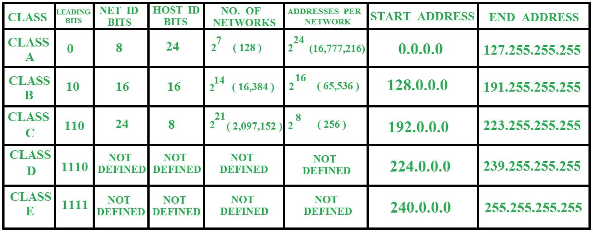
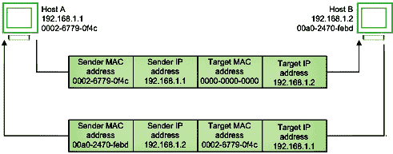
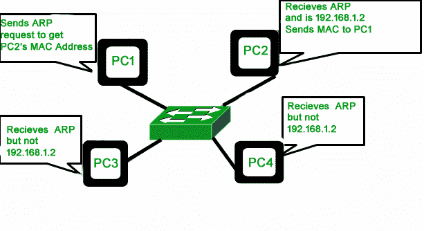

# 50 大 IP 寻址面试问答

> 原文:[https://www . geesforgeks . org/top-50-IP-寻址-面试-问答/](https://www.geeksforgeeks.org/top-50-ip-addressing-interview-questions-and-answers/)

**1。什么是 IP 地址？**

IP 地址是一个包含如何到达特定主机的信息的地址，尤其是在局域网之外。IP 地址是 32 位唯一地址，地址空间为 2 <sup>32</sup> 。写 IP 地址一般有两种表示法，点分十进制表示法和十六进制表示法。详见[有类 IP 寻址介绍](https://www.geeksforgeeks.org/introduction-of-classful-ip-addressing/)。

**2。IP 地址有哪些不同的类别，并给出每个类别的范围？**

IP 地址是一个包含如何到达特定主机的信息的地址，尤其是在局域网之外。IP 地址是 32 位唯一地址，地址空间为 2 <sup>32</sup> 。



更多详情请参考【有类 IP 寻址】的[介绍](https://www.geeksforgeeks.org/introduction-of-classful-ip-addressing/)。

**3。什么是子网掩码？**

**子网掩码**是一个 32 位的数字，用于标识一个 IP 地址的子网。子网掩码是 1 和 0 的组合。1 代表网络和子网标识，而 0 代表主机标识。在这种情况下，子网掩码是，

```
11111111.11111111.11111111.11000000 
or
255.255.255.192 
```

因此，为了获得目的地址所属的网络，我们必须按位&加上子网掩码。

```
    11111111.11111111.11111111.11000000
&&  11001000.00000001.00000010.00010100
-----------------------------------------------------
    11001000.00000001.00000010.00000000 
```

地址属于，

```
11001000.00000001.00000010.00000000 
or
200.1.2.0 
```

更多详情请参考[子网掩码的作用一文](https://www.geeksforgeeks.org/role-of-subnet-mask/)。

**4。为什么用 CIDR？**

这种有类寻址方法的问题是浪费了数百万个 A 类地址，许多 B 类地址被浪费了，而 C 类中可用的地址数量太少，无法满足组织的需求。D 类地址用于多播路由，因此只能作为单个块使用。E 类地址被保留。由于存在这些问题，有类网络被无类域间路由(CIDR)所取代。更多详情，请参考文章 [CIDR 全表。](https://www.geeksforgeeks.org/cidr-full-form/)

**5。LOOPBACK 地址是什么？**

环回地址用于让系统向自己发送消息，以确保 TCP/IP 堆栈正确安装在机器上。更多详情请参考[本地广播和环回地址](https://www.geeksforgeeks.org/local-broadcast-and-loopback-address/)一文。

**6。什么是默认网关？**

在组织系统中，网关是将流量从一个工作站路由到另一个网段的节点。默认网关通常连接内部网络和外部网络(互联网)。在这种情况下，网关节点还可以充当代理服务器和防火墙。网关还与路由器和交换机相关联，路由器使用报头和转发表来确定数据包的发送位置，交换机提供数据包进出网关的实际路径。

更多详情请参考计算机网络文章中[不同层的工作。](Working Of Different layers in Computer Network)

**7。为什么使用跃点限制字段？**

**跳数限制:**跳数限制字段与 IPv4 数据包中的 TTL 相同。它表示允许 IPv6 数据包传输的最大中间节点数。转发数据包的每个节点都会将其值递减 1，如果该值降至 0，数据包将被丢弃。这用于丢弃由于某些路由错误而陷入无限循环的数据包。

更多详情请参考[互联网协议第六版(IPv6)报头](https://www.geeksforgeeks.org/internet-protocol-version-6-ipv6-header/)一文。

**8。PING 使用什么协议？**

PING 使用 ICMP(互联网控制消息协议)。更多详情请参考【Ping 与 Traceroute 的区别一文。

**9。Tracert 有什么用？**

Traceroute 是一个广泛使用的命令行实用程序，几乎在所有操作系统中都可用。它向您显示到达目的地地址的完整路线。它还显示了中间路由器之间花费的时间(或延迟)。更多详情请参考【Ping 与 Traceroute 的区别一文。

**10。说出 FTP 协议使用的端口？**

**基本上**， **FTP 协议使用两个端口:**

**控制连接:**用于发送用户标识、密码、更改远程目录的命令、检索和存储文件的命令等控制信息。，FTP 利用连接。控制连接在端口号 21 上启动。

**数据连接:**为了发送实际文件，FTP 使用了数据连接。在端口号 20 上启动数据连接。
详见[应用层](https://www.geeksforgeeks.org/file-transfer-protocol-ftp-in-application-layer/)篇[文件传输协议。](https://www.geeksforgeeks.org/file-transfer-protocol-ftp-in-application-layer/)

**11 时。什么是 MAC 地址？**

MAC 地址是计算机唯一的 48 位硬件编号，在制造过程中嵌入网卡(称为**网络接口卡**)中。媒体访问控制地址也被称为网络设备的物理**地址**。在 IEEE 802 标准中，数据链路层分为两个子层

1.  逻辑链路控制子层
2.  媒体访问控制子层

媒体访问控制地址由数据链路层的媒体访问控制子层使用。媒体访问控制地址在世界范围内是唯一的，因为存在数百万个网络设备，我们需要唯一地识别每个设备。

更多详情请参考[计算机网络中 MAC 地址介绍](https://www.geeksforgeeks.org/introduction-of-mac-address-in-computer-network/)一文。

**12 时。解释 ARP？**

地址解析协议是一种通信协议，用于发现与给定网络地址相关联的物理地址。通常，ARP 是网络层到数据链路层的映射过程，用于发现给定互联网协议地址的媒体访问控制地址。
为了将数据发送到目的地，有一个 IP 地址是必要的，但还不够；我们还需要目的机器的物理地址。ARP 用于获取目的机器的物理地址(MAC 地址)。



在发送 IP 数据包之前，必须知道目的地的媒体访问控制地址。如果不是，那么发送者广播 ARP 发现分组，请求预期目的地的媒体访问控制地址。由于 ARP-discovery 是广播的，网络中的每台主机都会收到此消息，但除了 IP 相关的目标接收主机之外，所有人都会丢弃数据包。现在，这个接收者将发送一个带有其媒体访问控制地址(ARP 回复)的单播数据包给 ARP 发现数据包的发送者。原始发送方收到 ARP 回复后，会更新 ARP 缓存，并开始向目的地发送单播消息。



有关更多详细信息，请参考[地址解析协议如何工作一文。](https://www.geeksforgeeks.org/how-address-resolution-protocol-arp-works/)

**13。什么是 MTU？**

最大传输单位也称为 MTU，是网络和操作系统中使用的术语。它定义了在网络连接中作为单个实体传输的最大数据包大小。MTU 的大小决定了网络上可以传输的数据量(以字节为单位)。更多详情请参考[什么是 MTU](https://www.geeksforgeeks.org/what-is-mtumaximum-transmission-unit/) 文章。

**14。如果互联网上的 B 类网络的子网掩码为 255.255.248.0，那么每个子网的最大主机数是多少？**
子网掩码的二进制表示为 111111111 . 1111111111 . 111111000。00000000.子网中设置了 21 位。所以主机 id 还剩 11 (32-21)位。主机 id 的总可能值是 2^11 = 2048。在这 2048 个值中，保留了 2 个地址。所有位为 1 的地址被保留为广播地址，所有主机 id 位为 0 的地址被用作子网的网络地址。
通常，每个网络中可用于寻址特定主机的地址数量始终为 2^n-2，其中 n 是主机 id 的位数。所以答案是 **2046。**

**15。什么是 IP 组播？**

多播有一个或多个发送者和一个或多个接收者参与数据传输流量。在多播中，流量位于单播和广播的边界之间。它的服务器直接复制数据流，然后被模拟并路由到请求它的主机。IP 组播需要一些其他协议的支持，如 [<u>【互联网组管理协议(IGMP)</u>](https://www.geeksforgeeks.org/what-is-igmpinternet-group-management-protocol/) ，组播路由为其工作。此外，在有类 IP 中，寻址类别 D 是为多播组保留的。


**16。公有和私有 IP 地址的区别？**

1.  [**<u>公共 IP 地址</u>**](https://www.geeksforgeeks.org/difference-between-private-and-public-ip-addresses/)**–**
    公共 IP 地址是互联网协议地址，由各种服务器/设备加密。这时，您将这些设备与互联网连接起来。这是我们在主页上显示的同一个 IP 地址。那么为什么是第二页呢？嗯，不是所有的人都讲知识产权语言。我们希望让每个人都能尽可能容易地获得他们需要的信息。有些人甚至称之为他们的外部 IP 地址。公共互联网协议地址是通过互联网访问的互联网协议地址。与用于将邮件投递到您家中的邮政地址一样，公共互联网协议地址是分配给计算机设备的不同国际互联网协议地址。网络服务器、电子邮件服务器和任何可以直接访问互联网的服务器设备都是那些将输入公共互联网协议地址的设备。互联网地址协议在全球范围内都是独一无二的，并且只随唯一的设备提供。
2.  [**<u>私有 IP 地址</u>**](https://www.geeksforgeeks.org/what-is-apipa-automatic-private-ip-addressing/)**–**
    连接到您的互联网的所有设备都有私有 IP 地址。这包括电脑、智能手机和平板电脑，但也包括任何支持蓝牙的设备，如扬声器、打印机或智能电视。随着物联网的不断发展，你家里拥有的私有 IP 地址数量很可能会增加。你的路由器需要一种方法来分别识别这些东西，大多数东西都需要一种方法来相互了解。因此，您的路由器会生成私有 IP 地址，这些地址是分隔网络的每个设备的唯一标识符。

**17。你能解释一下什么是子网划分吗？**

当一个更大的网络被分成更小的网络时，为了维护安全，这就是所谓的子网划分。因此，对于较小的网络来说，维护更容易。有关更多详细信息，请阅读[子网划分](https://www.geeksforgeeks.org/introduction-to-subnetting/)文章中的[介绍。](https://www.geeksforgeeks.org/introduction-to-subnetting/)

**18。你知道什么是网络地址翻译吗？**

要访问互联网，需要一个公共 IP 地址，但我们可以在专用网络上使用私有 IP 地址。NAT 的思想是允许多个设备通过一个公共地址访问互联网。为此，需要将私有 IP 地址转换为公共 IP 地址。**网络地址转换(NAT)** 是将一个或多个本地 IP 地址转换为一个或多个全局 IP 地址的过程，反之亦然，以便为本地主机提供互联网访问。此外，它还转换端口号，即在将被路由到目的地的数据包中用另一个端口号屏蔽主机的端口号。然后，它会在 NAT 表中输入相应的 IP 地址和端口号。NAT 通常在路由器或防火墙上运行。更多详情请参考[网络地址翻译。](https://www.geeksforgeeks.org/network-address-translation-nat/)

**19。一个组织需要一系列的 IP 地址，才能为其 1500 台计算机中的每一台分配一个地址。该组织已就此任务联系了一家互联网服务提供商。ISP 使用 CIDR，并从可用的 IP 地址空间 202.61.0.0/17 提供服务。ISP 希望为组织分配地址空间，这将使用路由聚合最大限度地减少 ISP 路由器中的路由条目数量。要计算地址空间，ISP 可以允许任何一个组织使用这些地址空间吗？**

给定 IP 地址的子网掩码:

```
202.61.0.0/17 
⇒ 11111111 11111111 10000000 00000000
⇒ 255.255.128.0 
```

既然我们需要 1500 台主机，那么，主机地址的位数，

```
= ceiling (log2 (1500)) 
= ceiling (10.55) 
= 11 bits for host address 
```

因此，最后 11 位将用于主机地址:

```
00000000.00000000 → 00000111.11111111 (0.0  →  7.255)

00001000.00000000 → 00010000.00000000 (8.0 - 15.255)

00001111.11111111 → 00010111.11111111 (16.0 - 23.255) 
```

序列是 0、8、16、24、32、40、48、56、64、72、80、96、104、112、120。

因此，序列中存在 64 和 104，因此 202.61.104.0 / 21 和 202.61.64.0 / 21 是可能的 IP 地址。

**20。解释静态和动态 IP 的区别？**

<figure class="table">

| S.NO | 静态 IP 地址 | 动态 IP 地址 |
| --- | --- | --- |
| 1. | 它由互联网服务提供商提供。 | 而它是由动态主机配置协议提供的。 |
| 2. | 静态 IP 地址在任何时候都不会改变，这意味着如果提供了静态 IP 地址，那么它就不能被改变或修改。 | 而动态的 IP 地址静态的随时变化。 |
| 3. | 静态 IP 地址不太安全。 | 而在动态 ip 地址中，风险比静态 IP 地址低。 |
| 4. | 静态 IP 地址很难指定。 | 而动态 IP 地址则很容易指定。 |
| 5. | 可以跟踪静态 IP 地址设计的设备。 | 但是动态 ip 地址设计的设备无法追踪。 |
| 6. | 静态 IP 地址比动态 IP 地址更稳定。 | 而动态 ip 地址不如静态 ip 地址稳定。 |
| 7. | 维护静态 ip 地址的成本高于动态 IP 地址。 | 而动态 ip 地址的维护成本低于静态 IP 地址。 |
| 8. | 它用于计算数据不太保密的地方。 | 而在数据更机密、需要更安全的地方使用。 |

更多详情请参考[静态和动态 IP](https://www.geeksforgeeks.org/difference-between-static-and-dynamic-ip-address/) 地址的区别。

**21。我的电脑如何获得它的 IP 地址？**

要获取 IP 地址:

1.  单击开始->程序->附件->命令提示符。
2.  在命令提示符下键入 ipconfig，然后按回车键。

通过使用这些步骤，您可以获得您的电脑 IP 地址、子网掩码和默认网关的详细信息。

**22。Gateway 有什么特点？**

网关提供了多种功能。其中一些是:

*   网关充当数据传输的网桥，因为它使数据传输变得更加容易，并且不需要高存储容量。
*   网关为服务器传输的数据和用户终端发出的数据请求创建一个结构性的临时仓库。
*   网关使传输变得更加可行，因为它将所有数据排队，并将其分成小数据包，而不是批量发送。通过网关传输的数据被分成各种有用的小数据包，每个数据包都有各自的意义，并在处理数据时发挥作用。
*   如果能对网关进行修改，网关就能使数据更加安全，这样就能比智能设备更可靠。
*   网关通过为内容植入更好的可读性来优化搜索引擎、应用程序和服务器的数据，以便机器可以轻松理解和优化数据。更多详情请参考[网关介绍。](https://www.geeksforgeeks.org/introduction-of-gateways/)

**23。Ipv6 向后兼容 Ipv4 吗？**

不，IPv6 与 IPv4 协议不向后兼容。更多详情请参考[互联网协议第六版](https://www.geeksforgeeks.org/internet-protocol-version-6-ipv6/)文章。

**24。可以同时拥有一个 Ipv4 和一个 Ipv6 地址吗？**

是的，可以同时拥有 IPv4 和 IPv6 地址。更多详情请参考[互联网协议第 6 版](https://www.geeksforgeeks.org/internet-protocol-version-6-ipv6/)和【IPv4 和 IPv6 的区别文章。

**25。什么是 TTL？**

正在发送的数据的生命周期。一旦该指定时间结束或过去，数据将被丢弃，或者也可以表示为该数据包在网络中存在的跳数，此后该数据包将被丢弃。TTL 字段的目的是避免无法传送的数据报在网络中不断循环的情况。更多详情请参考[RTT 与 TTL](https://www.geeksforgeeks.org/difference-between-round-trip-time-rtt-and-time-to-live-ttl/) 的区别文章。

**26。如果 TTL 字段的值为 10。有多少路由器(最多)可以处理这个数据报？**

TTL 代表生存时间。此字段根据数据包的跳数(通过的路由器数量)指定数据包的寿命。每次路由器处理数据报时，TTL 字段都会递减 1。当该值为 0 时，数据包会自动销毁。更多详情请参考 RTT 与 TTL 文章的[区别。](https://www.geeksforgeeks.org/difference-between-round-trip-time-rtt-and-time-to-live-ttl/)

**27。如果协议字段中的值是 17，那么使用的传输层协议是哪种协议？**

如果协议字段中的值为 17，则传输层协议使用 UDP(用户数据报协议)。更多详情请参考 [UDP](https://www.geeksforgeeks.org/user-datagram-protocol-udp/) 文章。

**28。如果没有类，但地址仍然被授予，在无类寻址中会发生什么？**

在无类寻址中，没有类，但地址仍然以块的形式授予。无类 IP 地址块中的地址总数= 2(32–CIDR 值)。更多详情请参考【有类 IP 寻址】的[介绍。](https://www.geeksforgeeks.org/introduction-of-classful-ip-addressing/)

**29。假设两个 IPv6 节点想要使用 IPv6 数据报进行互操作，但是它们通过中间的 IPv4 路由器相互连接。那最好的解决办法是什么？**

如果两个 IPv6 节点想要使用 IPv6 数据报进行互操作，它们通过中间的 IPv4 路由器相互连接。那么隧道挖掘就是最好的解决方案。更多详情请参考[互联网协议第六版](https://www.geeksforgeeks.org/internet-protocol-version-6-ipv6/)文章。

**30。什么是 IANA？**

IANA，互联网分配号码管理局，是互联网的一个管理功能，负责跟踪互联网标准使用的 IP 地址、域名和协议参数标识符。其中一些标识符是参数，例如互联网协议(如 TCP、ICMP 或 UDP)用来指定功能和行为的参数；其中一些代表互联网地址，另一些代表域名。无论标识符的类型如何，IANA 函数(以下简称 IANA)都确保对值进行唯一性管理，并在可公开访问的注册管理机构中提供。

**31。什么是 DHCP？**

DHCP 是动态主机配置协议的缩写。它是主机用来获取网络设置信息的应用层协议。DHCP 由 DHCP 服务器控制，**动态分配**网络配置参数，如 IP 地址、子网掩码和网关地址。更多详情请参考[动态主机配置协议](https://www.geeksforgeeks.org/dynamic-host-configuration-protocol-dhcp/)一文。

**32。如何使用路由器管理网络？**

路由器有内置的控制台，允许您配置不同的设置，如安全性和数据记录。我们可以给计算机分配限制，比如允许它们访问什么资源，或者一天中什么特定时间它们可以浏览互联网。我们甚至可以限制哪些网站不能在整个网络上查看。更多详情请参考[路由器简介](https://www.geeksforgeeks.org/introduction-of-a-router/) [](https://www.geeksforgeeks.org/introduction-of-a-router/) 。

**33。什么是 ipconfig？**

**IPCONFIG** 代表**互联网协议配置**。这是一个命令行应用程序，显示所有当前的 TCP/IP(传输控制协议/互联网协议)网络配置，刷新 DHCP(动态主机配置协议)和 DNS(域名服务器)。它还显示所有适配器的 IP 地址、子网掩码和默认网关。它适用于微软视窗、ReactOS 和苹果电脑。ReactOS 版本由 Ged Murphy 开发，并根据通用公共许可证获得许可。更多详情请参考 [ipconfig 全表](https://www.geeksforgeeks.org/ipconfig-full-form/)文章。

**34。当您将网卡从一台电脑移动到另一台电脑时，是否也会传输 MAC 地址？**

是的，如果我们将网卡从一台电脑移动到另一台电脑，那么媒体访问控制地址也会被传输，因为媒体访问控制地址是硬连线到网卡电路的，而不是个人电脑。这也意味着当另一台电脑替换网卡时，另一台电脑可以有不同的媒体访问控制地址。

**35。解释集群支持？**

集群支持是指网络操作系统连接容错组中多台服务器的能力。这样做的主要目的是，如果一台服务器出现故障，集群中的下一台服务器将继续进行所有处理。

**36。布鲁特是什么？**

**Brouter**–也被称为桥接路由器，是一种结合了网桥和路由器功能的设备。它可以在数据链路层或网络层工作。作为路由器，它能够跨网络路由数据包，作为网桥，它能够过滤局域网流量。更多详情，请参考[路由器和 Brouter](https://www.geeksforgeeks.org/difference-between-router-and-brouter/) 的区别文章。

**37。说明 VPN 的特点？**

1.  vpn 还通过在客户端和 VPN 服务器之间提供加密隧道来确保安全性。
2.  VPN 用于绕过许多被阻止的站点。
3.  VPN 通过隐藏你的 ip 地址来方便匿名浏览。
4.  此外，最合适的搜索引擎优化(SEO)是通过分析来自虚拟专用网提供商的数据来完成的，这些提供商为浏览特定产品提供了国家/地区的状态。这种搜索引擎优化的方法被许多互联网营销经理广泛使用，以形成新的策略。更多详情请参考[虚拟专网](https://www.geeksforgeeks.org/virtual-private-network-vpn-introduction/)。

**38。MAC 地址和 IP 地址有哪些重要区别？**

<figure class="table">

| S.NO | mac 地址 | IP 地址；网络地址 |
| --- | --- | --- |
| 1. | 媒体访问控制地址代表媒体访问控制地址。 | IP 地址代表互联网协议地址。 |
| 2. | 媒体访问控制地址是一个六字节的十六进制地址。 | IP 地址是四字节(IPv4)或八字节(IPv6)地址。 |
| 3. | 带有媒体访问控制地址的设备可以通过 ARP 协议进行检索。 | 附加了 IP 地址的设备可以通过 RARP 协议进行检索。 |
| 4. | 网卡制造商提供媒体访问控制地址。 | 互联网服务提供商提供 IP 地址。 |
| 5. | 媒体访问控制地址用于确保计算机的物理地址。 | IP 地址是计算机的逻辑地址。 |
| 6. | 媒体访问控制地址在数据链路层运行。 | IP 地址在网络层运行。 |
| 7. | 媒体访问控制地址有助于简单地识别设备。 | IP 地址标识设备在网络上的连接。 |
| 8. | 计算机的媒体访问控制地址不能随时间和环境而改变。 | IP 地址会随着时间和环境而改变。 |
| 9. | 第三方不容易找到媒体访问控制地址。 | 第三方可以找到 IP 地址。 |

**39。127.0.0.1 是什么？**

在 [<u>IPv4</u>](https://www.geeksforgeeks.org/differences-between-ipv4-and-ipv6/) 中，以十进制 127 开头或第一个八位字节中有 01111111 的 IP 地址是环回地址(127。十.十.十)。通常，127.0.0.1 用作本地环回地址。
这导致了许多潜在的 IP 地址的浪费。但是在 IPv6 中::1 被用作本地环回地址，因此没有任何地址浪费。

**40。什么是 DNS？**

DNS 是一种主机名到 IP 地址的转换服务。DNS 是一个分布式数据库，在名称服务器的层次结构中实现。它是客户端和服务器之间消息交换的应用层协议。更多详情请参考[应用层](https://www.geeksforgeeks.org/domain-name-system-dns-in-application-layer/)中的 [DNS。](https://www.geeksforgeeks.org/domain-name-system-dns-in-application-layer/)

**41。代理服务器有什么用？**

代理服务器是指在客户端请求和特定服务器的某些服务或某些资源请求之间充当中介的服务器。根据客户端向服务器发出请求的目的，可以使用不同类型的代理服务器。代理服务器的基本目的是保护互联网客户端和互联网资源的直接连接。当客户端向任何其他服务器发出任何请求时，代理服务器还会阻止识别客户端的 IP 地址。更多详情请参考[代理服务器](https://www.geeksforgeeks.org/proxy-server/)文章。

**42。ipconfig 和 ifconfig 命令有什么区别？**

**IPCONFIG** 代表**互联网协议配置**。这是一个命令行应用程序，显示所有当前的 TCP/IP(传输控制协议/互联网协议)网络配置，刷新 DHCP(动态主机配置协议)和 DNS(域名服务器)。它还显示所有适配器的 IP 地址、子网掩码和默认网关。它适用于微软视窗、ReactOS 和苹果电脑。ReactOS 版本由 Ged Murphy 开发，并根据通用公共许可证获得许可。

**ifconfig** (接口配置)命令用于配置内核驻留的网络接口。它在引导时用于根据需要设置接口。之后，通常在调试过程中需要或需要系统调优时使用。此外，此命令用于为接口分配 IP 地址和网络掩码，或者启用或禁用给定的接口。有关更多详细信息，请参考

**43。APIPA 在网络中的重要性是什么？**

自动私有 IP 寻址在网络中很重要，因为如果您没有收到 DHCP 服务器的响应，通信可以正常建立。APIPA 对该服务进行管理，通过该服务，主 DHCP 服务器在特定时间段的响应和状态。除此之外，它还可以作为 DHCP 的备份，因为当 DHCP 停止工作时，APIPA 能够为网络主机分配 IP。它会停止不需要的广播。它使用 ARP(地址解析协议)来确认该地址当前未被使用。更多详情请参考[什么是 APIPA。](https://www.geeksforgeeks.org/what-is-apipa-automatic-private-ip-addressing/)

**44。防火墙和防病毒有什么区别？**

<figure class="table">

| S.NO | 防火墙 | 抗病毒素 |
| --- | --- | --- |
| 1. | 防火墙从硬件和软件两方面来实现。 | 防病毒仅在软件中实现。 |
| 2. | 防火墙只处理外部威胁。 | 防病毒同时处理外部威胁和内部威胁。 |
| 3. | 在防火墙中，反攻击是可能的，例如 IP 欺骗和路由攻击。 | 在防病毒软件中，删除恶意软件后不可能进行反攻击。> |
| 4. | 防火墙用于监控和过滤。 | 防病毒可以扫描受感染的文件和软件。 |
| 5. | 防火墙检查来自传入数据包的威胁。 | 防病毒检查来自恶意软件的威胁。 |
| 6. | 防火墙使系统免受各种威胁。 | 防病毒仅保护系统免受病毒侵害。 |
| 7. | 防火墙的编程比杀毒复杂。 | 与防火墙相比，防病毒程序更简单。 |

**45。什么是 SLIP？**

**SLIP** 代表**串行线路互联网协议**。这是一个在 **RFC 1055(征求意见)**中描述的 TCP/IP 实现。SLIP 建立点对点串行连接，可用于拨号连接、串行端口和路由器。它将封装的 IP 数据包通过串行线路进行成帧，以建立连接，同时使用 12000 bps 至 19.2 Kbps 之间的线路速度。SLIP 是在 1984 年推出的，当时 Rick Adams 用它连接了 4.2 伯克利 Unix 和 Sun Microsystems 工作站。作为可信的 TCP/IP 实现，它很快赶上了世界其他地区。在被 PPP(点对点协议)取代后，它现在已经过时了，PPP 解决了它存在的许多缺陷。有关更多详细信息，请参考

**46。什么是 Kerberos 协议？**

**Kerberos** 提供集中式认证服务器，其功能是将用户认证到服务器，服务器认证到用户。在 Kerberos 身份验证中，服务器和数据库用于客户端身份验证。Kerberos 作为第三方可信服务器运行，称为密钥分发中心(KDC)。网络上的每个用户和服务都是一个主体。

Kerberos 的主要组件是:

*   **认证服务器(AS):**
    认证服务器执行票据授予服务的初始认证和票据。
*   **数据库:**
    认证服务器验证用户在数据库中的访问权限。
*   **票据授予服务器(TGS):**
    票据授予服务器为服务器签发票据。

更多详情请参考 [Kerberos](https://www.geeksforgeeks.org/kerberos/) 文章。

**47。什么是 HSRP？**

热备用路由器协议(HSRP)是思科专有协议，为本地子网提供冗余。在 HSRP，两台或两台以上的路由器会给人一种虚拟路由器的错觉。

HSRP 允许您将两台或多台路由器配置为备用路由器，一次只将一台路由器配置为活动路由器。单个 HSRP 组中的所有路由器共享一个 MAC 地址和 IP 地址，该地址充当本地网络的默认网关。*活动路由器*负责转发流量。如果出现故障，*备用路由器*将承担活动路由器的所有责任，并转发流量。

详见 [HSRP 协议。](https://www.geeksforgeeks.org/hot-standby-router-protocol-hsrp/)

**48。为什么媒体访问控制地址被称为物理地址？**

媒体访问控制地址是一个物理地址(也称为硬件地址)，因为它在物理上标识了一项硬件。媒体访问控制地址使用三种类型的数字系统，并且都使用相同的格式，只有标识符的大小不同。地址可以是“通用管理”或“本地管理”。更多详情请参考[计算机网络中 MAC 地址介绍](https://www.geeksforgeeks.org/introduction-of-mac-address-in-computer-network/)一文。

**49。DHCP 的进程？**

在 DHCP 中，客户端和服务器主要交换 4 条 DHCP 消息，以便建立连接。这个过程被称为 DORA 过程(发现、提供、请求和确认)，但是在这个过程中有 8 条 DHCP 消息。更多详情请参考[动态主机配置协议(DHCP)](https://www.geeksforgeeks.org/dynamic-host-configuration-protocol-dhcp/) 一文。

**50。什么是“APIPA”？**

**APIPA** 代表**自动私有 IP 寻址(APIPA)。**它是操作系统(如 Windows)中的一项功能或特性，当计算机的 [**<u>DHCP(动态主机配置协议)</u>**](https://www.geeksforgeeks.org/dynamic-host-configuration-protocol-dhcp/) 服务器无法访问时，计算机可以自动自行配置一个 IP 地址和子网掩码。APIPA 的 IP 地址范围为 **(169.254.0.1 至 169.254.255.254)** 有 **65，534** 个可用 IP 地址，子网掩码为 **255.255.0.0** 。更多详情请阅读[什么是 APIPA](https://www.geeksforgeeks.org/what-is-apipa-automatic-private-ip-addressing/) 文章。

</figure>

</figure>

</figure>