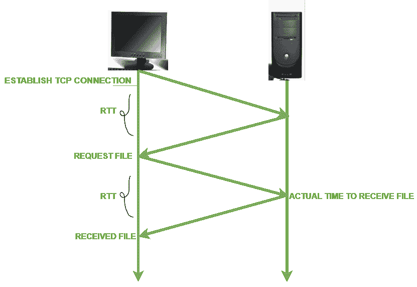
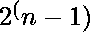

# 50 强 TCP/IP 面试问答

> 原文:[https://www . geesforgeks . org/top-50-TCP-IP-面试-问答/](https://www.geeksforgeeks.org/top-50-tcp-ip-interview-questions-and-answers/)

**1。解释一下 TCP/IP 类的范围？**


**2。什么是 Pvt. IP 地址？**

系统的私有 **IP 地址**是用于在同一网络内通信的 [<u>IP 地址</u>](https://www.geeksforgeeks.org/ip-addressing-introduction-and-classful-addressing/) 。使用私有 IP 数据，可以在同一网络内发送或接收信息。更多详情请参考[私有和公共 IP 地址的区别](https://www.geeksforgeeks.org/difference-between-private-and-public-ip-addresses/#:~:text=Private%20IP%20address%20of%20a,to%20communicate%20outside%20the%20network.)。

**3。解释 IP 保护网络上的数据吗？**

IP 本身并不能保证正确传递数据。它将所有数据保护留给传输协议。TCP 和 UDP 都有机制保证它们传递给应用程序的数据是正确的。

使用 IP 层，可以识别并传送数据包的正确目的地。传输层协议(TCP/UDP)使用校验和机制检查传送的数据是否正确。但是，如果目的地 IP 不存在，则通过减少 TTL(离开时间)字段来跳跃数据包，当该字段变为零时，数据包会丢失且无法传送。如果传输层是 UDP，则源不知道数据包传送失败。更多详情请参考 [<u>IP 地址</u>](https://www.geeksforgeeks.org/ip-addressing-introduction-and-classful-addressing/)

**4。说出传输层数据单元的名称？**

传输层的协议数据单元是数据段或数据报。

**5。告诉互联网层要发送的数据单元的名称？**

互联网层的协议数据单元是数据包。

**6。TCP 和 UDP 协议的区别？**

<figure class="table">

| 传输控制协议 | 用户数据报协议 |
| --- | --- |
| TCP 是一种面向连接的协议。面向连接意味着通信设备应该在传输数据之前建立连接，并且应该在传输数据之后关闭连接。 | UDP 是面向数据报的协议。这是因为没有打开连接、维护连接和终止连接的开销。按照网络传输的顺序，UDP 对于广播和多播类型是有效的。 |
| TCP 是可靠的，因为它保证向目的路由器传送数据。 | 在 UDP 中无法保证向目的地传送数据。 |
| TCP 提供了广泛的错误检查机制。这是因为它提供了流量控制和数据确认。 | UDP 只有使用校验和的基本错误检查机制。 |
| 数据排序是传输控制协议的一个特征。这意味着数据包按顺序到达接收器。 | UDP 中没有数据排序。如果需要订单，必须由应用层管理。 |
| TCP 比 UDP 相对慢。 | UDP 比 TCP 更快、更简单、更高效。 |
| 在 TCP 中可以重传丢失的数据包，但在 UDP 中不能。 | 用户数据报协议(UDP)中没有丢失数据包的重传。 |
| TCP 有一个(20-60)字节的可变长度报头。 | UDP 有一个 8 字节的固定长度报头。 |
| TCP 很重。 | UDP 是轻量级的。 |
| TCP 不支持广播。 | UDP 支持广播。 |
| HTTP、HTTPs、FTP、SMTP 和 Telnet 都使用 TCP。 | 域名系统、DHCP、TFTP、简单网络管理协议、RIP 和网络电话都使用 UDP。 |

</figure>

更多详情请参考[TCP 和 UDP 的区别](https://www.geeksforgeeks.org/differences-between-tcp-and-udp/)一文。

**7。TCP 协议如何提供可靠性？**

TCP 是可靠的，因为它使用校验和进行错误检测，试图通过重新传输、确认策略和计时器来恢复丢失或损坏的数据包。它使用字节数、序列号和确认号等特性来确保可靠性。

**8。写下 TCP 提供的服务名称？**

*   进程间通信
*   流向
*   全双工服务
*   多路技术
*   可靠性

更多详情请参考[计算机联网](https://www.geeksforgeeks.org/tcp-ip-in-computer-networking/)文章中的 [TCP/IP。](https://www.geeksforgeeks.org/tcp-ip-in-computer-networking/)

**9。解释 TCP 协议头格式？**


更多详情请阅读 [TCP/IP 模型](https://www.geeksforgeeks.org/tcp-ip-model/)文章。

**10。写下所有 TCP“标志”的名称？**

一个 TCP 标志字段包含 6 个不同的标志，即:

*   **URG:** 紧急指针有效
*   **确认:**确认号有效(用于累计确认的情况)
*   **PSH:** 请求推送
*   **RST:** 重置连接
*   **同步:同步序列号**
*   **FIN:** 终止连接

更多详情请阅读 [TCP/IP 模型](https://www.geeksforgeeks.org/tcp-ip-model/)文章。

**11 时。TCP 校验和字段的作用是什么？**

TCP 协议格式的重要领域之一。它有 16 位长。该字段保存错误控制的校验和。它在 TCP 中是强制性的，而不是 UDP。更多详情请阅读 [TCP/IP 模型](https://www.geeksforgeeks.org/tcp-ip-model/)文章。

**12 时。什么是 PORT？**

A **端口**基本上是一个物理的对接点，基本上是用来把外部设备连接到电脑上的，或者我们可以说一个端口充当了电脑和外部设备之间的接口，比如我们可以借助端口把硬盘和打印机连接到电脑上。更多详情请参考[各种 TCP 和 UDP 端口](https://www.geeksforgeeks.org/various-tcp-and-udp-ports/)文章。

**13。写出 TCP 使用的知名端口的名称？**

<figure class="table">

| 港口 | 服务 | 描述 | 传输协议 |
| --- | --- | --- | --- |
| seven | 回声 | 端口只是回显发送给它的任何内容。此功能可用于许多攻击，如 Smurf/Fraggle。 | TCP 和 UDP |
| nine | 抛弃 | 丢弃收到的任何数据报。 |   |
| 20 /21 | 文件传输协议 | FTP 协议用于向客户端发送数据的端口。 | 传输控制协议（Transmission Control Protocol） |
| Twenty-three | 用于远程联接服务的标准协议或者实现此协议的软件(可为动词) | 远程登录用于远程连接到工作站或服务器的端口(不安全) | 传输控制协议（Transmission Control Protocol） |
| Twenty-five | 简单邮件传输协议 | 用于通过互联网发送电子邮件 | 传输控制协议（Transmission Control Protocol） |
| Fifty-three | 域名系统 | 用于 DNS 请求、网络路由和区域传输的端口 | 传输控制协议（Transmission Control Protocol） |
| Sixty-seven | 引导协议(BOOTstrapping Protocol) | 引导协议 | 传输控制协议（Transmission Control Protocol） |
| Eighty | 超文本传输协议 | 用于在浏览器上浏览网页 | 传输控制协议（Transmission Control Protocol） |
| One hundred and ten | 邮局协议(POP3) | 用于检索服务器邮箱完整内容的端口 | 传输控制协议（Transmission Control Protocol） |

更多详情请参考[各种 TCP 和 UDP 端口](https://www.geeksforgeeks.org/various-tcp-and-udp-ports/)文章。

**14。在 TCP 中定义端点这个术语？**

通过 TcpEndpoint，您可以轻松地在客户端和服务器进程(可能驻留在不同的主机上)之间建立 TCP/IP 网络连接并进行通信。TcpEndpoint 类遵循类似电话的网络模型:客户端“呼叫”服务器，服务器“应答”客户端。一旦在客户机和服务器之间建立了网络连接，两者就可以通过读取和写入连接来相互“交谈”。

**15。解释 TCP 中的错误控制机制？**

TCP 协议有找出损坏段、丢失段、无序段和重复段的方法。
**TCP 中的错误控制**主要是通过使用**三个简单的技术**来完成的:

1.  **校验和**
2.  **确认**
3.  **重传**

**16。解释拥堵？**

当消息流量非常大，导致网络响应时间变慢时，网络层出现的一种状态称为拥塞。更多详情请阅读 [TCP 拥塞控制](https://www.geeksforgeeks.org/tcp-congestion-control/)文章。

**17。停等协议&滑动窗口协议有什么区别？**

<figure class="table">

| S.NO | 停止等待协议 | 滑动窗口协议 |
| 1. | 在停止等待协议中，发送方发送一帧，等待接收方的确认。 | 在滑动窗口协议中，发送方向接收方发送一个以上的帧，并重新发送损坏或可疑的帧。 |
| 2. | 停止等待协议的效率更差。 | 滑动窗口协议的效率更好。 |
| 3. | 停止等待协议的发送方窗口大小为 1。 | 滑动窗口协议的发送方窗口大小为 n |
| 4. | 停止等待协议的接收器窗口大小为 1。 | 滑动窗口协议的接收器窗口大小可以是 1 或 n |
| 5. | 在停止等待协议中，排序是不必要的。 | 在滑动窗口协议中，排序可能是必要的，也可能不是必要的。 |
| 6. | 

停止等待协议的效率是

```
1/(1+2*a)
```

 | 

滑动窗口协议的效率是

```
N/(1+2*a)
```

 |
| 7. | 停止等待协议是半双工的。 | 滑动窗口协议是全双工的 |

**18。往返时间是多少？**

数据包发送到目的地所用的时间长度包括在原始位置收到该数据包的确认所用的时间。更多详情请参考[什么是 RTT](https://www.geeksforgeeks.org/what-is-rttround-trip-time/#:~:text=What%20is%20RTT(Round%20Trip%20Time)%3F,-Last%20Updated%20%3A%2010&text=RTT%20also%20called%20round%2Dtrip,the%20display%20of%20that%20data.&text=It%20refers%20to%20the%20time,back%20to%20the%20original%20source.) 文章。



**19。TCP 确认的意义是什么？**

TCP 确认用于确认主机成功接收的数据包。如果确认号字段包含有效的确认号，则设置该标志。更多详情请阅读 [TCP/IP 模型](https://www.geeksforgeeks.org/tcp-ip-model/)文章。

**20。什么是重传？**

TCP 重传意味着通过网络重新发送丢失或损坏的数据包。这里，重传是 [TCP](https://www.javatpoint.com/tcp) 等协议用来提供可靠通信的机制。这里，可靠的通信意味着即使数据包丢失或损坏，协议也能保证数据包的传送。网络不可靠，不能保证丢失或损坏的数据包的延迟或重新传输。该网络结合了对受损或丢失数据包的确认和重传，提供了可靠性。更多详情请阅读 [TCP 拥塞控制](https://www.geeksforgeeks.org/tcp-congestion-control/)文章。

**21。如果 TCP 往返时间，RTT 目前是 3000 万秒，接下来的确认分别在 26、32 和 2400 万秒之后，RTT 的新估计是多少？(** **使用α = 0.9)**

估计新 RTT 公式


新 RTT = 0.9*30+(1-0.9)*26

新 RTT = 29.6

更多详情请参考[什么是 RTT](https://www.geeksforgeeks.org/what-is-rttround-trip-time/#:~:text=What%20is%20RTT(Round%20Trip%20Time)%3F,-Last%20Updated%20%3A%2010&text=RTT%20also%20called%20round%2Dtrip,the%20display%20of%20that%20data.&text=It%20refers%20to%20the%20time,back%20to%20the%20original%20source.) 文章。

**22。写下 TCP 的特点？**

*   **面向连接:**应用程序请求到目的地的“连接”，并使用该连接来传输数据
*   **流数据传输**:TCP 的职责是将这个字节流打包成数据包，称为 TCP 段，传递到 IP 层，传输到目的设备。
*   **可靠:**如果数据损坏、重复或损坏，它会从网络层恢复数据。
*   **点对点:** TCP 连接提供端到端的传递。
*   **互操作性**:消除了跨平台界限。
*   **错误和流量控制**:错误检查、流量控制和确认功能。
*   **名称解析:**有助于将人类可读的名称解析为 IP 地址。
*   **可路由性:** TCP/IP 是一种可路由的协议，
*   它有助于解析逻辑地址。
*   **全双工**:提供双向连接。

更多详情请阅读 [TCP/IP 模型](https://www.geeksforgeeks.org/tcp-ip-model/)文章。

**23。什么是 SCTP 协议？**

SCTP 代表**流控制传输协议**。它是计算机网络上面向连接的协议，提供全双工关联，即在网络中已建立连接的两个端点之间同时传输多个数据流。它有时被称为下一代 TCP 或 TCPng。SCTP 使支持互联网上的电话交谈变得更加容易。电话交谈需要在两端同时传输语音和其他数据。SCTP 协议使建立可靠的连接变得更加容易。SCTP 还旨在使通过无线网络建立连接和管理多媒体数据传输变得更加容易。SCTP 是一个标准协议(RFC 2960)，由互联网工程任务组(IETF)开发。更多详情请阅读[SCTP 全表](https://www.geeksforgeeks.org/sctp-full-form/)文章。

**24。解释三向握手协议的过程？**

**三方握手协议的过程**

*   **步骤 1 (SYN):** 在第一步中，客户端想要与服务器建立连接，因此它发送一个带有 SYN(同步序列号)的段，该段通知服务器客户端可能开始通信，以及它用什么序列号开始段。
*   **步骤 2(同步+确认):**服务器用设置的同步-确认信号位响应客户端请求。确认(ACK)表示它收到的段的响应，SYN 表示它可能用什么序列号开始该段。
*   **步骤 3 (ACK):** 在最后一部分，客户端确认服务器的响应，并且它们都建立了可靠的连接，通过该连接它们将开始实际的数据传输。

步骤 1、2 为一个方向建立连接参数(序列号)，并得到确认。步骤 2、3 为另一个方向建立连接参数(序列号)，并得到确认。有了这些，全双工通信就建立了。

更多详情请阅读 [TCP-3 次握手过程。](https://www.geeksforgeeks.org/tcp-3-way-handshake-process/)

**25。漏桶和令牌桶算法的区别？**

<figure class="table">

| 漏桶 | 令牌桶 |
| --- | --- |
| 当主机必须发送数据包时，该数据包被扔进一个桶中。 | 这个漏桶保存以规则的时间间隔生成的令牌。 |
| 铲斗以恒定的速度泄漏 | 铲斗具有最大容量。 |
| 突发流量通过漏桶转换为均匀流量。 | 桶有一个准备好的数据包，令牌从桶中移除，数据包被发送。 |
| 实际上，桶是以有限速率输出的有限队列。 | 如果桶中没有令牌，则无法发送数据包。 |

更多详情请阅读【计算机网络中的[拥塞控制](https://www.geeksforgeeks.org/congestion-control-in-computer-networks/)一文。

**26。写出令牌桶相对于漏桶算法的优势？**

*   如果令牌桶已满，将丢弃令牌，而不是数据包。在漏桶中，数据包被丢弃。
*   令牌桶可以以更快的速率发送大型突发，而桶总是以恒定的速率发送数据包。

更多详情请阅读【计算机网络中的[拥塞控制](https://www.geeksforgeeks.org/congestion-control-in-computer-networks/)一文。

**27。面向连接的服务和无连接有什么区别？**

<figure class="table">

| S.NO | 面向连接的服务 | 无连接服务 |
| 1. | 面向连接的服务与电话系统有关。 | 无连接服务与邮政系统有关。 |
| 2. | 面向连接的服务是长期稳定通信的首选。 | 突发通信更喜欢无连接服务。 |
| 3. | 面向连接的服务是必要的。 | 无连接服务不是强制性的。 |
| 4. | 面向连接的服务是可行的。 | 无连接服务不可行。 |
| 5. | 在面向连接的服务中，拥塞是不可能的。 | 在无连接服务中，拥塞是可能的。 |
| 6. | 面向连接的服务保证了可靠性。 | 无连接服务不能保证可靠性。 |
| 7. | 在面向连接的服务中，数据包遵循相同的路由。 | 在无连接服务中，数据包不遵循相同的路由。 |
| 8. | 面向连接的服务需要大范围的带宽。 | 无连接服务需要低范围的带宽 |

**28。TCP 连接有哪些阶段？**

在 TCP 中，面向连接的传输需要三个阶段:

*   连接建立
*   数据传送
*   连接终端

更多详情请阅读 [TCP 连接建立](https://www.geeksforgeeks.org/tcp-connection-establishment/)一文。

**29。TCP 滑动窗口的编写特点？**

TCP 滑动窗口的功能:

*   它使用可变大小的窗口来提供流量控制以及可靠的传输。
*   TCP 连接是全双工的，每个连接上同时进行两次传输，每个方向一次。
*   它支持不同速度和大小机器通过网络通信，也支持不同速度的路由器。

**30。TCP 报头的最大大小是多少？TCP 报头的最小大小是多少？**

*   TCP 报头的最大大小= 60 字节
*   TCP 报头的最小大小= 20 字节

**31。端口地址需要唯一吗？为什么或为什么不？为什么端口地址比 IP 地址短？**

端口寻址由传输层完成，传输层是开放系统互连模型的第四层。端口地址很短，因为它们必须执行消息的端到端传递，并且协议数量少于计算机系统，因此，端口地址少于 IP 地址。IP 地址是指连接到网络的计算机/设备，端口地址是指根据客户端请求与服务器通信的特定协议。更多详情请阅读 [TCP/IP 端口和](https://www.geeksforgeeks.org/tcp-ip-ports-and-its-applications/)及其[应用](https://www.geeksforgeeks.org/tcp-ip-ports-and-its-applications/)文章。

**32。UDP 和 IP 都不可靠到同样的程度吗？为什么或为什么不？**

不，UDP 是不可靠和无连接的。而 IP 的不可靠性在于上层协议。如果上层协议是 TCP，则 IP 数据包变得可靠。在数据完整性方面，UDP 比 IP 更可靠。IP 报头中的校验和仅适用于报头本身，不适用于整个数据包。UDP 校验和适用于整个用户段。

**33。定义术语数据报？**

它是通过网络传输信息的逻辑单元。这些数据从源传输到目的地。它不保证数据会在途中被传递或丢失。它有两个节头和一个数据有效载荷。它在网络中传输，而没有在源和目的地之间建立预先的虚拟网络。，即。与不同，它没有源和目标之间路径的先验信息。这些数据经常被分成更小的部分，并传输到规定的路线。

**34。什么是注册端口和动态端口？**

**注册港口:【1024 至 49151 之间的港口不是由 IANA 分配和控制的。它们只能在 IANA 注册，以防止重复。**

**动态端口:**此端口范围为 49152 到 65535，既不受控也不注册。它们可以用于任何过程。

**35。写出 TTL 字段的重要性？**

正在发送的数据的生命周期。一旦在该指定时间结束或过去之后，数据将被丢弃，或者它也可以表示为该分组被设置为存在于网络中的跳数，之后该分组被丢弃。TTL 字段的目的是避免无法传送的数据报在网络中不断循环的情况。

**36。IPv4 数据包已到达，前 8 位如图所示:01000010 接收器丢弃该数据包。为什么呢？**

IPv4 数据包已到达，前 8 位为 01000010。接收器丢弃该数据包，因为前 4 位代表版本 IPV4。
和另外 4 位表示报头长度(/ 4)，其范围应该在 20 到 60 字节之间。这里 0010 代表报头长度，等于 2 * 4 = 8。因此，接收方将拒绝该数据包。

**37。在 IPv4 数据包中，HLEN 的二进制值是 1000。这个包携带了多少字节的选项？**

如果 IPv4 数据包的二进制值为 1000，则该数据包携带 32 字节的选项。

选择= 1000 = 8

8*4 = 32

**38。什么是开环拥塞控制** **和闭环拥塞控制技术？**

开环拥塞控制策略用于在拥塞发生之前防止拥塞。拥塞控制由源或目的地处理。

闭环拥塞控制技术用于在拥塞发生后对其进行处理或缓解。

**39。IPv4 报头的哪些字段会因路由器而异？**

IPv4 报头的总长度字段和报头校验和因路由器而异。

**40。IPv4 数据报中 HLEN 的值是 7。有多少个选项字节？**

如果 **HLEN** 字段的**值**为 **7** ，则报头中包含 28(自 **7** × 4 = 28) **字节**。

**41。IPv4 数据包中的报头长度值能否小于 5？**

IP 数据包的报头长度字段的值不能小于 5，因为每个 IP 数据报必须至少有一个固定大小为 20 字节的基本报头。

**42。一台主机正在向另一台主机发送 100 个数据报。如果第一个数据报的标识号是 1024，那么最后一个(在 IPv4 中)的标识号是多少？**

如果源发送 100 个数据报，并且第一个数据报的标识号是 1024，那么最后一个数据报的标识号将是 1024 + 99 = 1123。

**43。解释消除 IPv6 报头校验和的原因？**

IPv6 中消除了校验和，因为它是由上层协议提供的；因此，这一级不需要。

**44。写下用于处理从 IPv4 到 IPv6 传输的三种策略的名称？**

*   双栈
*   开挖隧道
*   标题翻译

**45。什么是隧道挖掘？**

当同一类型的源网络和目的网络要通过不同类型的网络连接时，使用一种称为**隧道**的互联技术。

**46。** **一个 IP 数据包到达，前 8 位为 01000010。版本是什么？**
前 4 位显示版本，即 0100，属于 IP 版本 4。

**47。什么是碎片化？**

**分片**是网络层的一个重要功能。这是一种技术，其中网关将较大的数据包分解或分割成称为片段的较小数据包。然后，每个片段作为单独的内部数据包发送。每个片段都有自己独立的头和尾。有时，当一个分段的数据报遇到一个处理较小分段的网络时，它也会被分段。因此，数据报在到达其最终目的地之前可以被分段几次。分裂的反向过程是困难的。片段的重组通常由目的主机完成，因为每个片段都变成了一个独立的数据报。

**48。假设具有 48 位干扰信号的 10 Mbps 以太网的往返传播延迟为 46.4 ms，最小帧大小是多少？**

传输速度= 10 兆位/秒。
往返传播延迟= 46.4 ms
最小帧大小=(往返传播延迟)*(传输速度)= 10*(10^6)*46.4*(10^-3)= 464 * 10^3 = 464 kbit

**49。在 TCP 拥塞控制算法的慢启动阶段，拥塞窗口的大小是多少？**

在 TCP 拥塞控制算法的慢启动阶段，拥塞窗口的大小呈指数增长。

**50。使用 n 位帧序列号的选择性拒绝协议进行数据传输的最大窗口大小是多少？**

使用 n 位帧序列号的选择性拒绝协议进行数据传输的最大窗口大小为。

</figure>

</figure>

</figure>

</figure>