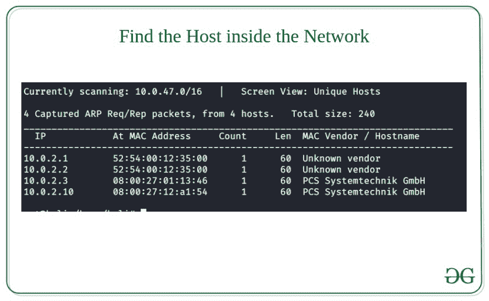
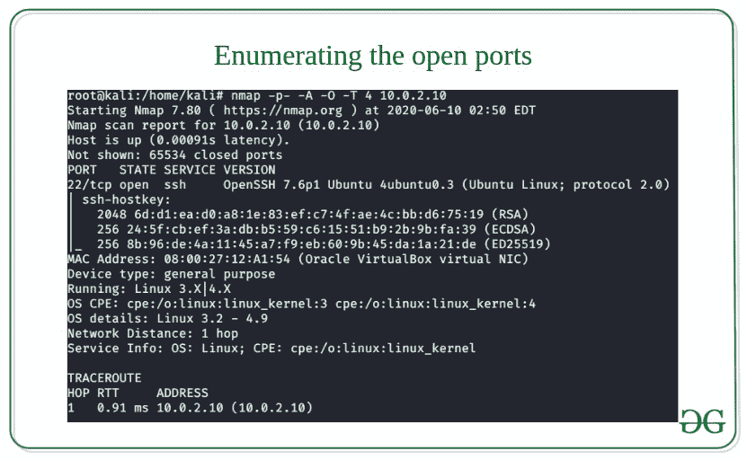
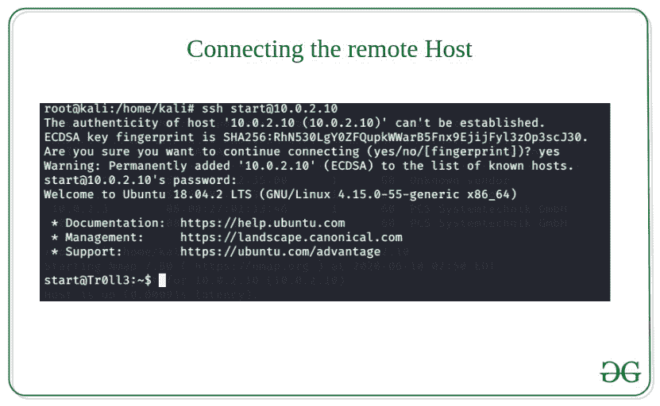
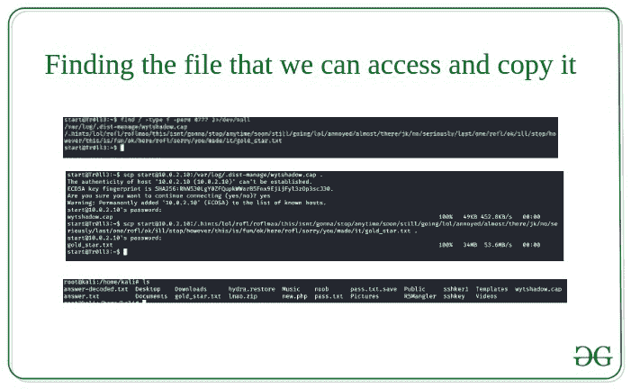
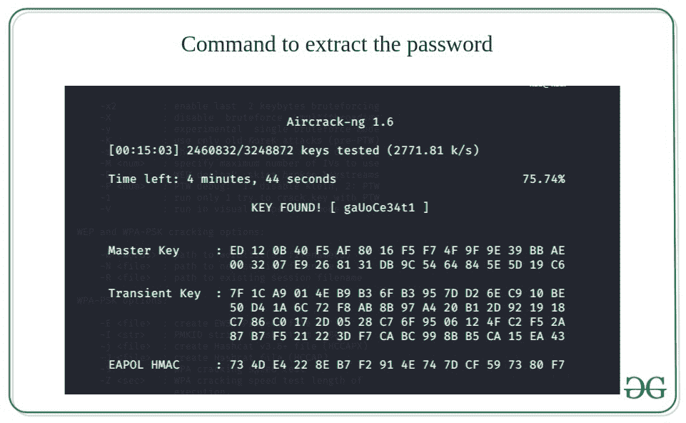
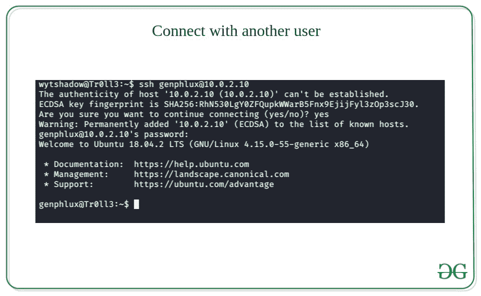
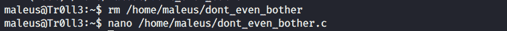
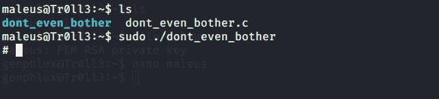
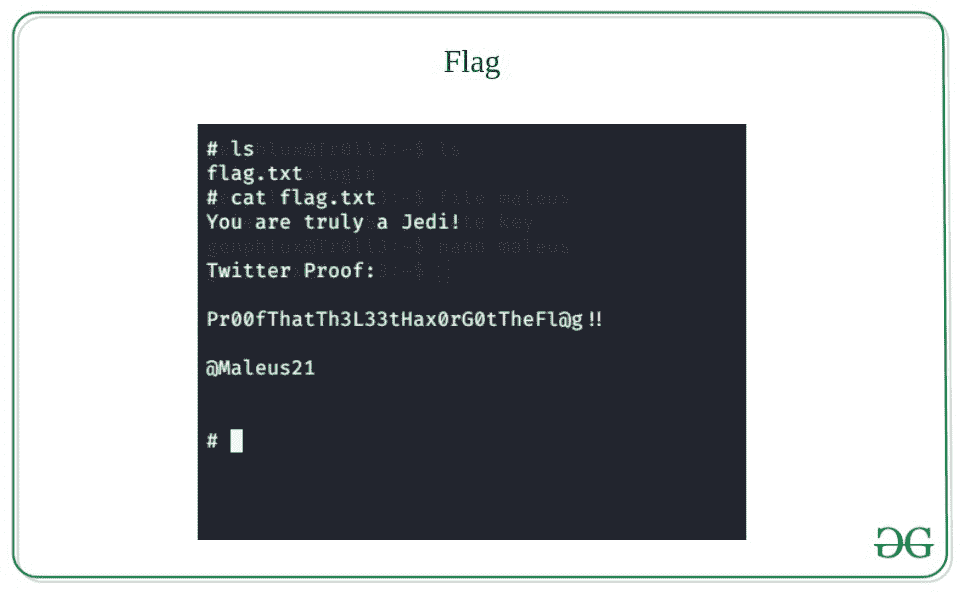

# Tr0ll 3 检查旗帜或 CTF 问题演练

> 原文:[https://www . geeksforgeeks . org/tr0ll-3-check-flag-or-CTF-problem/](https://www.geeksforgeeks.org/tr0ll-3-walkthrough-of-check-the-flag-or-ctf-problem/)

**CTF** 或**查旗**问题贴在[vulunhub.com。](https://vulunhub.com) **VulunHub** 是一个平台，提供易受攻击的应用/机器，获得信息安全领域的实际动手经验。

Tr0ll 3 是 vulunhub 上的一台机器。下载访问:
[巨魔 3 机器–Vulunhub](https://www.vulnhub.com/entry/tr0ll-3, 340/)

以下是 Vulunhub–Tr0ll 3 演练的步骤:

*   ### 在网络中查找主机

    使用命令 **netdiscover -i(接口名称)-r (IP 地址/16)**

    **示例:**

    ```
    netdiscover -i eth0 -r 10.0.2.0/16 
    ```

    

*   ### 用 nmap 扫描目标

    我们得到了目标 IP。下一步是用 nmap 扫描目标。
    **例:**

    ```
    nmap -p- -A -O -T 4 IP_address
    ```

    

    Nmap 显示只有端口 22 (SSH)是打开的。

    一旦我们打开目标机器，我们注意到有凭证(开始:这里)。

*   ### SSH 登录

    使用命令 **ssh start@IP_address** (点击输入并输入密码)

    

    我们进去了。是时候寻找有用的东西了。使用 **ls 命令**查看内容，我们发现了两个文件红丸和蓝丸，其中没有任何有用的信息。

*   ### 找到我们可以访问的文件

    使用命令**find/-键入 f -perm 777 2 > /dev/null** 来查找具有所有权限的文件。

    使用**scp start @ IP _ address:file _ path。/home/Kali/** 将文件从远程主机复制到我们的机器上。这里 **gold_star.txt** 包含一堆密码， **wytshadow.cap** 看起来像是无线网络捕获的数据包。wytshadow.cap 可以通过 **wireshark** 打开，但是如果你在另一台电脑上远程操作，就不方便了。因此，最好使用 **tcpdump** 命令来分析数据包，它告诉我们它是一个取消身份验证的数据包，并且所有数据包的协议都是**“802.11”**。
    **注意:** 802.11 是用于在无线连接设备之间传输数据包的协议。

    

*   ### 提取密码的命令

    现在，我们有了**。cap** 文件和一些乱码字符串。因此，我们使用了一个名为 **aircrack-ng** 的工具，它可能有助于提取密码。

    

    现在使用 **wytshadow** 作为用户 id 和破解的密码来访问另一个名为 wytshadow 的用户

    

    我们注意到有一个名为 **oohfun** 的文件有 SUID 位。让我们执行它。
    **注意:**可以使用**【文件 _ 文件名】**命令检查任何文件细节

    现在，使用 **sudo -l** 尝试检查我们在这里拥有什么 **sudo** 权限，并输入我们使用 **aircrack-ng** 破解的密码，这表明我们可以使用 sudo 权限启动 **ngnix** 服务器。现在转到**/etc/ngnix/sites-available**路径我们找到一个文件名**默认。**打开它显示我们可以使用端口 **8080 上的 **lynx** 服务进行远程处理。**但是首先我们必须在端口 **8080** 上启动 **ngnix** 服务器使用命令**启动 **ngnix** 服务器 sudo service nginx start** 我们可以使用 **netstat -nalp | less** 检查状态

*   Now to listen on the specific port type **” lynx http://10.0.2.10:8080″** in Kali terminal.

    瞧啊。我们又拿到了一张证件。让我们使用上面的凭证切换到 *genphlux 用户*。

    

*   Now use **ls** command and we have file **maleus** and **xlogin.** Maleus seems to be interesting. Let’s explore the file. We see that it stores a RSA key and xlogin is simple HTML document file Copy the private key and save it in any file with permission 600 ( I named ssh-key)

    有一个 ELF 64 位可执行文件**不要 _ 甚至 _ 打扰**有完全权限。当我们执行文件时，它需要一个我们还没有的密码。
    使用 **ls -lah** 我们得到了另一个有趣的文件，**。viminfo"** 。我们使用 cat 命令检查文件，得到凭证 **(B^slc8I$)** 。
    现在使用 **sudo -l** 命令查看 root 权限文件，我们可以像 maleus 用户一样以 root 身份运行**不要 _ even _ 打扰**文件。
    我们先删除 don _ even _ have 文件的内容，然后在这个文件里面注入我们的恶意代码。

    

*   Now inject the following script into **dont_even_bother.c** file. It’s the script that will invoke a shell on executing.

    ```
    int main(void) {
        setgid(0); setuid(0);
        execl("/bin/sh", "sh", 0);
    }
    ```

    这里我们提供了组 id 和用户 id 值为 0，因为在 Linux 中“0”代表根用户，这将有助于我们扩展当前的权限

*   Now we have to compile the C code in order to make it executable
    We compile the file by using the gcc compiler **“gcc dont_even_bother.c -o dont_even_bother”**
    Now as you remember we can run dont_even_bother as sudo user.So, lets run it .

    

*   Now, type **whoami** to see who are you and Great! We successfully got the root shell and owned root.
    Now type **cd /root** and then **ls** to see the content

    太好了。，我们得到了国旗作为旗帜

    