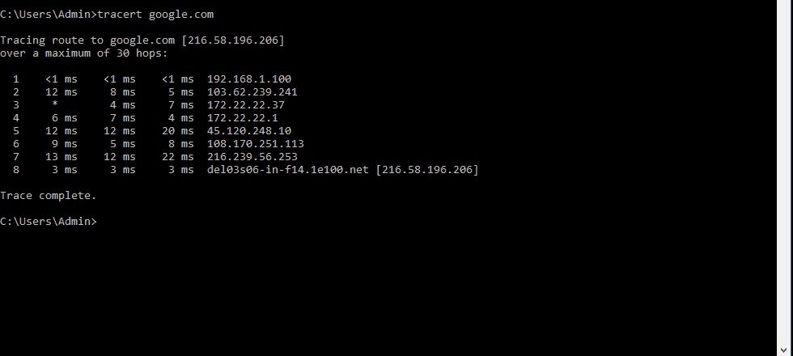
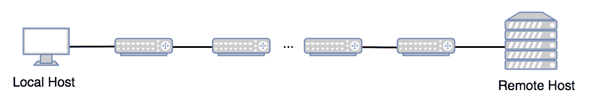

# 网络层追踪路由

> 原文:[https://www.geeksforgeeks.org/traceroute-in-network-layer/](https://www.geeksforgeeks.org/traceroute-in-network-layer/)

考虑一种情况，当你不能访问一个网站，可以访问其他网站。您可能想知道这是您的网络、某个中间网络还是网络服务器的问题。你是怎么想出来的？

可以使用 Traceroute。

**什么是** **追踪路线？**
Traceroute 是一个广泛使用的命令行实用程序，几乎在所有操作系统中都可用。它向您显示到达目的地地址的完整路线。它还显示了中间路由器之间花费的时间(或延迟)。是不是很棒？下面是一个视窗操作系统的例子。

**上面的** **输出是什么意思？**
第一列是中间路由器的序列号。在上面的输出中，三个数据包被发送到每一跳，以获得每个路由器延迟的良好估计。这三列显示了三个不同数据包花费的时间。最后一列是中间路由器的 IP/名称。
输出显示了第一跳的三个延迟，接着是第二跳的延迟，依此类推。

**什么是 Linux 等操作系统中的** **命令？**
在 Windows 中，如上图，命令名是“tracert”，但在 Linux、Unix 和苹果 MAC OS 中，一个命令就是“traceroute”。

【traceroute 是如何工作的？
如下图所示，源端和目的端之间有中间路由器。

它向目的地发送许多数据包。

第一组分组(在上面的例子中为 3 个分组)以这样的方式被发送，即它们被第一中间跳丢弃，并且从第一中间节点接收控制消息以获得第一跳的时间估计。

第二组分组(在上面的例子中为 3 个分组)以这样的方式被发送，即它们被第二中间跳丢弃，并且从第二中间节点接收控制消息以获得第一跳的时间估计。

【traceroute 如何确保数据包在第一跳被丢弃？
它为此使用了 TTL 字段。第一个数据包的 TTL 设置为 1，然后是 2，依此类推，直到到达目的地。

****总时间是如何估算的？**
当数据包被丢弃时，路由器会向源发送一条 ICMP 超时消息。这就是信源计算总时间的方法。**

**Traceroute 是网络中广泛使用的命令行实用程序。**

****参考文献:**
[https://www.youtube.com/watch?v=wTncuOHQbMw&索引=5 &列表= plkhskoi6 eznzjl 1 qtzmvbwtxrsjw 4 d2jj](https://www.youtube.com/watch?v=wTncuOHQbMw&index=5&list=PLkHsKoi6eZnzJl1qTzmvBwTxrSJW4D2Jj)**

**本文由**拉胡尔·古普塔**供稿。如果你发现任何不正确的地方，请写评论，或者你想分享更多关于上面讨论的话题的信息**